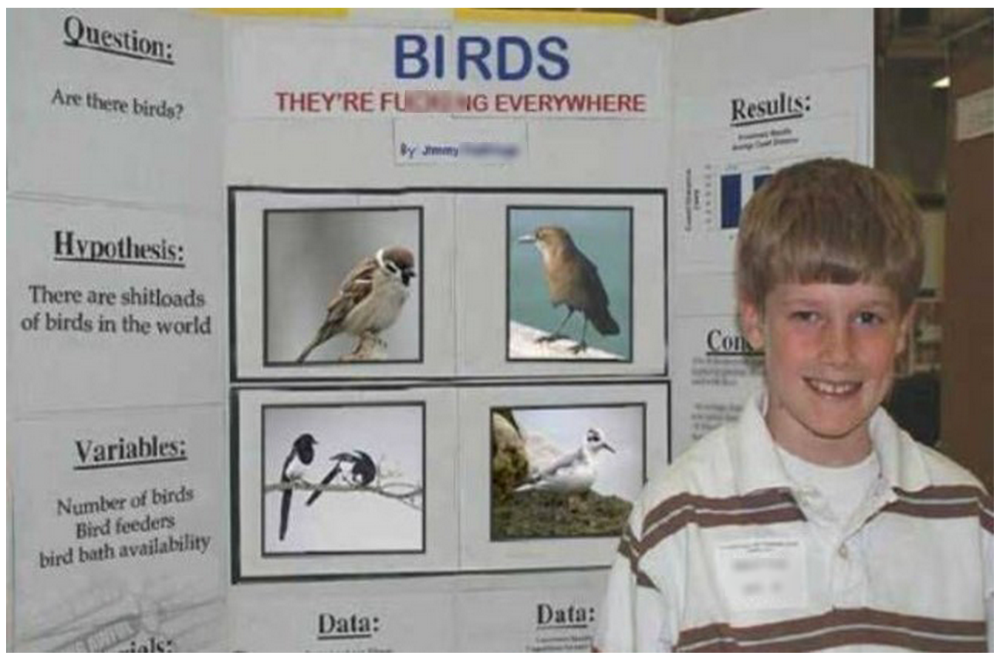
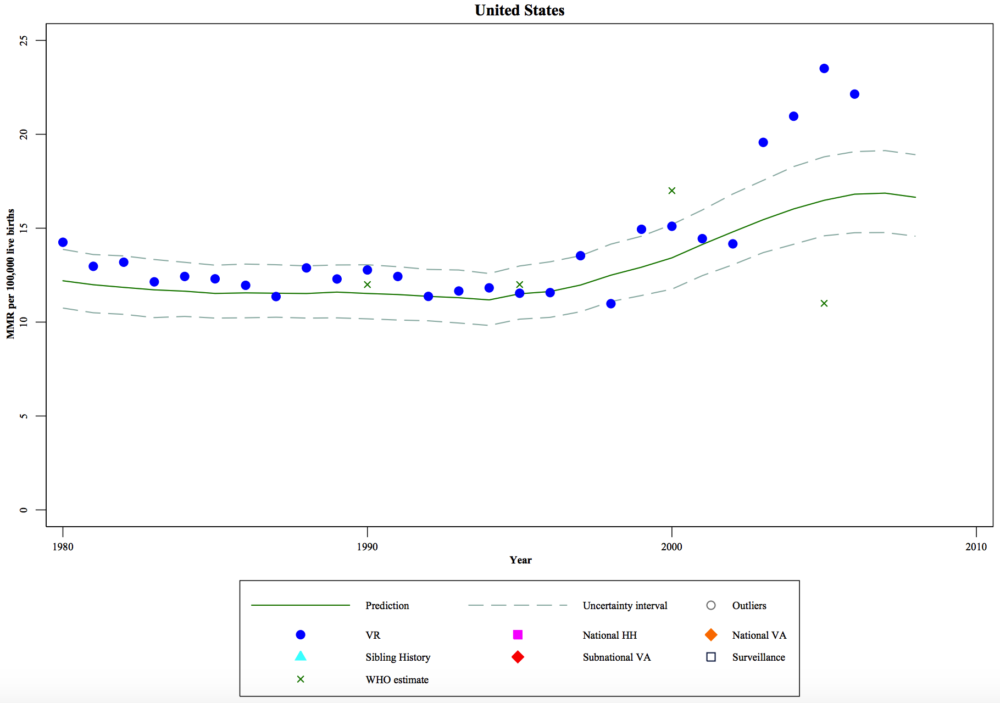
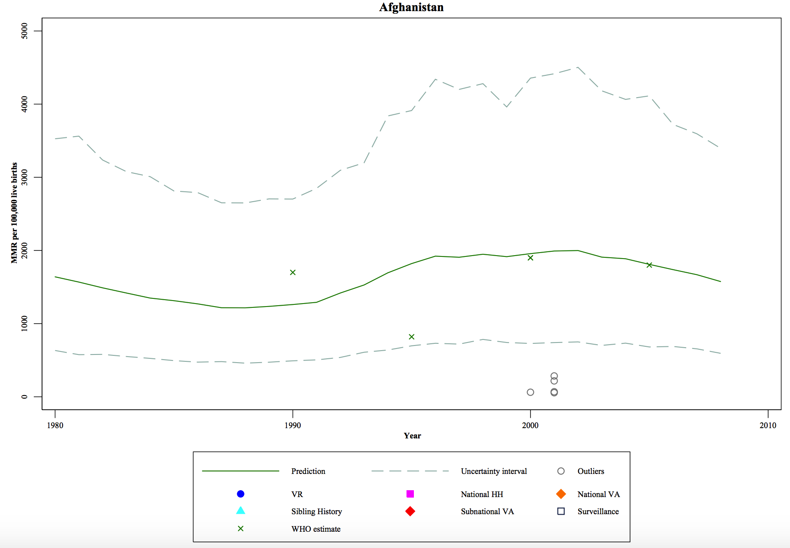
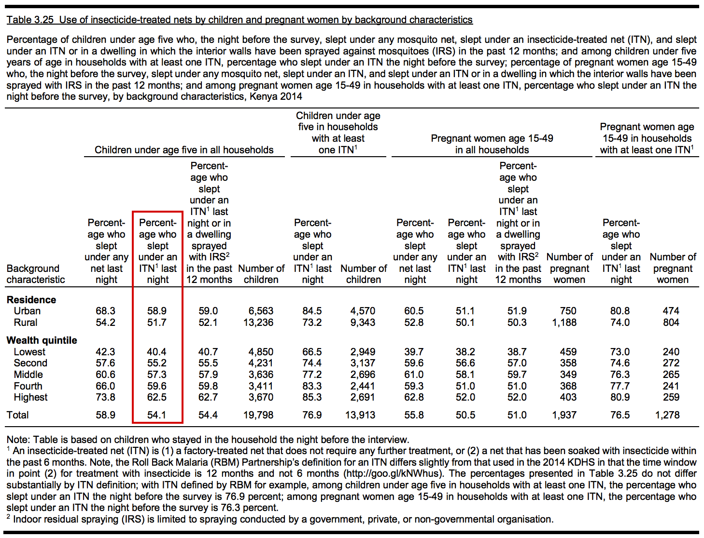
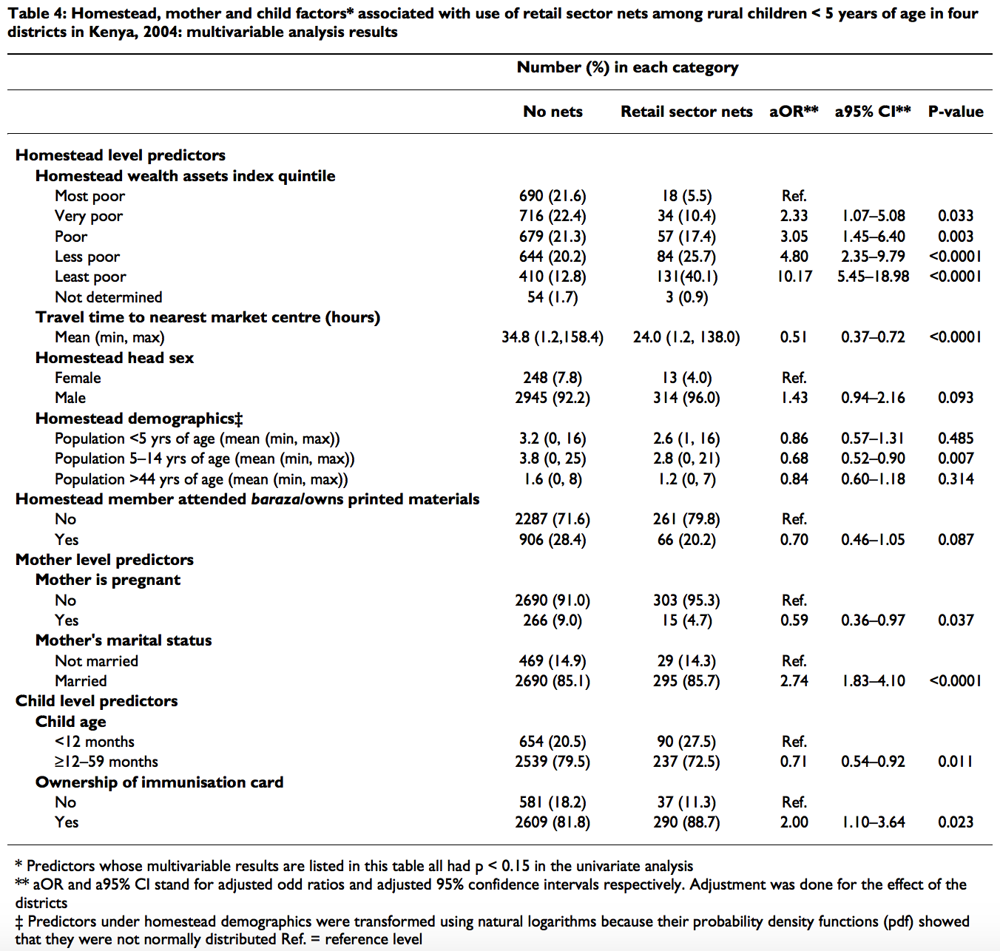
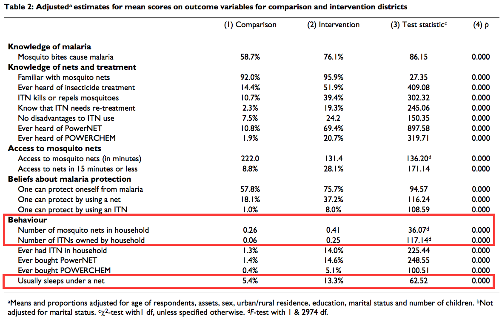

--- 
knit: "bookdown::preview_chapter"
---

# (PART) Part I: The Big Picture {-}

# Research 101 {#science}

Believe it or not, you already know the basics of the research process. You probably have a yellowing, tri-fold piece of cardboard tucked in the back of the closet in your parents' house that would prove me right. Just like Jimmy.[^jimmy]

[^jimmy]: OK, Jimmy is not this kid's real name, and his poster is not really about the observation that birds are everywhere. The internet had a little fun with Photoshop and re-imagined a number of science fair posters like little Jimmy's.

```{r jimmy, fig.cap="What you see here is the scientific method in action. Jimmy asked a question, made a hypothesis, collected and analyzed data, and ultimately, made some conclusions based on the results. Science!. Source: http://bit.ly/1HbluM4", echo=F}

```

Even if you have not been as productive as Jimmy, I'm certain that you've had years of practice consuming research. We're exposed to popular press accounts of research every day on TV, the radio, and the internet. Much of it might be wrong—"new study proves that eating chocolate prevents all cancer"—but it's a start.

So it's a safe bet that just about every reader has some foundation to build upon. The goal of this chapter, therefore, is to re-introduce familiar concepts about scientific research from a global health perspective. We'll come back to these fundamentals throughout the book and explore them in more detail. By the end you'll be ready to move your work from primary school cafeteria to academic conferences, policy debates, and real world program design and delivery.

## Scientific Research

Let's start with what we mean by **"scientific research"**. King et al. [-@king:1994] offer a useful definition in their book, "Designing Social Inquiry". They point to several main characteristics:

1. The goal is inference
2. The procedures are public
3. The conclusions are uncertain

### All about inference

By stating that the goal of scientific research is inference, we mean that science goes beyond the collection of facts. You've probably seen the word **inference** used in several different contexts in your global health studies. At the most basic level, when we talk about inference, we are referring to the process of making conclusions about some unobserved or unmeasured phenomenon based on our direct observations of the world. We use what we know to infer something about the things we don't know. This process can be deductive or inductive. 

In **deductive** reasoning, we start from general theories, make hypotheses, collect data, and make conclusions based on the data. **Inductive** reasoning flows the other direction, from specific observations to the generation of hypotheses and theories. Remember it this way: if you are testing a specific hypothesis, you are using deductive reasoning. If you are starting with your observations and making more general statements, then you are using inductive reasoning. To say that quantitative research is deductive and qualitative research is inductive is not quite right, but it's often true.[^box]

[^box]: But as we will see later, studies will not necessarily fit into one box. Often in global health research, you will see studies using **mixed methods** approaches and both types of reasoning.

For instance, Singla et al. [-@singla:2015] report the results of a cluster randomized trial of a parenting intervention in rural Uganda. This study used quantitative methods; the primary outcomes of this study were cognitive and receptive language development of the children of participating caregivers measured with the [Bayley Scales of Infant Development](https://en.wikipedia.org/wiki/Bayley_Scales_of_Infant_Development). The authors hypothesized that the intervention would improve child development. As you can see in the following table from the article, the program increased cognitive and receptive language scores, but did not have an effect on height-for-age, thus partially supporting the hypothesis.

```{r singla, fig.cap="Source: Singla et al. (2015), http://bit.ly/1UcVtoZ", echo=F}
knitr::include_graphics("images/singla.png", dpi = NA)
```

Later in the book we'll get into the nitty gritty details of how you read and interpret results like you see here. For now, let's focus on the approach to reasoning. Singla et al. is an example of deductive reasoning. The authors started with a hypothesis, collected quantitative data (i.e., scores on a measure called the Bayley), and inferred something about the impact of the intervention.[^inf] 

[^inf]: This is also an example of causal inference, a major focus in this book. Does X impact Y? Does this program cause a specific outcome? As we will discuss later, this is also an example of statistical inference. The authors recruited one sample of adult-child dyads, collected data, and used inferential statistics to generalize from the sample to the population. Don't worry, by the time you close this book, all these terms will make sense. Repetition, repetition, repetition.

We can contrast the Singla et al. trial with a qualitative study by Sahoo et al. [-@sahoo:2015] that exemplifies inductive reasoning. Sahoo and colleagues used a grounded theory approach to conduct and analyze interviews with 56 women in Odisha, India about their sources of stress and sanitation practices.[^gt] This study is an example of inductive reasoning because the authors started with the data—their observations—looked for themes and patterns, and came to some conclusions about the nature of sanitation-related stress.[^di] One result of this work was a conceptual framework for thinking about sanitation-related psychosocial stress, as shown below.[^sahooresults]

[^gt]: Grounded theory will come up again in a later chapter as a specific example of approaches to qualitative inquiry. Without getting into the weeds here, we can just say that it is an approach that involves iterative data collection and analysis. Most importantly, data come first in grounded theory. It is only through the iterative process of data collection and analysis that theories and broader implications emerge.

[^di]: Sahoo et al. [-@sahoo:2015] is also an example of descriptive inference. Unlike with causal inference, descriptive inference does not seek to establish that X caused Y. Yet descriptive inference goes beyond basic description—or the collection of facts—to say something about how the individual experiences and opinions of these women tell us something more universal about the nature of sanitation-related stress and its possible connections to factors like a woman's life stage and her behavior.

[^sahooresults]: Sahoo et al. observed that "sanitation" encompassed much more than defecation and urination, such as washing, bathing, and menstrual management. These sanitation activities brought numerous challenges that could be classified as environmental, social, or sexual and understood in the context of a woman's life stage, living environment, and access to sanitation facilities.  

```{r sahoo, fig.cap="Source: Sahoo et al. (2015), http://bit.ly/1JB6nSs", echo=F}
knitr::include_graphics("images/sahoo.jpg", dpi = NA)
```

The point to take away about inference is that, regardless of the approach to reasoning, the goal of scientific research is to use what we observe to make conclusions about what we do not observe directly. This is sometimes referred to as **empiricism**, and our systematic observations as **empirical evidence**. Empiricism is at the heart of scientific research.

### Research as a public act

Scientific research uses public methods that can be examined and replicated. **Replication** is a core principle of scientific research. No one study rules the day. If the results of your study are robust, another research group should be able to follow your methods and replicate the findings. When findings are replicated, we all have more confidence in the results.

Replications are relatively rare, however. For one, there are often few resources for replicating studies, especially when it comes to big field experiments. Second, journal space is limited (especially if there is still a print version) and peer review takes a lot of resources. Journals want to use their space and resources to publish novel ideas (ironically, novelty can sometimes mean small effects with a lot of noise that might fail to replicate). Without the promise of a publication, researchers have little incentive to spend time and money trying to replicate published findings. Publications are a key criterion for tenure and promotion in academia, so many researchers don't waste their efforts on studies that won't get published.

What happens when replications are attempted? Well, that's a topic for a later chapter. The short answer is bitterness. Replicators grab more headlines when they "debunk" findings, and the original authors almost invariably call into question the quality of the replication. Just see [#wormwars](https://twitter.com/hashtag/wormwars) to learn what happened when a famous de-worming study was re-examined. Or Google social psychology and priming. Yikes! 

A separate but related issue is **reproducibility**, the ability to generate a study's findings given the original dataset and sometimes the original analysis code. Think irreproducible findings are rare? Think again. The *[Quarterly Journal of Political Science](http://thepoliticalmethodologist.com/2014/12/09/a-decade-of-replications-lessons-from-the-quarterly-journal-of-political-science/)* found that slightly more than half of their published empirical papers subjected to review had results that could not be replicated *with the author's own code*.

The positive part of this story is that it's becoming more common for authors to share their data and analysis code. This has been standard practice in economics for some time, but the idea is revolutionary in medicine and public health. We'll explore why this is so important and easier than ever to do. 

### Living with uncertainty

Every method has limitations, every measurement has error, and every model is wrong to some extent. In short, research is an imperfect process. Sometimes researchers make outright mistakes. These mistakes may or may not be detected and corrected in the **peer review** process, or during post-publication review if authors share their data and analysis code. Other findings are free of obvious mistakes, but fail to be replicated, and over time run counter to a growing body of literature that points in the other direction. In this way science is said to be self-correcting. We'll discuss how this ideal can fall short in the face of challenges like **publication bias**, but the point here is to get comfortable in the short term with the idea of uncertainty.

A good example of uncertainty comes from the estimation of maternal mortality. Hogan et al. [-@hogan:2010] published estimates for 181 countries. Some countries like the United States have vast amounts of data; vital registries that attempt to track all births and deaths. Countries with vital registries struggle with changing definitions over time, but the uncertainty interval around their estimates is typically tight, as shown in the figure below from the Hogan et al.'s supplementary webappendix, because there is a lot of good data. 

```{r hogan, fig.cap="Source: Hogan et al. (2010), http://bit.ly/1JBCelO", echo=F}

```

In many low-income countries the situation is very different. Here is the estimate and uncertainly interval for maternal mortality in Afghanistan. There are only four data points! No wonder the uncertainty interval is so great.[^est] 

```{r hogan2, fig.cap="Source: Hogan et al. (2010), http://bit.ly/1JBCelO", echo=F}

```

[^est]: You might be wondering how they even come up with any estimates without much data. The answer is statistical modeling. Afghanistan may not have much data on maternal mortality, but there are data on other indicators like total fertility rate, gross domestic product per head, HIV seroprevalence, female education, etc. Using the data we do have from all countries and all years, we can model how these variables are related to maternal mortality. We take this equation, plug in values for Afghanistan, and solve for maternal mortality. More or less.

So how many women die during pregnancy or within 42 days of delivery? The same research group that published Hogan et al., the [Institute for Health Metrics and Evaluation](http://www.healthdata.org/), estimated that there were 292,982 maternal deaths globally in 2013, with a 95% uncertainty interval ranging from 261,017 to 327,792; that's a range of 66,775 for everyone who struggles with mental math [@kassebaum:2014]. This might seem like a lot, but remember that we're talking about global statistics for a world population of more than 7 billion people.[^whomm]

[^whomm]: The World Health Organization (WHO) and partners [published their own estimates for 2013](http://www.who.int/reproductivehealth/publications/monitoring/maternal-mortality-2013/en/). They estimated that there were 289,000 maternal deaths, which is pretty close to the IHME estimate of almost 293,000. As [Kassebaum et al. [-@kassebaum:2014]](http://www.thelancet.com/journals/lancet/article/PIIS0140-6736(14)62421-1/abstract) explain, however, the consistency in these estimates masks substantial disagreements, including estimates that diverge at least 20% in 120 countries in 2013 and different perspectives on progress toward achieving the Millennium Development Goal 5.

The takeaway message is that there is uncertainty in everything. Don't take any single estimate as the "Truth". Instead, try to learn about the origin of estimates and recognize the limitations of what we know.

## The Fundamentals

Before we get too far along, we need to establish a common understanding of some fundamental concepts and terms. We'll do so in the context of research on malaria.[^malaria]

[^malaria]: Malaria is a preventable and curable disease that took the lives of more than 500,000 people in 2013—mostly African children. Four species of parasites cause malaria and are transmitted to humans through the bites of *Anopheles* mosquitoes.

### The nature of research

Research can be classified as basic or applied. **Basic research**—or "pure" research—is the pursuit of fundamental knowledge of phenomena. An example would be the bench science to understand the parasitic life cycle and how parasites interact with humans at different stages.

Basic research can be contrasted with **applied research** which is focused on specific problems or applications. For instance, an applied research question is how to increase the coverage and use of bed nets that prevent malaria transmission.

Applied science takes many different forms, including [**clinical research**](https://en.wikipedia.org/wiki/Clinical_research). Clinical research is a broad field that encompasses patient-oriented research, epidemiological and behavioral studies, and outcomes research and health services research.[^cr] Basic research is the foundation of clinical research.

[^cr]: Glossary of Terms for Human Subjects Protection and Inclusion Issues, based on the 1997 Report of the NIH Director’s Panel on Clinical Research, entry: “clinical research”. Available at [http://grants.nih.gov/grants/peer/tree_glossary.pdf](http://grants.nih.gov/grants/peer/tree_glossary.pdf).

#### Clinical trials{-}

One type of clinical research is a clinical trial. Drugs and vaccines have to pass through different phases of clinical trials before regulatory bodies will approve their use with humans:

* Preclinical research
* Phase I
* Phase II
* Phase III
* Phase IV 

Let's take the development of a vaccine for malaria as an example of the clinical trial life-cycle. A vaccine candidate called RTS,S, or Mosquirix™, [recently made news](http://money.cnn.com/2015/07/24/news/malaria-vaccine-bill-gates/) for getting one step closer to becoming a licensed vaccine after a successful Phase III trial. This moment was more than 30 years in the making.

[Development of RTS,S](http://malariavaccine.org/files/UpdatedRTSS_FactSheet_21April2010.pdf) began in 1984 through a partnership between the pharmaceutical company GSK and the Walter Reed Army Institute of Research. The vaccine candidate was created in 1987 and entered **preclinical** research. During the pre-clinical phase, testing is performed in non-human subjects with the goal of collecting data on how well the vaccine works (efficacy), how much damage it can do to an organism (toxicity), and how it is affected by the body (pharmacokinetics).

Clinical research on humans began in 1992. To obtain regulatory approval, the vaccine had to complete three phases of testing. Doherty et al. [-@doherty:1999] conducted a **Phase I** safety and immunogenicity trial with 20 adults in The Gambia in 1997. This small sample size is typical of Phase I trials where the objective is usually to find a safe dosing range and look for side effects. The authors reported that the vaccine did not have any significant toxicity but did produce the expected antibodies. 

Several **Phase II** studies conducted over a decade (Phase IIa and Phase IIb) demonstrated **efficacy** of the vaccine against several endpoints (a.k.a. outcomes) [@moorthy:2009]. A Phase IIb trial began in Mozambique in 2003 with more than 2,000 children aged 1 to 4 [@alonso:2004]. Children were randomly assigned to receive three doses of RTS,S or a control vaccine. At 6-months, the prevalence of malaria was 37% lower in the treatment group compared to the control group. A follow-up study with 214 infants also showed partial protection [@aponte:2007]. This was an important proof-of-concept.

Final results of a large **Phase III** trial with more than 15,000 infants and young children in seven African countries were published in *The Lancet* in 2015 [@rts:2015]. Children in the study were randomly assigned to 1 of 3 arms: 3 doses of RTS,S and a booster dose at month 20; 3 doses of RTS,S and a booster dose of a comparator vaccine at month 20; or 4 doses of a comparator vaccine. The study reported that RTS,S reduced clinical malaria cases by 28% and 18% among young children and infants, respectively, over a 3 to 4 year period. This is the goal of a Phase III trial—to show that a treatment is efficacious.

On the basis of these results, the European Medicines Agency issued a "European scientific opinion", which could help inform the decision of the WHO and African national regulatory authorities. If RTS,S is approved for use and eventually hits the market, researchers will likely conduct **Phase IV** trials to evaluate the vaccine's long-term effects. 

This will not be the end for research on RTS,S, however. The vaccine may be efficacious, but that does not mean it will be easy or cost-effective to deliver at scale to millions. Studies that assess how to best get efficacious treatments to the people who need it most fall under the domain of **implementation science**. 

There are many stumbling blocks from getting interventions from "bench to bedside", so to speak. Practitioners of **translational research** point to four key bottlenecks:

* T1: translation from basic science to clinical research
* T2: translation from early clinical trials to Phase III trials and beyond with larger patient populations
* T3: translation from efficacy (Phase III) to real-world effectiveness—the domain of implementation science
* T4: translation from evidence about delivery at scale to new policy

Behavioral research (e.g., development and evaluation of parenting interventions) does not follow the same exact phases of vaccine and drug development, but the broad principles are the same.

#### Monitoring and evaluation{-}

Another arena of applied work in global health is monitoring and evaluation, or M&E. Let's start with the "E", **program evaluation**.

In the U.S., program evaluation became commonplace by the end of the 1950s and grew dramatically in the 1960s as the federal government expanded and introduced new social programs. Lawmakers wanted accountability, and the evaluation of social programs took off [@rossi:2003]. But is program evaluation considered research?

Methods giant [Donald Campbell](https://en.wikipedia.org/wiki/Donald_T._Campbell) thought so [@campbell:1969]:

> The United States and other modern nations should be ready for an experimental approach to social reform, an approach in which we try out new programs designed to cure specific problems, in which we learn whether or not these programs are effective, and in which we retain, imitate, modify or discard them on the basis of their effectiveness on the multiple imperfect criteria available.

Campbell had an outsized impact on the field. It's no surprise that an organization dedicated to synthesizing the best available evidence on social interventions, the [Campbell Collaboration](http://www.campbellcollaboration.org/), bears his name.

```{block, type='rmdpuzzle'}
A good candidate for Donald Campbell's successor is French economist and MIT researcher [Esther Duflo](http://economics.mit.edu/faculty/eduflo). Together with Abhijit Banerjee and Sendhil Mullainathan, she co-founded [JPAL](http://www.povertyactionlab.org/), which stands for the Abdul Latif Jameel Poverty Action Lab. JPAL is a global research organization headquartered at MIT that uses randomized evaluations (i.e., experiments) to answer policy questions related to poverty alleviation. The JPAL website, [http://www.povertyactionlab.org](http://www.povertyactionlab.org), contains excellent resources about the methods of randomized evaluations, published studies, and policy briefs. Interested readers should also check out [Innovations for Poverty Action](http://www.poverty-action.org/), or IPA, a sister organization of sorts that is also a leader in the use of randomized evaluations to study important policy questions about global poverty.
```

Yet, not everyone agrees. Educational psychologist [Lee Cronbach](https://en.wikipedia.org/wiki/Lee_Cronbach) certainly did not.[^cron] Cronbach recognized the overlap in methods and designs, but he thought that program evaluation was really designed for program implementers and funders, and that the messy nature of programs required a loosening of research standards [@cronbach:1982]. Just learn what you can.

[^cron]: You might know Cronbach from that statistic you report for reliability but don't really know what it means—[Cronbach's alpha](https://en.wikipedia.org/wiki/Cronbach%27s_alpha).

In their introductory text on evaluation, Rossi et al. [-@rossi:2003] strike a balance in views. Their answer is perhaps a bit unsatisfying, but I'd argue true nevertheless. 

*It depends*. 

Program evaluations should be as rigorous as logistics, ethics, politics, and resources permit. And no less. Is there a lower bound in terms of quality that should limit what is even worth doing? Probably, but the line is so context dependent that it is not sensible to attempt a definition. If there is one rule to follow, I'd suggest that it's this: "don't go beyond the data". Everyone wants to claim "impact", but not every evaluation can based on the design and implementation.

Now we turn to the "M", **program monitoring**. Program monitoring is concerned with the implementation of programs, policies, or interventions. How are resources being used? Is the program being delivered as intended (a.k.a. with fidelity)? How many people participate, and does the program reach the intended targets? These are all program monitoring questions.

Accurate monitoring is essential for reporting to funders, but it's also essential for all good evaluations. The reason is simple. If a program is shown to not "work"—to have no impact—the next question is why? Did the program fail to have an impact because the idea or theory behind the program was wrong (**theory failure**)? Or was it the case that the implementation of the program was so troubled that there was never a chance of having an impact (**implementation failure**)? Every trial should include ongoing monitoring or a formal process evaluation.  

### Research problems and questions

Every study begins with a research problem. A **research problem** represents a gap in our knowledge. In academic research, this is another way of saying a gap in "the literature". 

```{block, type='rmdpuzzle'}
Usually when people speak of "the literature", they mean [scholarly](https://en.wikipedia.org/wiki/Academic_publishing) or [peer-reviewed](https://en.wikipedia.org/wiki/Peer_review) journal articles. There is also something called "[grey literature](https://en.wikipedia.org/wiki/Grey_literature)" that is more encompassing and harder to search systematically. Grey literature sources are typically disseminated through channels other than peer-reviewed journals. Examples could include technical reports or [white papers](https://en.wikipedia.org/wiki/White_paper) published on the web.
```

Research problems are typically broad. For instance, **stakeholders** might want to know how to increase the use of bed nets for children under 5 years of age. Or whether all children should receive deworming medication prophylactically. 

```{block, type='rmdpuzzle'}
Stakeholders can refer to a wide range of people and organizations. Typically we mean **donors** (i.e., the public and private organizations that fund research and programs), **policy makers** (i.e., government officials and bureaucrats at international bodies like the WHO), **program implementers** (i.e., organizations like Doctors Without Borders that actually deliver services to **beneficiaries**, a.k.a. people), and **scholars** who study the topic or policy issue.
```

These problems have something in common: they are solvable. In his introductory text on behavioral research methods, Leary [-@leary:2012] writes that this is another key criterion for scientific research. The problems must be solvable. This does not mean easy; it just means that we can use systematic, public methods to gather and analyze data on the problem. Think of it this way: we can come up with a method for studying how to get more parents to ensure that their kids sleep under a mosquito net every night, but we don't yet have a scientific method for determining whether there is a mosquito afterlife where these pests get to buzz around for all of eternity.

In order to study a broad research problem, we must narrow to a more specific **research question**. de Vaus [-@devaus:2001] says there are essentially two types of research questions: 

* Descriptive—what is going on?
* Explanatory—why is it going on?

Let's stick with the bed net example. If we want to study uptake or use of bed nets, we might ask a descriptive research question like, "How many children sleep under bed nets?" But this is too general. Children of what age? Living where? We also need to operationalize what we mean by sleeping under a bed net. It's common in this line of research to ask about the previous night, as in the night before the survey. As we will discuss in the chapter on measurement, we have to consider challenges to getting valid information, such as recall difficulties. A better way to phrase the question might be, "What percentage of children under 5 years of age in Kenya slept under an insecticide treated net the previous night?"

### Research designs

As Glennerster and Takavarasha [-@glennerster:2013] explain in their excellent practical guide to running randomized evaluations, different research questions require different research designs. We'll spend most of our time in this book looking at strategies for answering the "why" questions. I lump them into three categories and differentiate them from descriptive designs: 

* descriptive
* correlational
* quasi-experimental
* experimental

#### Descriptive research{-}

The goal of **descriptive research** is to characterize the population. Often this means estimating the **prevalence** of a phenomenon or disease. 20% are illiterate. 36% have an unmet need for contraception. 9% are HIV positive. Description can also be qualitative in nature (e.g., [thick description](https://en.wikipedia.org/wiki/Thick_description)).

Just about every study will have some descriptive element. Some studies are exclusively descriptive. A good example are the [Demographic and Health Surveys](http://www.dhsprogram.com/), more commonly referred to as DHS surveys (yes, "surveys" is redundant). Every student of global health should come to know what the DHS Program has to offer. The program is funded by the [U.S. Agency for International Development](http://www.usaid.gov/) (USAID), and registered users can request access to data from more than 300 surveys conducted in 90+ countries.

```{block, type='rmdpuzzle'}
DHS surveys are a good example of **demographic research**. Demographers contribute to and use data sources like DHS surveys and national population and housing censuses to understand more about population size, structure, and change (e.g., birth, death, migration, marriage, employment, education).

Many countries strive to conduct a [census](https://en.wikipedia.org/wiki/Census), or an enumeration of all citizens, every 10 years. The [United Nations Statistics Division](http://unstats.un.org/unsd/default.htm) and the [United Nations Population Fund](http://www.unfpa.org/census) (UNFPA) provide technical support (a.k.a., help) to countries preparing for, conducting, and analyzing a national population and housing census. These two organizations, in partnership with the [United Nations Children's Fund](http://www.unicef.org/) (UNICEF), maintain [CensusInfo](http://www.censusinfo.net/), a database of global census data.
```

Here is the relevant table from the 2014 Kenya DHS Key Indicators Report for describing the prevalence of ITN use.[^dhsprocess] This is a typical DHS cross tabulation (or crosstab) of the results. In this example, the percentage of children under the age of 5 that slept under an insecticide treated net the previous night in Kenya was 54.1%. This descriptive data is further disaggregated by residence and wealth quintile as is typical for DHS tables.[^rep]

[^dhsprocess]: The DHS Program runs several types of surveys, with the DHS surveys being the most well known. A DHS survey takes an average of 18-20 months to complete. Preliminary results are released about a month after the end of data collection, but it can take up to a year to release the final report and data. See here for more details about the DHS process: [http://dhsprogram.com/What-We-Do/Survey-Process.cfm](http://dhsprogram.com/What-We-Do/Survey-Process.cfm).

[^rep]: As we will discuss later, DHS surveys include enough people to be **representative** for different subgroups, such as urban and rural settings or wealth quintiles (the rich, the poor, and everyone in between). 

```{r kdhs, fig.cap="Source: Kenya 2014 DHS Key Indicators Report, http://bit.ly/1g4NYS5", echo=F}

```

The data summarized in this table describes the problem of bed net use. Descriptive questions are well-suited for **needs assessments**. Before we can design a program or policy to increase bed net usage, for instance, we must to understand the need. In Kenya, almost half of children under 5 are not sleeping under insecticide treated nets according to the DHS. This is a particular concern for children living in areas of high risk. 

```{block, type='rmdpuzzle'}
This DHS report is an example of a **cross-sectional** study. These are typically one-off surveys but can include other forms of data collection. The key is that it's a snapshot. The goal is often description but might also include correlation. Cross-sectional studies are differentiated from **panel** or **longitudinal** studies by their participants; the latter include the same research participants (**sample**) over time in multiple studies, whereas cross-sectional studies only include a particular sample once. So even though the DHS Program will conduct a new survey in a country every five years or so, they always recruit a new sample of participants (a.k.a. "successive independent samples"). This makes the DHS surveys cross-sectional rather than panel or longitudinal in design.
```

#### Correlational research{-}

This descriptive information sheds light on programmatic and policy priorities, but we have to go beyond describing the problem to make a difference.

A helpful next step is often to build on descriptive insights by attempting to predict or explain the behavior or phenomenon. For instance, Noor et al. [-@noor:2006] asked a correlational research question (edited below) about the factors associated with net use among children under the age of 5: 

> Are wealth, mother's education, and physical access to markets associated with the use of nets purchased from the retail sector among rural children under five years of age in four districts in Kenya?

**Correlational research** asks questions about the relationship (a.k.a. association) between two or more variables. In this case, ITN use and a variety of potentially influential factors, such as household wealth and a mother's education level.

```{block, type='rmdpuzzle'}
You'll encounter different labels for variables, and it can be confusing to keep straight at first. The behavior Noor et al. are trying to predict, bed net use, is the **dependent variable**, often referred to as the outcome, response variable, or simply Y. The factors thought to be related to ITN use are the **independent variables**. Some disciplines will call them predictor or explanatory variables. Sometimes they are controls, exposures, or simply X. This will become more clear as we go.
```

Noor and colleagues reported that only 15% of children in the rural study sample slept under a net the previous night—a much lower percentage than the national prevalence reported by recent DHS surveys. As shown in the table below, they also found that several factors were associated with higher odds of bed net use, including: greater household wealth, living closer to a market center, not having older children present in the household, having a mother who is married and not pregnant, being younger than 1 year old, and having an immunization card.

```{r noor2, fig.cap="Source: Noor et al. (2006), http://bit.ly/1HoltVo", echo=F}

```


```{block, type='rmdcomment'}
We'll review in detail how to read tables like this in later chapters, but it might be helpful to preview some concepts here. The results in this table come from a multivariable logistic regression. The authors describe the model they fit in the article, but we won't worry ourselves with these details. Instead, let's highlight a few key points. 

The table starts with household-level predictors of net use, specifically household wealth quintile. The first two columns show us the number and percentages of households that have or do not have retail sector nets, disaggregated by wealth quintile. So of all the households without retail sector nets, 690 or 21.6% were classified as being the most poor. The distribution looks a bit different for households with nets; 40.1% of households with retail sector nets were classified as being the least poor. This makes intuitive sense: if you are poor, you are less likely to purchase a net from the market.

The next three columns give us the results of the regression. Since wealth quintiles have different categories, the authors set one category—the most poor—to be the reference category. So the results will be relative to the poorest households. 

As you can see, the odds of using a net are 10.17 higher among the "least poor" compared to the "most poor".  This does not tell us why wealthier households are more likely to use nets for their young kids, but we know that there is some relationship here.

Remember, however, that 10.17 is just what we call a point estimate for the odds ratio. The 95% confidence interval ranges from 5.45 to 18.98. We'll talk more about the specifics as we go, but it's important to get in the habit of evaluating the uncertainty of every estimate. In this case, it's pretty clear that having more money is associated with better preventive behaviors.
```

You will often see descriptive and correlational studies like the DHS and Noor et al. classified as non-experimental or **observational** studies. Other observational designs include cohort and case-control studies (the topic of [a later chapter](observational)). Researchers use these designs to determine whether there is an association between some exposure and a disease. 

```{block, type='rmdpuzzle'}
Observational studies are the bread and butter of epidemiology. Epidemiologists often conduct cross-sectional studies to estimate the prevalence and incidence of different disorders as well as correlational research to understand risk and protective factors.
```

##### Prospective cohort{-}

In a **prospective cohort** study, healthy participants are recruited and followed into the future for a period of time. For instance, Lindblade and colleagues [-@lindblade:2015] conducted a prospective cohort study in Malawi to test the efficacy of ITNs in an area of moderate resistance to pyrethroids, a common class of insecticide. A prospective cohort of 1,199 healthy children aged 6-59 months was followed for a year. This group of children make up the cohort, and the fact that they were recruited and followed for a period of time into the future makes the design prospective.

[^retro]: In a retrospective cohort design, researchers would find a cohort of people without the disease at some point in the past and assess available records to determine each person's exposure status and outcome.

Compared to no bed nets, ITNs reduced the incidence of malaria infection by 30%. This is promising, but the study design has limitations. One important limitation is that the children were not randomized to ITN access. So it could be the case that children who used the ITNs were somehow different from the children who did not use the ITNs. This is a potential selection bias, a threat to internal validity. You'll learn more about such threats in a later chapter. The basic challenge for causal inference is that the design does not rule out the possibility that something other than ITN use accounted for the reductions in malaria infections.

##### Case-control{-}

Sometimes it is not possible to recruit a group of healthy people and wait to see who gets sick. Imagine having to wait a decade or more to see who develops rare diseases like gliomas. This would be a very expensive study that would need to involve thousands of people to study such a rare disease that takes time to emerge. A **case-control** study might be a better fit. In this design, researchers identify people with the disease (cases) and without the disease (controls) and ask them about *past* exposures.

Obala et al. [-@obala:2015] did this in Kenya with 442 children hospitalized with malaria and healthy matched controls without evidence of malaria. They wanted to know why there is a high malaria burden despite high ITN coverage. The research team visited visited the home of each case and control and asked questions about ITN coverage and recent use, along with measuring the parasite burden of family members, mapping nearby potential vector breeding sites, and assessing neighborhood ITN coverage. Obala and colleagues found that ITN coverage was not correlated with hospitalizations, but consistent ITN use decreased the odds of hospitalizations by more than 70%.

As with prospective cohort designs, there is a risk of selection bias. In this case, we have to be concerned that the matching process was not perfect. The matching was done on the basis of age, gender, and village. But there could be unmeasured ways in which the cases and controls differ, which would undermine the results. 

* * *

Correlational studies can yield important insights of course, but they have limitations. You've probably heard that correlation does not equal causation. For instance, did you know there is a nearly [perfect correlation](http://www.tylervigen.com/view_correlation?id=7) between the per capita consumption of cheese and the number of people who have died by becoming tangled in their bedsheets? (If you just put down the hunk of aged cheddar you were eating, please keep reading this book!)

That said, all studies have limitations and tradeoffs. Designing a good study is a process of weighing scientific objectives with logistical constraints, ethical considerations, time, money, and a host of other factors. Keep reading to learn more about how to make these tough calls. 

#### Experimental and quasi-experimental research{-}

Without a doubt, the correlational results described in studies like Noor et al. [-@noor:2006] can help to design programs and policies. But what we often want to know is whether our programs and policies "work". When we ask whether something works, it's a question of impact, and **impact evaluations** use **experimental** or **quasi-experimental** research designs. ([Experimental](#experimental) and [quasi-experimental](#quasi) are addressed in more detail in later chapters)

The goal of impact evaluations is causal inference. Does X cause Y? Does a particular program or intervention or treatment increase or decrease a particular outcome? For reasons we will [explore in greater detail later](causeeffect), experimental research designs offer the cleanest estimate of impact. The hallmark of an experimental design is that we as researchers manipulate some independent variable and examine changes to some dependent variable that result. A common example in global health is the **randomized controlled trial (RCT)** in which some units, such as individuals, schools, or communities, are randomly assigned to receive an intervention (treatment) or not (control). We measure an outcome after the intervention period and estimate the average difference between the two study arms, also known as the **average treatment effect**.

Experiments are the "gold standard" in the eyes of many people, but researchers are not always able to assign people or clusters to study arms or otherwise manipulate an independent variable. Logistics and ethics can get in the way. In these cases, researchers might rely on non-experimental designs commonly referred to as "quasi-experimental" designs. The name of the game in quasi-experimental research is to reduce threats to internal validity, something that randomization pretty much takes care of naturally. Beware: not all non-experimental designs are created equal. We'll discuss several of them later in this book, including:

* pre-post
* post-test only
* difference-in-differences
* multivariate regression and matching
* regression discontinuity
* instrumental variables
* interrupted time series

* * *

An important global health policy question that has been studied using experimental and quasi-experimental methods is the impact of user fees on the adoption of health goods, such as bed nets. Advocates of fees argue that free distribution is not sustainable and leads to waste when people who don't need or want the goods are recipients. There is also an argument that people only value what they pay for, so removing fees will make people less likely to use goods like bed nets. 

The flip side is that the provision of some health goods, in economics-speak, creates "positive externalities" and should therefore be financed with public dollars. What this means is that some interventions have spillover effects whereby people who are not treated still experience some indirect effect. A good example of a spillover effect is vaccines and the resulting [herd immunity](https://en.wikipedia.org/wiki/Herd_immunity). Hawley et al. [-@hawley:2003] showed a similar protective effect of ITN use on child mortality and other malaria-related outcomes among households without ITNs that were located within 300 meters of households with ITNs.

So we know that there is evidence that ITNs have direct [@phillipshoward:2003] and indirect benefits. The research question is then how to increase coverage and use of nets. Is free distribution the best strategy, or should users have to spend something to get a bed net that might retail for a price that is out of reach for many poor households?

##### Quasi-experimental{-}

Agha et al. [-@agha:2007] used a quasi-experimental design to estimate the impact of a [social marketing](https://en.wikipedia.org/wiki/Social_marketing) intervention on ownership and use of ITNs in rural Zambia. Nets that commonly sold for USD $27 were subsidized and sold for $2.50 at public health clinics. Neighborhood health committees were established and 600 volunteer "promoters" were trained to teach residents about malaria and encourage them to purchase the nets.

To estimate the impact of the intervention, the authors analyzed data from post-intervention surveys in three intervention and two comparison districts. This study design was quasi-experimental because the districts were not randomized to the intervention or control arms. 

```{r agha, fig.cap="Source: Agha et al. (2007), http://bit.ly/1MkO5a0", echo=F}

```

Agha and colleagues reported that ITN ownership and use was higher in intervention districts according to the post-intervention data, but were careful to avoid going 'beyond the data' to claim evidence of a causal relationship. There are several design limitations to consider here, and you will learn more about how to spot these issues as we go.

Briefly, we can note that (i) the authors did not randomize districts to study arms and (ii) no baseline (a.k.a. pre-treatment) data was collected. Experimental studies benefit from but do not require baseline (or pre-intervention) data because randomization usually ensures that the treatment and comparison groups are similar at the start—if enough units are randomized. But a non-randomized study like this leaves itself open to criticism without baseline data to show that the intervention and comparison districts were similar *before* the intervention was introduced. The results suggest that they were different *after* the intervention period, but we can't be sure this was caused by the intervention itself.

Given the limitations, how should we view the results? If this was one of the first studies on the topic, we would view it as a starting point that would encourage more rigorous investigations. As part of a larger body of evidence, however, it would probably be passed over in **systematic reviews** and **meta-analyses**—studies of studies—because of the limitations of the design for causal inference.

##### Experimental{-}

Another limitation of Agha et al. [-@agha:2007], at least for our purposes, is that it does not provide a direct answer to our policy question: should ITNs be free or subsidized? Fortunately, other studies fill this gap.

Cohen and Dupas [-@cohen:2010] used an experimental design to study this question in Kenya where malaria is the leading cause[^leading] of morbidity and mortality. The authors randomly assigned 20 prenatal clinics in an endemic region to 1 of 5 groups: a control group that did not distribute ITNs, a free distribution group, a group that charged 10 Ksh per ITN (97.5% subsidy), a group that charged 20 Ksh (95% subsidy), and a group that charged 40 Ksh or about $0.60 USD (90% subsidy). When units like clinics, schools, and villages are randomized, we refer to the design as a **cluster-randomized trial**, or CRT. 

[^leading]: KEMRI (n.d.). Kenya malaria fact sheet. Available at [http://www.kemri.org/index.php/help-desk/search/diseases-a-conditions/29-malaria/113-kenya-malaria-fact-sheet](http://www.kemri.org/index.php/help-desk/search/diseases-a-conditions/29-malaria/113-kenya-malaria-fact-sheet).

The authors followed up a subset of pregnant women over time and found that those who paid a subsidized price were no more likely to use the bed nets than women who received one for free. They also found that the increase in price from $0 to $0.60 USD reduced demand for ITNs by 60%. This implies that the cost-sharing model of having women pay something for ITNs will reduce coverage. This is bad for the women who forgo a net purchase because of the direct prevention effects of ITNs, but we know from Hawley et al.'s work that it's also bad for the community since ITNs have spillover effects. Cohen and Dupas conclude that free distribution would ultimately save more child lives.

### Research methods

If research designs are strategies for answering research questions with the best possible evidence, then **research methods** are the tactics for obtaining the evidence. Often methods are divided into three broad categories:

* quantitative
* qualitative
* mixed

**Quantitative methods** are used to collect and analyze numerical data. This includes binary or dichotomous** data (e.g., hospitalized or not), categorical data (e.g., wealth quintile), and continuous data (e.g., hematocrit). A good example of a quantitative method is a survey in which people are asked to answer questions with fixed response options or provide numerical values, such as their monthly income. Lab tests resulting in disease classifications (yes/no) or a measurement such as the number of blood cells in a sample of blood are also examples of quantitative methods.

**Qualitative methods** focus on non-numerical data. [Participant observation](https://en.wikipedia.org/wiki/Participant_observation), interviews, and focus group discussion are common qualitative methods in global health. Qualitative methods are well-suited for obtaining thick description and for exploration.

For instance, Scandurra et al. [-@scandurra:2014] analyzed data from interviews, observations, photos, and videos to study perceptions and practices related to bed net care and repair in Uganda. As is typical of manuscripts based on qualitative data, the authors include illustrative quotes, such as this one regarding net repair from a 55 year-old female:

> [It] depends on one’s situation. If you have money, there is no need of sewing a net, you just buy a new one but if you are poor, you have to do it. So this is when you are poor.

Scandurra et al. found that there are strong social norms around net hygiene and appearance. Dirt floors and indoor cooking with dirty fuel sources and little ventilation tarnish the look of nets, and as a result, nets get washed frequently and may reach their lifetime wash limit much sooner than commonly assumed. If true, this could have implications for preventive efficacy.

Often qualitative methods are seen as being less rigorous because they are more flexible and do not lead to the same type of hypothesis testing and results compared to quantitative methods. But this is not true. As we'll [discuss in a later chapter](qualmixed), rigor is a characteristic of how the methods are applied rather than the methods themselves.

Your choice of methods should be based on your research question. It's often the case that impact evaluations use quantitative methods, but there is not a 1-to-1 match between research designs and methods. Many studies incorporate both quantitative and qualitative methods, and we refer to this as **mixed methods**. Sometimes the goal of mixing methods is **triangulation** of results with respect to the same research question. Other times we begin with qualitative work to develop the tools and measures that we will use in a trial. When qualitative work follows a quantitative phase, the goal is often to explain or explore results in more depth that was not possible with the quantitative data. 

Increasingly you will see RCTs complement their use of quantitative methods with qualitative inquiry [@ocathain:2013]. Alaii et al. [-@alaii:2003] provide a good example. The authors of this paper incorporated qualitative interviews on non-adherence into a larger randomized trial of the efficacy of ITNs on child morbidity and mortality in Kenya [@phillipshoward:2003]. They wanted to better understand why people, particularly children under the age of 5, were not using their ITNs correctly. Alaii et al. found that more than a quarter of individuals were non-adherent, often due to excessive heat.

### Theories and hypotheses

Many impact evaluations fit the label of **black box evaluations**, meaning that they don't focus on why programs do or don't have an impact. The evaluation is not guided by theory, and the hypotheses are as simple as "the program will have an impact on the outcome". White (2009) outlines a strategy for changing this and moving to **theory-based impact evaluations** [@white:2009].

Leary [-@leary:2012] defines a **theory** as "a set of propositions that attempts to explain the relationships among a set of concepts". In quantitative research, you could replace "propositions" with "hypotheses" and "concepts" with "variables". 

As we reviewed earlier, the logical approach in quantitative research is often deductive. You start with theory and develop research hypotheses that are then tested. A **hypothesis** is an a priori prediction about what will occur—about how constructs are related. If the hypothesis is supported by the data, you have support for the underlying theory. If your study is well designed, it might be given more weight as other researchers consider the evidence in support of the theory. In theory testing, 1+1 does not always equal 2.

For a hypothesis to be scientific it should be falsifiable, or testable. To return to a silly example from earlier, the following would not be a research hypothesis because it cannot be tested: "if a mosquito is killed, it goes to mosquito heaven". Maybe, but we can't test this hypothesis. Science progresses through the possibility of falsification, so hypotheses must be engineered to potentially fail.

#### Proving and disproving theories{-}

To return to an earlier example, some people advocate against the free distribution of ITNs out of the belief that there is a "sunk cost" effect when having to spend money for a bed net; people will use the net more to justify their purchase [@arkes:1985]. In this case, the theory is one of sunk costs directing behavior. The falsifiable hypothesis tested by Cohen and Dupas [-@cohen:2010] was that people who paid a non-zero price for an ITN would use the ITN more than those who received the ITN for free. As you will recall from our discussion, there was not support for this hypothesis.

So the theory is rejected, right?

Not necessarily. Leary [-@leary:2012] offers some helpful advice for thinking about proof and disproof. Proof is logically impossible, whereas disproof is practically impossible. Frustrating, right? 

##### Proof is not possible{-}

It helps to state the theory and hypothesis as an if-then statement. For example, "If the theory of sunk cost effects is true, then people who pay for an ITN will be more likely to use it than people who get an ITN for free." If the theory is true, the hypothesis will be true.

What happens if you flip this statement? If you find evidence that the hypothesis is true—as you might in a study—does it mean that the theory is true?

Cohen and Dupas [-@cohen:2012] did not find support for the hypothesis that people who paid a non-zero price for an ITN would use the ITN more than those who received the ITN for free. But let's pretend for a moment that they did. Would that prove the sunk cost theory? 

No, logically it can't. 

It would be like concluding that my raging fever is malaria because I have mosquito bites all over my arm. The "theory" here would be that my fever is malaria, and the hypothesis would be that I must have been bitten by a mosquito. 

If I have mosquito bites all over, my fever must be malaria, right?

Well, no. I was bitten by a mosquito, but maybe the scene of the crime was my backyard in the eastern United States where we don't worry about malaria. So in this case, the hypothesis was true, but it doesn't prove the theory.

##### Disproof is possible, but uncommon{-}

What if the hypothesis was not supported, and I was not bitten by mosquitos? Could my "theory" be true—could my fever be malaria? 

No. And logic would support this. If the hypothesis is derived from the theory, and if the hypothesis is not supported, the logical inference is that the theory is wrong.

Yet, we still shy away from concluding that the theory is wrong. The reason is simple: complexity. A study like Cohen and Dupas [-@cohen:2012] could fail to reject the null hypothesis that use does not differ between free and subsidized clients—thus not supporting the hypothesis of different use rates—but there are many practical reasons for this. For instance, maybe their measure of bed net use was systematically flawed and hid the difference as a result. The possibilities are endless. This is partly why journals are hesitant to publish **null results**.

#### Science marches on{-}

So, where do we go from here? Answer: the literature! No one study is enough to lead people to discard a theory. But several null results might be. Conversely, no study ever proves a theory, but an accumulation of studies showing support for the theory-derived hypothesis builds confidence in the theory. Particularly when the studies are conducted by different researchers, across different populations, and triangulating with multiple methods.

Of course you see the challenge here. How do researchers know that several studies have failed to support a certain theory if journals are reluctant to publish null results? And if negative evidence is missing, won't the positive evidence be over-represented in the literature? Yes. This is the problem of publication bias, or the **file drawer problem**, and there is not an easy answer. Efforts like [AllTrials](http://www.alltrials.net/) to register and report the results of all trials, regardless of outcome, seem like a step in the right direction.

So, to the literature we go.

## Share Feedback{-}

This book is a work in progress. You'd be doing me a big favor by taking a moment to tell me what you think about this chapter.

```{r CH01feedback, echo=F}
knitr::include_url("https://duke.qualtrics.com/SE/?SID=SV_bykt6KZav947UwJ",
height="600px")
```

## Test Yourself{-}

```{r CH01review, echo=F}
knitr::include_url("https://duke.qualtrics.com/SE/?SID=SV_eDkamxmS5xhIcD3",
height="1000px")
```

