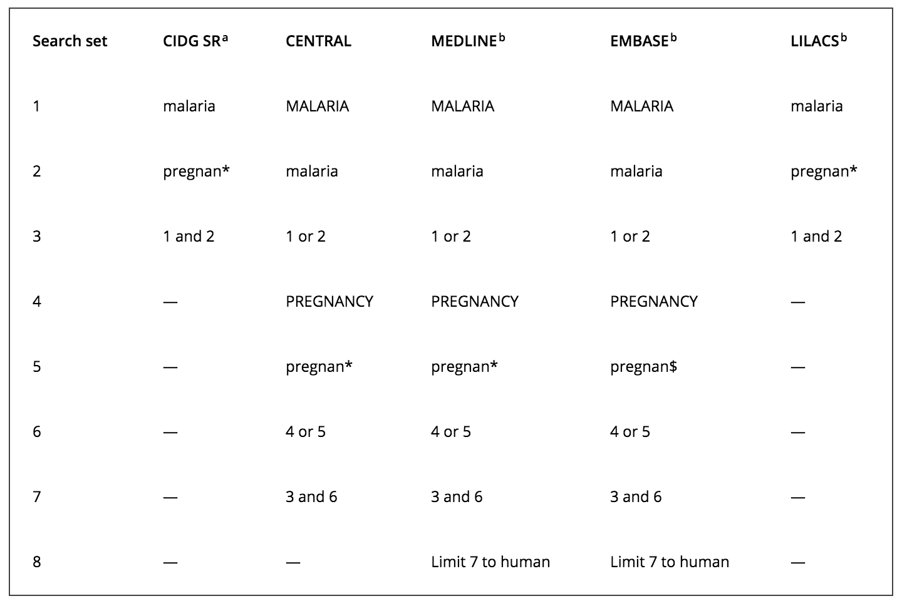

--- 
knit: "bookdown::preview_chapter"
---

# (PART) Part II: How to be a Better Consumer of Research {-}

# Searching the Literature {#literature}

The starting point of every research study is a literature review. To know where you are going, you need to know where the field has been. Technology makes this easier in some ways than it has been in the past, but we're swimming in information, and the pool gets deeper every day. 

A lot deeper, actually.

Google's former CEO Eric Schmidt has [said we create as much information every two days as we did from the beginning of time through 2003](http://techcrunch.com/2010/08/04/schmidt-data/). Two days! And he said this back in 2012, so it's an even shorter time span today. Of course the "cat photo" to "research finding" ratio is probably something like 1,000,000:1 nowadays, but this only makes the point that good information can be hard to find.

In this chapter we'll discuss a strategy for quickly getting a sense for the state-of-the-art in health research, and then outline the steps you need to take to ask a good research question and search the literature for primary sources.

## Start with Systematic Reviews and Meta-Analyses

```{block, type='rmdplay'}
Systematic reviews and meta-analyses ([PDF slide deck](https://drive.google.com/open?id=0Bxn_jkXZ1lxuU2lYSXZ4NWpndEE))
```

```{r ch2systematic, echo=F}
knitr::include_url("https://warpwire.duke.edu/w/BFYBAA/")
```

Repeat after me:

> I will not start my research by Googling "malaria". 
> I will not start my research by Googling "malaria". 
> I will not start my research by Googling "malaria".

If your topic is malaria and you're not sure if the vector is mosquitos or monkeys, then [Wikipedia](https://en.wikipedia.org/wiki/Malaria) is probably a good place to start. There's no shame in that. Otherwise, it is always a good idea to begin with a check for relevant systematic reviews or meta-analyses. Finding a good review beats Googling "malaria" any day.  

### Meta-Analyses

A **meta-analysis** is a quantitative approach in which the results from multiple studies are combined to estimate an overall effect size. We'll talk more about effect sizes later, but the concept is pretty simple. Let's use a meta-analysis by Radeva-Petrova et al. [-@radevapetrova:2014] as an example.

The authors reviewed 17 studies of the effects of chemoprevention on pregnant women living in malaria-endemic areas. The basic question they set out to answer with their review was as follows: Do women who take antimalarial medication during pregnancy have a lower risk of getting infected with malaria, and thus a lower risk of experiencing the bad health outcomes that are associated with malaria?

One **indicator** of malaria infection is parasitaemia, or the presence of malaria parasites in the blood. If chemoprevention has some preventive effect, you'd expect to see less parasitaemia among women exposed to the medication (aka, treatment). Few interventions are 100% effective, so we often talk about reductions in the risk of bad outcomes like malaria. This is one type of **effect size**, a measure of the strength or magnitude of a relationship, such as the relationship between taking a medicine and experiencing a bad outcome.

Here is a **forest plot** from Radeva-Petrova et al. [-@radevapetrova:2014] that shows the results of 10 studies (8 trials) that compared cases of parasitaemia among 3,663 pregnant women who were randomized to an **intervention group** (*n*=2,053) that received some preventive antimalarial drug or to a control group (*n*=1,610) that received a **placebo** (or nothing). 

```{r malariaforest, fig.cap="Source: Radeva-Petrova et al. (2014), http://bit.ly/2hwwpOI", echo=F}
knitr::include_graphics("images/rpforest.png", dpi = NA)
```

```{block, type='rmdcomment'}
Here's how Lewis and Clarke [-@lewis:2001] describe a forest plot:

> In a typical forest plot, the results of component studies are shown as squares centered on the point estimate of the result of each study. A horizontal line runs through the square to show its confidence interval—usually, but not always, a 95% confidence interval. The overall estimate from the meta-analysis and its confidence interval are put at the bottom, represented as a diamond. The center of the diamond represents the pooled point estimate, and its horizontal tips represent the confidence interval. Significance is achieved at the set level if the diamond is clear of the line of no effect.
 
> The plot allows readers to see the information from the individual studies that went into the meta-analysis at a glance. It provides a simple visual representation of the amount of variation between the results of the studies, as well as an estimate of the overall result of all the studies together. Forest plots increasingly feature in medical journals, and the growth of the Cochrane Collaboration has seen the publication of thousands in recent years.

Lewis and Clarke [-@lewis:2001] discovered that the first forest plot was published in 1978, and first used in a meta-analysis in 1982. The name lagged behind, appearing first in 1996, apparently referring to the forest of lines typical of most forest plots.
```

Details about each study are reported as rows in this figure. Take a look at the study by Shulman et al. [-@shulman:1999] in row 6. This study found that 30 of the 567 women in the intervention group tested positive for parasitaemia (i.e., malaria). This compared to 199 of the 564 woman in the control group. This is a risk ratio of 0.15—`(30/567)/(199/564) = 0.15`—which means that chemoprevention reduced the risk of parasitaemia by 85%. This is a huge effect size!

The effect size for each study is presented in the far right column and depicted graphically in the size of point estimate square. All of the point estimates fall to the left of the line of no effect (<1), thus favoring chemoprevention because you want to reduce the risk of this bad outcome. [A risk ratio of 1 would indicate no difference in risk, and a ratio >1 would mean the risk is higher among the intervention group, thus favoring the control group.] The overall (pooled) effect size is shown last as 0.39, or a 61% reduction in the risk of parasitaemia.

We won't bother ourselves with the calculation of this pooled effect size, other than to note that it's not as simple as averaging the 10 studies. This is because the studies were not given equal weight, as you can see in the "weight" column. For instance, Greenwood et al. [-@greenwood:1989] only had a sample size of `21+13=34` children. As a result, the effect size estimate is very noisy. The 95% confidence interval is wide and crosses 1. Consequently, its weight of 6.7% is lower than the others. Simply put, studies weaker research designs get less weight in the analysis.

So here in one figure we get a summary of the best available evidence and an estimate of the overall effect size, with uncertainly intervals. You can't get that from a Google search.

### Systematic Reviews

You might be wondering how Radeva-Petrova et al. [-@radevapetrova:2014] found these studies in the first place. The answer is through a **systematic review** of the literature. 

Most, if not all, meta-analyses will be completed as part of a systematic review of the literature, and every systematic review is a type of literature review. But not every literature review is a systematic review, even if done *systematically*.

```{r reviewcircles, fig.cap="Literature reviews, systematic reviews, and meta-analyses", echo=F}
knitr::include_graphics("images/reviewcircles.png", dpi = NA)
```

As you can see from the table below, a systematic review requires a number of steps that are good practice, but too thorough and time-consuming for the general literature review you might prepare when starting your work. Nevertheless, you need to know the general process of preparing a systematic review to evaluate the quality of the reviews you read, and you'll hopefully pick up some good habits along the way.

```{r sysrev, echo=F}
sysrev <- data.frame(sr=c(
"The goal of a systematic review is to be comprehensive and include every relevant article.",
"For this reason, most systematic reviews are conducted by teams given the large scope of the work.",
"Systematic reviews must define and follow a method that can be replicated, just like any other study.",
"Most systematic reviews pre-register this plan, meaning that the authors submit their planned methods to a registry like [PROSPERO](http://www.crd.york.ac.uk/PROSPERO/) prior to conducting the study. Pre-registration gives other researchers confidence that the team is not cherry picking results at the end to make an interesting paper. It also lets other researchers know that a group is already working on the same review, thus signaling that their work might duplicate efforts and fail to get published.",
"Included in these pre-registration plans will be a specific search strategy with exact search terms for individual scholarly databases so other researchers can recreate the search.",
"Similarly, a systematic review must also outline clear criteria for including and excluding studies (e.g., keep if assignment to study arms was random). With these criteria in place, team members screen all search results, usually starting with title and abstract reviews only and moving to full text reviews as the pool of eligible studies dwindles.",
"Systematic reviews also develop and follow guidelines for extracting details from every included  study, such as numbers of participants and key outcomes.",
"Finally, teams conducting systematic reviews formally assess the quality of each included study, including the potential for bias, and take these assessments into account when synthesizing the results."),
lr=c("The literature review that you write for the introduction of your manuscript is not expected to be exhaustive.",
"literature reviews can be handled solo.",
"Literature reviews, on the other hand, don't have to follow such rigid methods or make the methods explicit.",
"Not the case for literature reviews.",
"It's a good idea to do the same for a literature review, even if not a strict requirement.",
"Screening for a literature review is typically less intensive.",
"An annotated bibliography might suffice for a literature review.",
"This process is more ad hoc for literature reviews."))
names(sysrev) <- c("Systematic Reviews", "Literature Reviews")

knitr::kable(sysrev, format = "html", 
caption = 'Comparing systematic reviews and literature reviews.'
) %>%
  html_table_width(c(300,300))
```
 
#### Where to find systematic reviews{-}

Three excellent sources for finding systematic reviews (and meta-analyses) in global health are the [Cochrane Library](http://www.cochranelibrary.com/), the [Campbell Collaboration](http://www.campbellcollaboration.org/), and [3ie](http://www.3ieimpact.org/evidence/systematic-reviews/). You can also get to many of the reviews in these databases by searching within PubMed using the [Clinical Queries](http://www.ncbi.nlm.nih.gov/pubmed/clinical) feature.

#### How to read systematic reviews{-}

##### Abstract and plain language summary{-}

Cochrane reviews follow a standard format that can look overwhelming at first, but is actually quite easy to read and understand. As with most journal articles, Cochrane reviews begin with an *Abstract*. Next comes a *Plain language summary* which can be helpful for newcomers to a particular topic. Radeva-Petrova et al. [-@radevapetrova:2014] include the following passage in their plain language summary:

> For women in their first or second pregnancy, malaria chemoprevention prevents moderate to severe anemia (high quality evidence); and prevents malaria parasites being detected in the blood (high quality evidence). It may also prevent malaria illness. We don't know if it prevents maternal deaths, as this would require very large studies to detect an effect.

This one paragraph brings us up to speed with the state of the science for preventing malaria and its effects among pregnant women living in malaria-endemic areas (and points you to some gaps in the literature!). Google does not filter the evidence in this manner. Starting with systematic reviews pays off almost every time.

##### Summary tables{-}

Next come the *Summary tables*, such as the one presented below from Radeva-Petrova et al. [-@radevapetrova:2014]. These tables round out everything you need to make your initial judgment. 

```{r summary1, fig.cap="Malaria chemoprevention for pregnant women living in endemic areas. Source: Radeva-Petrova et al. (2014), http://bit.ly/1U3q2Oj", echo=F}
knitr::include_graphics("images/summary1.png")
```

The first comparative risk column shows the assumed risk among the control group. For instance, the risk of antenatal parasitaemia is 286 events per every 1,000 people. This is the median control group risk across eight trials of 3,663 women. The relative risk is 0.39—recall that this is the pooled, or "meta" effect size—so you can see how the corresponding risk among the intervention group is `286*0.39=111` per 1,000 people.[^tbldetails] 

As shown in the final column, the quality of this evidence is rated as "high". The authors are referring here to [GRADE criteria](http://www.gradeworkinggroup.org), a systematic approach to evaluating the quality of empirical evidence:

1. **High**—Further research is very unlikely to change our confidence in the estimate of effect.
2. **Moderate**—Further research is likely to have an important impact on our confidence in the estimate of effect and may change the estimate.
3. **Low**—Further research is very likely to have an important impact on our confidence in the estimate of effect and is likely to change the estimate.
4. **Very Low**—We are very uncertain about the estimate.

[^tbldetails]: For more information on summary tables, see [here](http://www.cochranelibrary.com/about/explanations-for-cochrane-summary-of-findings-sof-tables.html).

##### Background{-}

Much of what you want to know you can learn from the abstract, summary text and tables, and forest plots (if included). If you keep reading, you'll come next to the *Background* section. This is typically a short overview that explains what gaps in our knowledge the review is intended to fill. Radeva-Petrova et al. [-@radevapetrova:2014] use this section to present a conceptual framework for malaria prevention during pregnancy.

```{r concept, fig.cap="Drugs for preventing malaria in pregnancy: conceptual framework. Source: Radeva-Petrova et al. (2014), http://bit.ly/1U3q2Oj", echo=F}
knitr::include_graphics("images/concept.png")
```

##### Methods{-}

The *Methods* section details how the review was organized and conducted. The purpose of this section is to provide enough detail to enable other researchers to attempt to replicate the review. The main components are:[^prisma]

1. A description of the population and intervention.
2. The key outcomes of interest.
3. The search strategy and databases.
4. Inclusion and exclusion criteria for studies.
5. Procedures for extracting information from each study.
6. Procedures for assessing bias and conducting a meta-analysis (if one is included)

[^prisma]: See the [PRISMA Statement](http://www.equator-network.org/reporting-guidelines/prisma/) for a checklist of components to include in each section.

##### Results{-}

The *Results* section typically begins with details about how many primary articles were identified, screened, and excluded, typically presented graphically with a flow diagram like the one below from Radeva-Petrova et al. [-@radevapetrova:2014].

```{r flowdiag, fig.cap="Study flow diagram. Source: Radeva-Petrova et al. (2014), http://bit.ly/1U3q2Oj", echo=F, fig.height=5}
knitr::include_graphics("images/flowdiag.png")
```

Once the included studies are identified, it's customary for review authors to report on the quality of the evidence presented in each study. We'll discuss the nature of these sources of bias in a later chapter, but you should familiarize yourself with these heatmaps. While a bit on the ugly side, they provide a useful summary of bias. As a future producer of research, you should start to look at these figures and think, "how can I make sure my studies are full of green pluses?"

```{r bias, fig.cap="Risk of bias summary: review authors’ judgements about each risk of bias item for each included trial. Source: Radeva-Petrova et al. (2014), http://bit.ly/1U3q2Oj", echo=F}
knitr::include_graphics("images/bias.png")
```

##### Discussion and conclusions{-}

Discussion sections provide a short summary of the findings, commentary on the quality of the evidence, and thoughts about what the review adds to the existing literature on the topic. A discussion tends to be short relative to the size of the overall review. 

Discussion sections are often followed by a brief statement of the authors' conclusions. This is an opportunity for the authors to frame the results in terms of the implications for practice and research. 

Radeva-Petrova et al. [-@radevapetrova:2014] conclude:

> Routine chemoprevention to prevent malaria and its consequences has been extensively tested in RCTs, with clinically important benefits on anemia and parasitaemia in the mother, and on birth-weight in infants.

In other words, "chemoprevention works" in this context.

##### Appendices{-}

Reading the appendices will give you a sense of what it takes to put together a systematic review. There are usually tables after tables of characteristics of included and excluded studies, often followed by dozens of forest plots if the systematic review includes a meta-analysis with several outcomes or populations of interest. Radeva-Petrova et al. [-@radevapetrova:2014] wrap up on page 120!

## Devising a Search Strategy

Hopefully at this point you'll agree that it's a good idea to start with a systematic review, not a search engine. Of course not every topic has been the subject of a recent systematic review or meta-analysis, so you'll sometimes need to search the primary literature yourself. I'll show you how, but first you need to clearly define what you're looking for.

### Asking a research question

Here's a helpful mnemonic for creating a good clinical question: [PICO](http://guides.mclibrary.duke.edu/c.php?g=158178&p=1035882).

```{r pico, echo=FALSE}
  pico <- data.frame(letter=c("**P**", "**I**", "**C**", "**O**"),
                     label=c("Patient, Population, or Problem",
                             "Intervention, Prognostic Factor, or Exposure",
                             "Comparison",
                             "Outcome"))
  names(pico) <- NULL
  knitr::kable(pico, col.names=NA)
```

Let's use PICO to develop a well-focused, searchable research question on treating malaria during pregnancy. The **problem** we want to address is malaria infections. The **population** is pregnant women living in malaria-endemic areas.  

Not every clinical question involves testing of a treatment or **intervention**, but we'll focus a lot on these types of questions in this book. For the example at hand, the intervention would be malaria chemoprevention. [Prognostic factor refers to covariates that could influence the prognosis of the patient. An exposure would be something that we think might increase the risk of an outcome.]

Similarly, not every question involves a **comparison** group.[^RCTcomp] In this example, the comparison is nothing or a placebo.

[^RCTcomp]: Randomized trials always will.

There are many potential **outcomes** for treating malaria. In this case, let's focus on parasitaemia.

We can combine all of this into a research question: 

> Among pregnant women living in malaria-endemic areas, is chemoprevention more effective than a placebo at preventing parasitaemia?

### Approaches

With your basic research question outlined, you're ready to begin searching. At the beginning you might take a quick and dirty™ approach to get started. Eventually you'll need to graduate to a proper search strategy to be more systematic, even if your end goal is not a capital "S" Systematic review. 

#### Quick and dirty{-}

A reasonable initial approach is to find a few recent articles to get a quick sense of what is out there. Google Scholar *could* come in handy here. For instance, my advanced Google Scholar search for PICO terms "malaria pregnant chemoprevention parasitaemia" (limited to recent years) identified a paper by Braun et al. [-@braun:2015] on the use of intermittent preventive treatment in pregnancy (IPTp) with sulfadoxine–pyrimethamine (SP)—a specific type of chemoprevention—on malaria infections among pregnant women in western Uganda.

```{block, type='rmdtip'}
Customize your Google Scholar experience by clicking on the gear icon. Enable use of a bibliography manager, and click on "Library links" to add your library to get links to full text.
```

A good starting point for future searching is to note an article's **keywords**. Not all journals print keywords, but if they do, you'll probably find them right after the abstract. 

Next comes the **introduction**. Some journals and disciplines have very brief introduction sections and might not be of much help. This is often true in medicine and public health. 

The **discussion** section is also a place to look for new leads. Authors typically use the discussion to link the study results to the existing literature, demonstrating how the results add to what is already known.

After looking at the introduction and discussion sections, it's often useful to skim the **references** to get a sense of which journals publish this type of work. If a certain journal appears to be a common outlet for this work, a scan of the journal's table of contents for recent issues could be useful.[^hand]

[^hand]: This is referred to as "hand searching".

```{block, type='rmdtip'}
If you have access to a university library, you can learn more about the scholarly journals in a field by looking up [*Journal Citation Reports*](https://en.wikipedia.org/wiki/Journal_Citation_Reports). This annual report ranks the journals in each field according to impact factors. [Impact factors](https://en.wikipedia.org/wiki/Impact_factor) are one metric used to evaluate the importance of a journal in its field.
```

#### More systematic{-}

##### Plan and document your search strategy{-}

Whether or not you are conducting a capital "S" Systematic review, it's a good idea to plan and document your search. You don't need to be as thorough in a lit review as you would for a systematic review, but it wouldn't hurt to take a page from the approach. Let's look at Radeva-Petrova et al. [-@radevapetrova:2014] for some inspiration.

Every good systematic review will include a table or appendix like this one to make the method reproducible. If you and I run this search query at the same time on two different computers, we should get the same results.

```{r search, fig.cap="Source: Radeva-Petrova et al. (2014), http://bit.ly/1U3q2Oj", echo=F}

```

For the purposes of your literature review, you don't necessarily need to ensure that other people can recreate your results, but you should make sure that *you* can. 

```{block, type='rmdtip'}
Create an account within the database you are searching to login and save your search approaches and make it easier to retrace your steps at a later date. Also, differences in the design of each database and interface often require you to customize your search. If you are conducting an actual systematic review that you wish to publish—as opposed to just searching the literature systematically—then you should consult with a librarian who will be familiar with the intricacies of building search strategies.
```

##### Selecting a database{-}

As you can see from the table, Radeva-Petrova et al. [-@radevapetrova:2014] searched five databases. MEDLINE is probably the most well known of this group. When you search [PubMed](http://www.ncbi.nlm.nih.gov/pubmed), you are searching the MEDLINE database. This is typically a good place to start to find health-related studies. Talk with a research librarian to understand if other databases might be a better choice for your topic.

##### Generate search terms{-}

Once you decide on a database, you need to generate search terms. Start with the keywords published with the sample articles you dig up.

You can learn a lot about potential keywords by searching for [**MeSH**](http://www.ncbi.nlm.nih.gov/mesh) terms. MeSH, which stands for "Medical Subject Headings", is a controlled vocabulary thesaurus that is used to index articles in PubMed. This thesaurus is helpful because there are often many ways to refer to the same phenomenon. For instance, the MeSH term for "breast cancer" is "Breast Neoplasm". When you search for "breast cancer" in PubMed, the database helps you out by casting a wider net by including the MeSH term automatically behind the scenes (note: it doesn't always do this! You can check up on what PubMed includes in the search by clicking on the search details link after running a search):

`"breast neoplasms"[MeSH Terms] OR ("breast"[All Fields] AND "neoplasms"[All Fields]) OR "breast neoplasms"[All Fields] OR ("breast"[All Fields] AND "cancer"[All Fields]) OR "breast cancer"[All Fields]`

Turns out there are a lot of ways that we refer to breast cancer! The following entry terms are indexed to the MeSH term "breast neoplasms" by humans at PubMed:

* Breast Neoplasm
* Neoplasm, Breast
* Neoplasms, Breast
* Tumors, Breast
* Breast Tumors
* Breast Tumor
* Tumor, Breast
* Mammary Neoplasms, Human
* Human Mammary Neoplasm
* Human Mammary Neoplasms
* Neoplasm, Human Mammary
* Neoplasms, Human Mammary
* Mammary Neoplasm, Human
* Mammary Carcinoma, Human
* Carcinoma, Human Mammary
* Carcinomas, Human Mammary
* Human Mammary Carcinomas
* Mammary Carcinomas, Human
* Human Mammary Carcinoma
* Breast Cancer
* Cancer, Breast
* Cancer of Breast
* Mammary Cancer
* Malignant Neoplasm of Breast
* Malignant Tumor of Breast
* Breast Carcinoma
* Cancer of the Breast

Back in the world of mosquitos, the MeSH term for "malaria" is "malaria", conveniently, and a search for this term in PubMed actually searches:

`"malaria"[MeSH Terms] OR malaria[All fields]`

The following entry terms are indexed to the MeSH term "malaria":

* Remittent Fever
* Fever, Remittent
* Paludism
* Plasmodium Infections
* Infections, Plasmodium
* Infection, Plasmodium
* Plasmodium Infection
* Marsh Fever
* Fever, Marsh

##### Running your search{-}

Once you have some initial search terms, it's time to build and run your query. This will be an iterative process, full of trial and error. You might start with 200,000 results. Some terms and combinations will fail to narrow this field. Others will trim too much. 

```{r boo, fig.cap="Boolean operators: AND, OR, NOT", echo=F}
knitr::include_graphics("images/boolean.jpg", dpi = NA)
```

You'll need to know some basic Boolean operators to be an effective searcher: AND, OR, NOT. For instance, let's consider the search PubMed runs when you enter "malaria OR pregnancy":

`("malaria"[MeSH Terms] OR "malaria"[All Fields]) OR ("pregnancy"[MeSH Terms] OR "pregnancy"[All Fields])`

These four terms are combined with `OR`, meaning we keep results that match *any* of these terms. At the time of writing, PubMed returns 922,588 results. 

Of course it would make more sense to search for "malaria AND pregnancy", instead of "malaria OR pregnancy":

`("malaria"[MeSH Terms] OR "malaria"[All Fields]) AND ("pregnancy"[MeSH Terms] OR "pregnancy"[All Fields])`

The first two terms and last two terms are combined separately with `OR`. These combinations are then combined with `AND` (notice the use of parentheses to segment the operations), dropping our pool of results to 4,203 records. The `AND` operator will always maintain or decrease the number of results.  

If we want to limit the results humans, we can add `AND "humans"[MeSH Terms]` to the end.[^humans] Doing so drops our pool of results to 3,798. 

[^humans]: PubMed lets you limit results to humans or animals from the results page with one click, so it's not essential to use Boolean operators manually in this case. PubMed will do it behind the scenes for you.

`("malaria"[MeSH Terms] OR "malaria"[All Fields]) AND ("pregnancy"[MeSH Terms] OR "pregnancy"[All Fields]) AND "humans"[MeSH Terms]`

Alternatively, we could use the `NOT` operator to limit the results to non-humans, but `NOT` is not commonly used. No it's not.

Let's return to our PICO question and use Boolean operators to combine the components. 

> Among pregnant women living in malaria-endemic areas, is chemoprevention more effective than a placebo at preventing parasitaemia?

Here's what we want to do in plain English:

* pregnancy `OR` pregnant women
* `AND` malaria endemic
* `AND` chemoprevention (if you know specific drugs to search, string together with `OR`s)
* `AND` randomized controlled trial
* `AND` parasitaemia

As I tap out these words on my keyboard, this search returns 513 records in PubMed. 

Once you are satisfied with your results, you could choose to apply the same search to another database. This might be worth the effort if your topic crosses disciplinary boundaries, like economics and health. Best to check with a research librarian. 

Oh hey, here's one now:

```{block, type='rmdplay'}
5 tips for PubMed searching
```

```{r fivetips, echo=F}
knitr::include_url("https://www.youtube.com/embed/6wWeeCBBlk4")
```

##### Screening results{-}

Even the best search queries return some duds, so the next step is screening. We can return to Radeva-Petrova et al. [-@radevapetrova:2014] to see what a thorough approach looks like. You would likely take some shortcuts for a regular literature review.

Typically systematic review searches will return hundreds or thousands of potential hits, so a study team will screen titles and abstracts to exclude obvious mistakes. When beginning this process, it's common to have team members screen some of the same records to establish **reliability**, a concept that we will discuss in more depth in the chapter on measurement. Basically, you want to know that everyone screening records would make the same inclusion/exclusion decision.

The Radeva-Petrova et al. [-@radevapetrova:2014] search strategy turned up 179 unique records, and the authors excluded 126 of these records after screening the abstracts. The excluded studies did not meet certain *pre-defined* criteria. For instance, the authors only wanted to include studies using RCTs and quasi-experimental designs.

This left the team with 53 studies that required a full-text review. Only 17 of the 53 studies still met eligibility criteria after this review.[^foot22]

[^foot22]: These 17 trials were described in 22 articles. 

##### Supplemental searches{-}

It is customary in a systematic review–and helpful in general reviews—to augment database searches with reference reviews and hand searches to ensure that no key references were missed in the database query. A reference review is nothing more than a scan of an eligible article's bibliography. In a hand search, you would go to the website of journals that published the eligible articles and scan the tables of contents for each issue published during the search window. If you find that either supplemental method turns up a lot of new results, it could make sense to revise your systematic review search strategy to be more comprehensive.

##### Extracting data{-}

Depending on your objectives you might choose to systematically extract data from each study—key facts related to study design, methods, and results. Or you might take a shorter path and create an annotated bibliography. 

If you need to be more systematic—an essential requirement for a capital "S" Systematic review—then you need to design a data extraction strategy. Your PICO research question can be a helpful guide to identifying the minimum data you should extract. Returning to Radeva-Petrova et al. [-@radevapetrova:2014]: 

> Among pregnant women living in malaria-endemic areas, is chemoprevention more effective than a placebo at preventing parasitaemia?

Some possibilities include:

* study setting/population
* sample size
* sample demographics, including parity
* study design
* intervention details, such as specific medication and dose
* primary outcome (e.g., parasitaemia)
* effect size

There are numerous software options for storing your extracted data, but you'll likely find that a simple spreadsheet with rows of studies and columns of study variables will work just fine. Lots of teams use this approach for big systematic reviews, so it will probably serve you well for something more modest.

## For the Love of Everything Holy Use a Reference Manager

Even if you chose to ignore everything I've written up to this point, do yourself a favor and use a program for managing references. I'm amazed every year when I learn that students on the precipice of graduation manually type and format their in-text citations and bibliographies. What a waste of time!

There are several reference managers you might consider. I'll mention one because it is free and open-source: [Zotero](https://www.zotero.org/). The concept of "free" does not need much explanation, but students often have several free options that are not really free. A good example is a program like EndNote. A university might make this program a free download for enrolled students, but the license expires upon graduation or soon becomes obsolete without a paid upgrade. Additionally, in global health it's common to work with colleagues who do not have access to a program like EndNote, which makes collaboration challenging. For these reasons, I highly recommend a program like Zotero that is free to use and open to improve.

A tutorial is beyond the scope of this chapter, but it's worth mentioning some features that are common to many reference managers:

* Easy importing of references from databases like PubMed. Go from your search results to reference manager in seconds.
* Automatic retrieval of full-text PDF.
* Sync PDFs in collection to tablets and phones
* Connections to word processing software to make inserting references in papers a snap.
* Automatic creation of bibliographies based on works cited.
* Push button reformatting of in-text citations and references to different styles, such as APA and Harvard.
* Shared collections with automatic syncing via the cloud to facilitate collaboration.
* Easy export of references for migration to just about any other reference manager.

So next time you see someone typing references and complaining about APA formatting, open your laptop and run your reference manager. Watch them weep!

## Share Feedback{-}

This book is a work in progress. You'd be doing me a big favor by taking a moment to tell me what you think about this chapter.

```{r CH02feedback, echo=F}
knitr::include_url("https://duke.qualtrics.com/SE/?SID=SV_737a1xu4Igskgxn",
height="600px")
```

## Test Yourself{-}

```{r CH02rq, echo=F}
knitr::include_url("https://duke.qualtrics.com/SE/?SID=SV_ebuqsfKPPCXwAYJ",
height="1000px")
```

