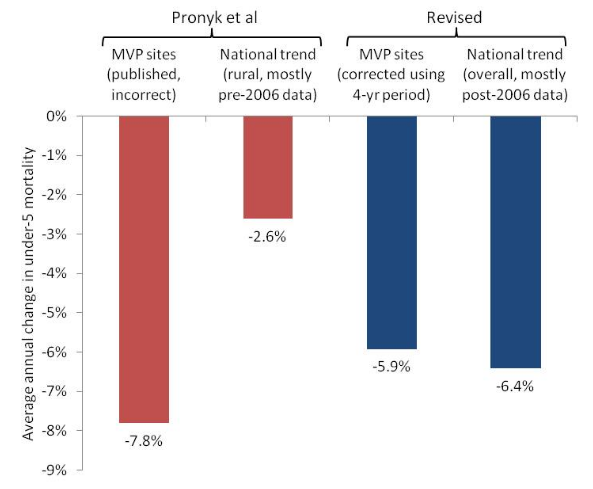
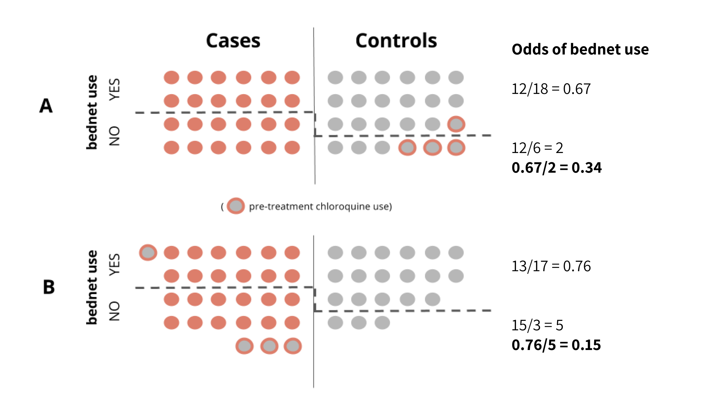

--- 
knit: "bookdown::preview_chapter"
---

# Critical Appraisal {#critical}

Whether you are a clinician treating patients, a public health official making policy recommendations, or a representative of a donor agency responsible for setting funding priorities, your decisions should be based on evidence, not beliefs. The phase "evidence-based" first came into use in the 1990s, nearly two decades after Archie Cochrane highlighted how medical practice lagged behind what science had to say about "what works". Medical schools soon began teaching their students [**evidence-based medicine**](https://en.wikipedia.org/wiki/Evidence-based_medicine) (EBM), defined by @sackett:1996 as:

> The conscientious, explicit and judicious use of current best evidence in making decisions about the care of the individual patient. It means integrating individual clinical expertise with the best available external clinical evidence from systematic research.

Thereafter, we witnessed an expansion of the "evidence-based" idea to evidence-based practice more generally, as well as to population-level approaches such as evidence-based public health [@brownson:2009] and evidence-based global health policy [@yamey:2011]. As in EBM, these newer conceptualizations aim to adopt policies and programs that have been shown to save lives and improve health at scale. But before policy makers can make evidence-based decisions, the scientific community must evaluate the strength of the evidence. This is commonly referred to as **critical appraisal**, the topic of this chapter.

```{block, type='rmdplay'}
```

```{r ebm, echo=F}
knitr::include_url("https://www.youtube.com/embed/Z_yiUf3f92s")
```

## Be Skeptical of News Reports and Press Releases

Much of what we learn about scientific results from the media comes in the form of click bait, such as [this article in Discover Magazine](http://blogs.discovermagazine.com/seriouslyscience/2016/07/27/your-next-mosquito-repellant-could-be-made-from-chicken-odor/#.V6HRqJMrLwc) titled "Want to avoid malaria? Just wear a chicken." Would you be surprised to know that the study did not actually require people to wear chickens?[^jaleta]

[^jaleta]: What did this study actually do and find? Jaleta et al. [-@jaleta:2016] placed [CDC mini-light traps](http://www.cdc.gov/museum/history/mosquito.html) at the foot of a bed in each of 11 homes in an Ethiopian village called Wama Kusaye. They introduced 11 "treatments" over 11 days in a [Latin Square](https://en.wikipedia.org/wiki/Latin_square) experimental design and recorded the number of mosquitoes caught in the traps overnight. One of the treatments was indeed a live chicken, but fortunately no human participants were asked to carry it around or let it crawl into bed. Interestingly, a blood meal analysis suggested that *Anopheles arabiensis* avoids biting chickens, and sticking a live chicken in a cage resulted in a significant reduction in the number of mosquitoes caught in the traps. Odor compounds specific to the air around chickens also achieved this result.

> According to [this study](http://malariajournal.biomedcentral.com/articles/10.1186/s12936-016-1386-3), malaria might be avoided by carrying a chicken everywhere. Despite the outlandish title, this news report got it mostly right. If you turn on the news or read a university press release, you'll often find summaries and claims that go far beyond the conclusions of the original article. Most studies give do us a small glimpse of the "truth," but the measured and careful language of scientific articles does not always capture the attention of the public.

```{block, type='rmdcomment'}
Part of the problem is also that good science writers are hard to come by. One of the best is Ben Goldacre, a British psychiatrist who runs the [EMB Data Lab](https://ebmdatalab.net/) at the [Centre for Evidence-Based Medicine](http://www.cebm.net/) at the University of Oxford. He wrote the *Guardian's* ["Bad Science"](https://www.theguardian.com/science/series/badscience) column for a decade, and later published a [great book](http://amzn.to/2aKLGaQ) with the same title. His more recent work can be reviewed on [AllTrials](http://www.alltrials.net/).
```

```{block, type='rmdplay'}
```

```{r oliver, echo=F}
knitr::include_url("https://www.youtube.com/embed/0Rnq1NpHdmw")
```

## Peer-Reviewed Does Not Mean "Correct"

Journalists and communications professionals can and do make mistakes in summarizing and interpreting scientific findings, but sometimes the problem is with the study authors. 

*How can published research be flawed if it was peer-reviewed?*

**Peer review** is an important component of the scientific process, but it is not a guarantee of "truth" or a certification of the results. So what is peer review?

```{block, type='rmdcomment'}
Exhibit A for peer review does not mean "correct": a *Lancet* article published by Pronyk et al. [-@pronyk:2012] about the impact of the [Millennium Villages Project](https://en.wikipedia.org/wiki/Millennium_Villages_Project) (MVP) on child survival in rural sub-Saharan Africa. 

The MVP was founded by economist [Jeffrey Sachs](https://en.wikipedia.org/wiki/Jeffrey_Sachs) as a proof of [his concept](http://amzn.to/2aUF9dJ) that extreme poverty could be solved, and the [**Millennium Development Goals**](https://en.wikipedia.org/wiki/Millennium_Development_Goals) met, with a big financial push. The basic idea behind a Millennium Village is to intervene across sectors simultaneously—water, sanitation, education, health, etc.—to give communities a chance to escape the poverty trap. 

Sachs and his colleagues published their first comprehensive report on the MVP in *The Lancet*—***a high-impact, peer-reviewed journal***—with the stated aim to "assess progress towards the MDGs and child survival over the project's first 3 years and compare these changes to local trends." The authors examined child mortality rates across nine Millennium Villages and concluded the following:  

> <span style="color:white">*The average annual rate of reduction of mortality in children younger than 5 years of age was three times faster in Millennium Village sites than in the most recent 10-year national rural trends (7·8% vs 2·6%).*
</span>

When this PEER-REVIEWED article was published online, Bump et al. [-@bump:2012] challenged the calculation of both of these figures and the resulting interpretation that the MVP had a large impact on child mortality. One of the authors of this criticism, Gabriel Demombynes, explained the errors in [this post](http://blogs.worldbank.org/impactevaluations/the-millennium-villages-project-impacts-on-child-mortality).

First, Pronyk et al. [-@pronyk:2012] annualized (aka, divided) the 21.7% cumulative decline in mortality by 3 for the number of years the intervention was active rather than by 4, the correct time window in this retrospective assessment of mortality. This correction reduced the annual rate of decline among Millennium Villages from a claim of 7.8% to an actual 5.4%.

Second, Pronyk et al. [-@pronyk:2012] compared their estimated annual decline after 2006 (7.8%) to the results of national surveys in MVP countries from 2001 to 2010. A more appropriate comparison using all of the available post-2006 data suggests an average annual rate of decline of 6.4% across the 9 MVP countries.



Bump et al. [-@bump:2012] conclude:

> <span style="color:white">*The above observations imply that a key finding of the paper—that child mortality fell at the treatment sites at triple the nationwide rural background rate—is incorrect. Child mortality fell at 5·9% per year at the sites versus 6·4% per year on average across all areas of the countries in question (probably more in rural areas alone) according to the available data that most closely match the project period. This difference is not significant.*
</span>

Pronyk [-@pronyk:2012e] published a correction that was noted by [Retraction Watch](http://retractionwatch.com/2012/05/31/millennium-villages-project-forced-to-correct-lancet-paper-on-foreign-aid-as-leader-leaves-team/). This is an example of [post publication peer-review](https://blogs.scientificamerican.com/information-culture/post-publication-peer-review-everything-changes-and-everything-stays-the-same/). 
```

### GETTING PAST THE GATEKEEPERS

Let's say you just completed what you think is a fascinating new study that upends years of conventional thinking on your research question. You could issue a press release and tell the world, but most scientists would reserve judgement or consider your results preliminary pending peer review. They would expect you to write a manuscript detailing your research design, data, methods, and results, and then submit this manuscript to an **academic or scholarly journal**.

Typically, your submission would be screened by the journal's editor, a role often filled by a senior scientist in your field. If the editor thinks that your paper is free of obvious fatal flaws and will be of interest the journal's readership, then the editor might assign it to an associate editor with some expertise on your topic to manage the peer review process.

### WHO IS A PEER?

The associate editor will then attempt to find 3 or more scholars in your field—your peers—to review the paper and comment on its merits. Some journals give you the option to recommend reviewers who might be a good fit and to request that certain colleagues are not considered. The editorial team does not need to respect your wishes, but finding appropriate reviewers is a challenge and you can help by suggesting scholars who are qualified to evaluate your work. So a "peer" can be:

* someone at your level, more junior, or more senior
* someone who shares the same conceptual framework regarding your topic of study, or someone who takes a different view entirely
* someone who works on a parallel topic, or someone who is a direct "competitor"
* someone who is a topic expert, or, when it's hard to find the right person, someone who does not have much background at all
* someone who is a technical expert on your methods, or someone who does not know the first thing about your chosen analytical approach

You'll probably never know. Most journals use a blind review process by which you don't know who accepts the editor's request to review your paper, and the reviewers are not informed of your identity. At least that's the idea. Sometimes reviewers give hints about their identity by recommending that you cite a lot of their own work. And sometimes it's easy to determine your identity as the author because your current work builds on your previous studies or you've already presented the work at scientific conferences.

### WHAT HAPPENS DURING THE REVIEW PROCESS?

Once your paper arrives on a reviewer's desk, he or she will take a few weeks (or months!) to recommend that your paper be rejected or accepted with no, minor, or major revisions. Some reviewers enumerate your perceived flaws in painstaking detail. Others give high-level comments that might be too vague to be helpful to you or the editor.

The editorial team reviews these reviews, and it's up to them to make a decision. Most academics are happy to get a "revise and resubmit" letter (aka, "R&R"). The editor will usually give some indication that a revised paper would have a good chance of publication, but it's not a guarantee. Sometimes the revised paper will go back out for further review, but the editor can also make the decision to accept the revision without additional input.

The editor has a tough task because it's often the case that reviewers take different positions on your submission. As Smith [-@smith:2006] suggested, these recommendations can be direct opposites:

* *Reviewer A: `I found this paper an extremely muddled paper with a large number of deficits'*

* *Reviewer B: `It is written in a clear style and would be understood by any reader'.*

So peer review is just like course evaluations!

### WHAT DOES NOT HAPPEN?

A critical thing to note, however, is that reviewers almost never have access to your data or analysis code. They base their decisions on what you said you did (your methods), what you said you found (your results), and what you said it all means (your discussion). You have to describe your data sources, but no one is checking your work. So even if reviewers find possible flaws in your logic, analysis mistakes and fraud go largely unchecked.[^gelman] 

[^gelman]: Andrew Gelman, a statistician at Columbia University writes a great (non-peer reviewed) blog and comments regularly on the [limitations of peer review](http://andrewgelman.com/2016/02/01/peer-review-make-no-damn-sense/) and the need for more post-publication review.

This lack of verification is why it is wrong for people to conclude that published in a peer-reviewed journal means correct. Journalists can harbor this belief, and defensive authors sometimes promote it when challenged on their study's findings. If it were true that `published==correct`, then we'd have no need for [**corrigendum**](https://en.wikipedia.org/wiki/Erratum) and retractions—and the website [Retraction Watch](http://retractionwatch.com/) would be empty.

### PEER REVIEW OF FUNDING PROPOSALS

Funding agencies like the NIH also use a peer review process to make funding decisions. When you send your grant to an institute at the NIH, a Scientific Review Officer (SRO) checks the proposal for completeness and assigns it to several peer reviewers serving on a Scientific Review Group. The reviewers write up their critiques and assign a [score from 1 (exceptional) to 9 (poor)](https://grants.nih.gov/grants/policy/review/rev_prep/scoring.htm). If your preliminary score is too low, the full committee may not discuss your proposal and it's the end of the road (unless you decide to improve and resubmit). 

If your proposal is discussed, the committee assigns a final score (multiplied by 10 to be on a scale of 10-90). After the meeting, you'll receive a summary statement with comments, the overall impact score, and the percentile score. If your proposal is above the payline—a percentile score that most institutes set based on the available budget—then your proposal will likely be funded. The overall [success rate](https://report.nih.gov/success_rates/Success_ByIC.cfm) in 2015 was 18.3%.

```{block, type='rmdplay'}
```

```{r grantreview, echo=F}
knitr::include_url("https://www.youtube.com/embed/fBDxI6l4dOA")
```

## How to be a Good Consumer of Research

Here's a [nice framework for how to be a good peer reviewer](https://github.com/jtleek/reviews) (aka, referee) that is a good starting point for thinking about how to be a good consumer of research more generally. In this guide, Leek describes a scientific paper as consisting of four parts.[^leek] I take the liberty of collapsing methodologies and data, as well as adding the Introduction.

1. An introduction that frames the research question
2. A set of methodologies and a description of data
3. A set of results
4. A set of claims

Leek offers a helpful recommendation about how to approach a new paper:

> Your prior belief about [#2-3] above should start with the assumption that the scientists in question are reasonable people who made efforts to be correct, thorough, transparent, and not exaggerate. 

[^leek]: [Jeffrey Leek](http://jtleek.com/) is a member of the biostatistics faculty at the Johns Hopkins Bloomberg School of Public Health and teaches a number of very popular MOOCs (Massive Open Online Courses) on data science. He has written several books on data analysis, and has created a few helpful guides like [this one on peer review](https://github.com/jtleek/reviews) that might be helpful for folks just starting out in the field.  

This book focuses mainly on how to read and write sections 1 and 2. I think you'll gain new insight into how to evaluate research results and claims if you make it to the end, but it's probably safe to say that you'll need more background in analysis to feel confident in your ability to critique findings and plan your own analysis.

### INTRODUCTION SECTION

A good *Introduction* will explain the aim of the paper and put the research question in context.[^hyp] In public health and medicine, this section will often be very short compared to what you'll find in other disciplines like economics. As a reader, you want to focus on understanding the research question. If you are familiar with the research area, you might also read the *Introduction* with a critical eye toward the literature reviewed. Did the authors miss any key references that could signal that they are unaware of developments in the field?[^pubdate]

[^hyp]: If the paper adopts a hypothesis-testing framework, you might find the hypothesis stated at the end of the Introduction or the beginning of the Method section.

[^pubdate]: Very recent work might be missing due to the long publication timeline. Most journal articles will print the date of submission and acceptance, so you can get a sense of whether the authors would have had an opportunity to include other published work.

### METHOD SECTION

A good *Method* section will provide enough information to let the reader attempt to replicate the findings in a new study. Journal space constraints make this challenging, so you'll often find that authors post supplemental materials online that give additional details.[^supp] Even with supplemental materials, however, it would be common to need to contact the author for additional details and materials if you really wanted to attempt a replication.

[^supp]: Supplemental materials are often published online "as is", meaning that the files are not typeset or peer reviewed.

The organization of the *Method* section will vary by discipline, but you should expect to find some information about the research design, subjects, materials or measures, data sources and procedures, and analysis strategy. The [**Equator Network**](http://www.equator-network.org/), which awkwardly stands for "Enhancing the QUAlity and Transparency Of health Research", is a good resource for understanding modern reporting standards. If you are preparing your own manuscript, most journals will expect you to include all of the information outlined in the checklist that's relevant for your research design. If you are reviewing an article, you can do your part to promote comprehensive reporting by referring authors to these checklists.

```{block, type='rmdtip'}
Include the completed checklist as an appendix with your article submission to head off reviewers who will complain about missing information that you definitely included on page 5, line 20 thank you very much.
```

#### Is the research design well-suited to answer the research question?{-}

This book will introduce you to common research designs in global health. What you should know at this point in your reading is that there are many different designs that could potentially answer most research questions, but not all designs are created equal. A graphic like the one you see in Figure \@ref(fig:loe) is commonly used in the EBM literature to convey this point. The meta-analyses and systematic reviews that you read about in **[Chapter 3](literature)** are 'studies of studies' and they sit atop the evidence hierarchy. They enjoy this status because they synthesize the best available evidence. No one study is the final word on a research question, so it should make sense that a meta-analysis that pools together results and accounts for variable study quality could potentially give you a better answer than any one study alone. 

```{r loe, fig.cap="Levels of evidence", echo=F}
knitr::include_graphics("images/levels.png")
```

However, the Cochrane Handbook for Systematic Reviews [-@cochrane] cautions us to pay attention to design features (e.g., how participants were selected) rather than labels (e.g., cohort study) because such labels are broad categories. Therefore, don't rely too much on this hierarchy. These rankings reflect ideals. It's possible to have a poorly designed or implemented RCT. The evidence from such a flawed study will not necessarily be better than the evidence from a non-randomized study just because it carries the label "randomized".

##### Is there a risk of bias and confounding?{-}

Some study designs are better than others (at least *in theory*) because of their ability to address potential bias when conducted properly. As we discussed in **[Chapter 2](science)**, the goal of scientific research is inference and we must live with some error and uncertainty. As a consumer of research, you have to accept this as fact and assess the extent to which a study's design and methods might lead us away from the "truth". 

Error comes in two flavors: random and systematic. **Random error** adds noise (aka, variability) to your data, but it does not affect the average. For instance, I might step on a scale and see that I weigh 185.12. I step off and back on, and this time I weigh 185.13.[^weight] This is random error that results from the limitations of my scale. If I keep taking measurements, this random error will balance out. Random means that the readings won't be systematically too high or too low.

[^weight]: This is my hypothetical example so I get to weigh whatever I want.

You've probably already guessed that **systematic error** is not random. Systematic error is also known as **bias** and represents a deviation from the "truth". Let's imagine that my scale is broken and I don't really weigh 185. I weigh 200. I can worry about the imprecise measurements of 185.12 and 185.13 all day, but I'd be missing the bigger problem that my scale is systematically reading the wrong weight. I can keep taking measurements over and over, but my scale is just wrong. If my goal is 186, I would come to the wrong conclusion that I can stop dieting!

```{block, type='rmdplay'}
```

```{r bias2, echo=F}
knitr::include_url("https://www.youtube.com/embed/EOXBlgMEqB0")
```

You can estimate random error (as we'll discuss in **[Chapter 9](sampling)**), but you typically don't know the extent to which bias affects your study results. For this reason, we often frame this as a "risk of bias". 

In a non-randomized design, the biggest risk of bias comes from potential **selection bias** [@cochrane]. Selection bias can take different forms. In the context of intervention research, selection bias represents pre-treatment (aka, baseline) differences between study groups. 

```{block, type='rmdcomment'}
For instance, Webster et al. [-@webster:2003] conducted a case-control study—a non-randomized, or observational study design that we'll discuss more in **[Chapter 13](observational)**—in Eastern Afghanistan to study the efficacy of bednets as a tool for preventing malaria. Patients who presented at the study clinic with a fever were tested for malaria. Those who tested positive were classified as "cases", and the rest were classified as "controls". The researchers asked cases and controls about their bednet use, education, income, and several other characteristics. Then they compared bednet users and non-users on their odds of malaria (i.e., being classified as cases).

Webster et al. [-@webster:2003] wanted to look at potential selection effects with this particular research design, so they also examined patients' use of chloroquine prior to attending the clinic. If a patient was classified as a control (negative blood film) but tested positive for chloroquine, this would indicate that the patient received treatment for malaria prior to arriving at the clinic, meaning they really should have been classified as a case. 

To determine if this misclassification of cases as controls could introduce selection bias, the authors looked at chloroquine use in bednet users and non-users. They found that the use of chloroquine prior to clinic testing was LESS common among patients who reported using bednets compared to non-users. If chloroquine use was less common among bednet users, it would underestimate the estimated effect of bednets. Consider the following example.



Panels A and B show cases (those who tested positive for malaria) and controls by their reported bednet usage. In Panel A, there are 4 patients who are misclassified as controls, meaning that they tested negative for malaria but only because they treated themselves with chloroquine prior to the test. You can see that chloroquine use is less common among net users.

Still in Panel A, we see that the odds of malaria (cases) among bednet users is 12/18 and the odds of malaria among non-users is 12/6. This is an odds ratio of 0.34, suggesting that bednets protect against malaria (a value of 1 would indicate no effect).

However, Panel B shows that this effect might be an underestimate. If we move the misclassified control patients to the case group where they belong, the odds change. Now the odds of malaria among bednet users is 13/17 and the odds among non-users is 15/3. This is an odds ratio of 0.15, suggesting an even greater protective effect.

In Panel A, the effect was biased toward the null, meaning that the effect looked smaller than it probably is in reality. This bias results in **confounding**, and we would call chloroquine use a **confounding variable**. Confounding variables are correlated with both the "treatment" (i.e., bednet use) and the outcome (i.e., malaria).
```

```{block, type='rmdshiny'}
Exploring selection bias
```

```{r shiny_sb, echo=F}
knitr::include_app("https://globalhealthresearch.shinyapps.io/selection-bias2/", height = "750px")
```

As we'll explore later, an experimental design typically overcomes the risk of bias and confounding through random assignment. If the sample size is large enough, potential confounding variables like chloroquine use from the example above should be equally likely likely for all groups. 

The key word here is "typically". Things can still go wrong in an experimental design that result in a risk of bias. For this reason, every Cochrane systematic review assess several types of known risks of bias in RCTs [@cochrane]:

* selection bias
* performance bias
* detection bias
* attrition bias
* reporting bias

We'll discuss these sources of bias more in **[Chapter 11](experimental)**, but the takeaway should be that every study has a potential for bias and, as a reviewer or general research consumer, you should assess the risks of bias that might challenge the validity of the results. As you'll see later, this type of validity—are the study results "correct"?—is typically referred to as **internal validity** [@cochrane]. At the end of this chapter you'll read about another dimension of validity called external validity.

#### Who (or what) was the subject of study and how were these subjects recruited and/or selected?{-}

Studies of human subjects typically have a subsection of the *Method* section that describe participant selection and recruitment. What made someone eligible or ineligible to participate? Who was excluded, intentionally or not? These details help to define the population of interest and will inform the study's generalizability, a concept we'll discuss shortly.

Once eligible participants were identified, how were they selected and recruited? Was this process random, or did the researchers invite who was available? As you'll learn in **[Chapter 9](sampling)**, the method of sampling has implications for what inferences are possible about the population.

#### What materials and/or measures were used in the course of the study?{-}

Almost every study uses some type of materials or measures. Diagnostic studies, for instance, evaluate a diagnostic test or a piece of hardware that analyzes the test samples. Environmental studies might use sophisticated instruments to take atmospheric measurements. Expect studies like these to provide specific details about the materials and equipment.

Study variables also need to be precisely defined. For instance, hyperparasitemia describes a condition of many malaria parasites in the blood. But what constitutes "many"? The WHO defines it as "a parasite density > 4% (~200,000/µL)" [@whomalaria:2015]. Does the study use this definition? Another one?

In studies measuring social or psychological constructs such as anxiety, you'd expect to read about how this thing called "anxiety" is defined and measured. Is anxiety diagnosed by a psychiatrist (if so what is the basis for this diagnosis?) or is anxiety inferred from a participant's self-reported symptoms on a checklist or screening instrument (if so, what are the questions and how is the instrument scored?)? We'll dive into measurement issues in **[Chapter 8](measurement)**.

#### How was the study conducted and how was the data collected?{-}

This part of a *Method* section should describe what happened after participants were recruited and enrolled. What happened first, second, third? If the study is observational, the procedures might be limited to data collection. Who collected the data, and how were they trained? Where were the data collected? For intervention studies, the procedures will describe how participants were randomized to study arms and what happened (or did not happen) in each arm. Were the participants, data collectors, and/or patients **blind** to the treatment assignment?

#### How was the data analyzed?{-}

If the study uses a hypothesis-testing framework (and not all do), then you'll find details about study hypotheses in the *Introduction* or *Method* section, depending on the journal. The *Method* section should also detail how the analysis will be carried out. For instance, if you are reading an intervention study, how was the effect size be estimated? Ordinary least squares regression? Logistic regression? The list goes on and on. 

```{block, type='rmdtip'}
When you are preparing your own manuscript, remember that the *Method* section is where you should define variables and specify your analysis. Your *Results* section should just get to the business of reporting the findings. There's no need to re-explain your analysis.
```

#### Was the study pre-registered and approved by an ethics board?{-}

The [US Federal Policy for the Protection of Human Subjects](http://www.hhs.gov/ohrp/regulations-and-policy/regulations/common-rule/index.html) (aka, the “Common Rule”) defines research as “a systematic investigation, including research development, testing and evaluation, designed to develop or contribute to generalizable knowledge...” If the research involves human subjects, it must be reviewed and approved by an Institutional Review Board before any subjects can be enrolled. Most studies fall under IRB oversight, but some might qualify as exempt.

Increasingly researchers are taking the additional step of registering a study protocol prior to the study launch in a clearinghouse like [https://clinicaltrials.gov/](https://clinicaltrials.gov/). This is a requirement for investigations of drugs that are regulated by the FDA, and now it's an expectation of many journals.[^icmje] Pre-registration does not ensure trustworthy results, but the practice is a [welcome increase in research transparency](http://www.vox.com/2016/3/14/11219446/psychology-replication-crisis). If the analysis described in an article deviates from the planned analysis, you would expect the authors to provide a compelling justification. 

[^icmje]: From the [International Committee of Medical Journal Editors](http://www.icmje.org/recommendations/browse/publishing-and-editorial-issues/clinical-trial-registration.html): "Briefly, the ICMJE requires, and recommends that all medical journal editors require, registration of clinical trials in a public trials registry at or before the time of first patient enrollment as a condition of consideration for publication."  

```{block, type='rmdpuzzle'}
Studies often measure a number of outcomes (sometimes in a number of different ways), and it's easy to cherry-pick results and find something to present. Sometimes authors will actually deviate from the pre-registered protocol and present different results when the pre-registered plan does not work out. This is called **outcome switching**. Some medical journals [don't seem to care](http://www.vox.com/2016/2/25/11113420/outcomes-switching-medicine-compare-project), but the [COMPare Trials Project](http://compare-trials.org/) thinks they should.
```

```{r compare, fig.cap="Is outcome switching a problem in medical trials?; Source: http://compare-trials.org/.", echo=F}
knitr::include_graphics("images/compare.png")
```

### RESULTS SECTION

#### Can each finding be linked to data and procedures presented in the Methods{-}

Every finding in the Results section should be linked to a methodology and source of data documented in the Method section. Articles in medical journals are some of the shortest, so you might need to download supplemental materials posted online to get a clearer sense of what the authors did and found. Remember, a plot twist can be a useful literary device in a work of fiction. This advice does not extend to journal articles.

#### Is the analysis correct?{-}

Without access to the data and any analysis code—still the norm for most publications—you can't independently verify the results. Even if you did have access, some analyses are so complex that only people with extensive training feel qualified to question the accuracy of the results.

### DISCUSSION SECTION 

#### Is each claim linked to a finding presented in the Results?{-}

Each claim (e.g., the world is flat) should be supported by results that are reported in the paper (e.g., summary of altitude data). If you don't find a link between a claim in the *Discussion* section with a finding in the *Results* section, you should begin to wonder if the author is "going beyond the data". For instance, if I present results on the efficacy of a new treatment for malaria but do not present any data on cost, then it would be inappropriate for me to claim that the treatment is "cost-effective". It's legitimate to speculate a bit in the Discussion section based on documented findings, but authors should be careful to label all speculation as such—and these thought exercises should never find their way into the article's Abstract.

#### Is each claim justified?{-}

Once you establish that there is a link between a claim and a set of results, you want to make sure that the claim represents a correct interpretation of these findings. You also want to make sure that the authors do not "go beyond the data" by making conclusions that are not supported by the analysis. For instance, finding weak or mixed evidence that a new program works and recommending massive scale-up. Or claiming that a program is cost-effective but not presenting data on actual costs.

#### Are the claims generalizable?{-}

> Most [studies] are highly localized and paticularistic...Yet readers of [your study's] results are rarely concerned with what happened in that particular, past, local study. Rather, they usually aim to learn either about theoretical constructs of interest or about a larger policy.

That's Shadish et al. [-@scc] writing about the importance of **generalizability** of research findings and claims. When a study is so highly localized that the results are unlikely to generalize to new people and places, we'd say that the study has low **external validity**.

One approach to promoting generalizability is to use formal probability sampling. We'll cover this more in **[Chapter 9](sampling)**, but randomly sampling participants from the population of interest is one way to increase the external validity of a study. 

For instance, Wanzira et al. [-@wanzira:2016] analyzed data from the 2014 Uganda Malaria Indicator Survey, a large national survey, and found that women who knew that sulfadoxine/pyrimethamine (SP) is a medication used to prevent malaria during pregnancy had greater odds of taking at least two doses as compared to women who did not have this knowledge. Since the UMIS is nationally representative, we could assume that the results could apply to Ugandan women who did not participate in the study. Would the results generalize to women in Tanzania? Yes, one could make an argument that they would. Would the results generalize to women in France? No, probably not. For one, malaria is not an issue there.

#### Are the claims put in context?{-}

A good *Discussion* section will put the study's findings in context by suggesting how the study adds to the literature. Do the results replicate or support other work? Or do the findings run contrary to other published studies? 

#### What are the limitations?{-}

No study is perfect, so there's no need to pretend that yours is any different. In addition to knowing how the results fit into the bigger research landscape, it's also important for readers to understand potential limitations of your design and method. 


## Additional Resources{-}

[Critical appraisal worksheets](http://www.cebm.net/critical-appraisal/) from the Centre for Evidence-Based Medicine

[BMJ Series](http://www.bmj.com/about-bmj/resources-readers/publications/how-read-paper) on "How to Read a Paper"

Critical appraisal [resources from Duke Medicine](http://guides.mclibrary.duke.edu/ebm/appraise)

## Share Feedback{-}

This book is a work in progress. You'd be doing me a big favor by taking a moment to tell me what you think about this chapter.

```{r CH03feedback, echo=F}
knitr::include_url("https://duke.qualtrics.com/SE/?SID=SV_1TYeNqEOjlGmu3P",
height="600px")
```
