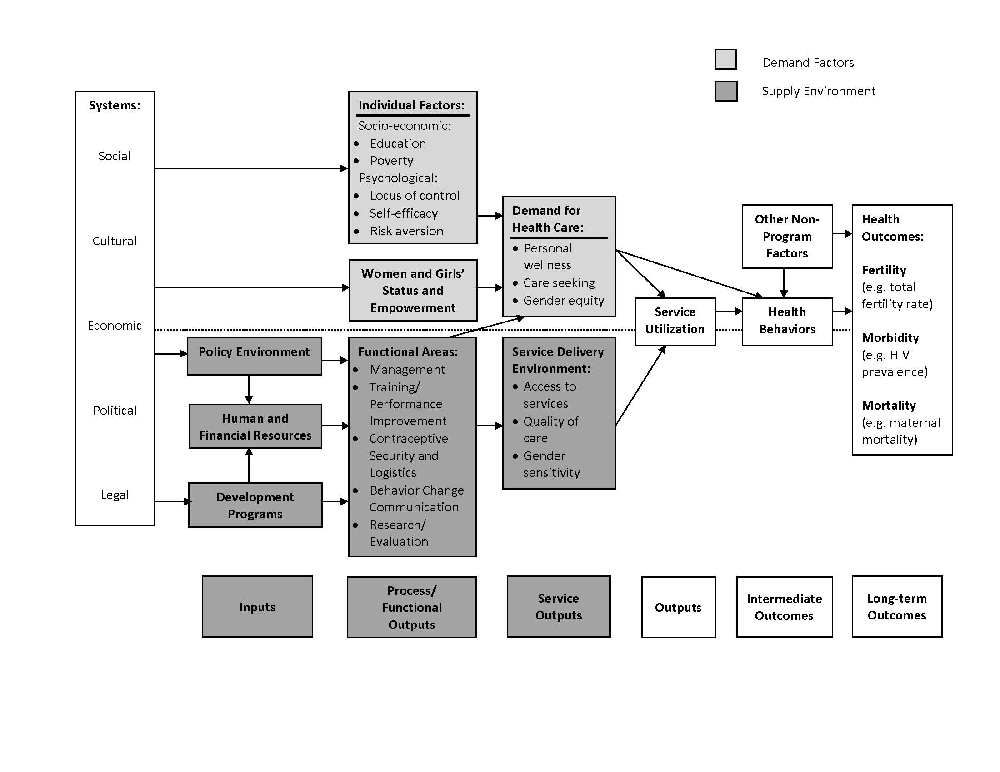

--- 
knit: "bookdown::preview_chapter"
---

# (PART) Data Collection and Measurement {-}

# Theory of Change {#logic}

Underneath any good claim of causal inference is theoretical model of how we think X actually causes Y. Few studies set out to test a specific mechanism of impact, but most impact evaluations are designed around a theory about how the world works. We call this a theory of change.

A **theory of change** articulates how an intervention—or a policy, program, or treatment—is expected to impact an outcome. It explains how X causes Y, and what is needed for this to happen. You might see this referred to as a theory of change, logic model, logical framework, causal model, results chain, pipeline model, results framework, program theory, or one of several other combinations of these words. 

Developing a good theory of change is an essential part of designing effective programs, but I like to teach students about these models because they help us think through measurement issues. Before you can articulate how you will measure key study variables, you need to think through what these variables are in the first place. A theory of change can help you approach this task.

## All Models are Wrong, But Some Are Useful

Before I describe how to create a theory of change, I want to frame this discussion in a broader context. A theory of change falls under the larger umbrella of what are known as **conceptual models**. A **model** is a simplified representation of a more complex reality. A plastic replica of the human heart is a model. So is an epidemic model of Ebola tranmission. Neither model is perfect, but we can probably learn something from each one. As the mathemetician and statistican George Box famously wrote, "Essentially, all models are wrong, but some are useful" [@box:1987]. 

Conceptual models are used to propose how constructs are related—without necessarily claiming that the relationships are causal. You'll come across many different types of conceptual models in the literature. Let's review a few examples before turning to theories of change.

### IN PSYCHOLOGY AND RELATED DISCIPLINES

Conceptual models are very common in psychology, public health, and related fields. One of the most commonly used conceptual models in the study of health behavior change is the health belief model (Figure \@ref(fig:hbm)). The health belief model was developed in the 1950s as researchers in the U.S. Public Health Service were trying to understand why people were reluctant to engage in preventive health behaviors [@rosenstock:1974]. This model suggests that health behaviors are explained by a person's perception of the benefits vs. risks of action, perceived threat of the health issue, self-efficacy for change, and cues to action.

```{r hbm, fig.cap="Health belief model. Source: http://bit.ly/2i9Lw0Ehbm.jpg", echo=F}
knitr::include_graphics("images/hbm.jpg")
```

Another example is the information-motivation-behavioral skills (IMB) model proposed by @fisher:1992 to explain HIV-related risk behaviors (Figure \@ref(fig:imb)).

```{r imb, fig.cap="Information-motivation-behavioral skills model", echo=F}
knitr::include_graphics("images/ibm.png")
```

Conceptual models like this one can be tested empirically (i.e., with data). For instance, @zhang:2011 explored the fit of the IMB model to data on condom use among female commercial sex workers in China. Figure \@ref(fig:imbmodel) is a **path diagram** that shows the results of a structural equation model that was fit to the data. 

```{r imbmodel, fig.cap="Information-Motivation-Behavioral Skills structural equation model. Source: Zhang et al. (2011), http://bit.ly/2i2SrWb", echo=F}
knitr::include_graphics("images/ibmmodel.png")
```

```{block, type='rmdcomment'}
[**Structural equation modeling**](https://en.wikipedia.org/wiki/Structural_equation_modeling) (SEM) is a multivarite technique that combines a sturctural model represented by the path diagram and a measurement model that specifies the relationships between latent variables and their indicators. In path diagrams like the one shown in the figure above, directly observed variables are called manifest variables and are represented as rectangles, and latent constructs are represented as elipses. For instance, condom use is a manifest variable that is directly measured, whereas self-efficacy is a latent construct that is measured indirectly by asking people several questions that are combined to make a composite indicator of this thing called self-efficacy. In the language of SEM, variables are labeled endogenous and exogenous rather than independent and dependent. In this example, knowledge and perceived risk are exogenous variables because they are not "caused by" another variable. Condom use is an endogenous variable.
```

### IN EPIDEMIOLOGY

#### Directed acyclic graphs {-}

A related type of causal diagram are directed acyclic graphs, or DAGs. This idea from mathematics and computer science has been applied to epidemiologic (observational) research in an effort to identify potential confounding variables that need to be addressed to make valid causal inferences [@greenland:1999]. in Figure \@ref(fig:dag) shows two example DAGs. In this example, @suttorp:2015 show that, at a minimum, it is necessary to control for age when estimating the relationship between chronic kidney disease and mortality (a). If cancer is directly related to kidney disease (b), it will also be important to control for cancer. Drawing out these relationships helps us to see that it may not be necessary to control for dementia because there is no direct relationship between dementia and kidney disease.

```{r dag, fig.cap="Graphical presentation of confounding in directed acyclic graphs. Identification of a minimal set of factors to resolve confounding. In (a), the backdoor path from CKD to mortality can be blocked by just conditioning on age, as depicted by the box around age. However if we assume that cancer also causes CKD (b), the backdoor paths can only be closed by conditioning on two factors, either age and cancer (as depicted) or cancer and dementia. Source: Suttorp et al. (2015), http://bit.ly/2i5ZZwq", echo=F}
knitr::include_graphics("images/dag.jpg")
```

#### Epidemic model {-}

Epidemic models are used to explain or predict the spread of an epidemic. @kermack:1927 proposed a deterministic compartmental model called SIR that consists of the number of uninfected people susceptable to the disease (S), the number of infected (I), and the number of people removed (R) through death or immunization. @rivers:2014 used this basic framework to create a compartmental model of the 2014 Ebola outbreak in Liberia and Sierra Leone (Figure \@ref(fig:ebolamodel)).

```{r ebolamodel, fig.cap="Compartmental flow of a mathematical model of the Ebola Epidemic in Liberia and Sierra Leone, 2014. Source: Rivers et al. (2014), http://bit.ly/2jkpl5G", echo=F}
knitr::include_graphics("images/ebola_flow.png")
```

In this model, the population is divided into six compartments: 

* Susceptible (S)
* Exposed (E)
* Infectious (I)
* Hospitalized (H)
* Funeral (F; handling bodies) 
* Recovered/Removed (R)

```{block, type='rmdcomment'}
@rivers:2014 published this model in November 2014, concluding:

> <span style="color:white">*The forecasts for both Liberia and Sierra Leone in the absence of any major effort to contain the epidemic paint a bleak picture of its future progress, which suggests that we are in the opening phase of the epidemic, rather than near its peak.*</span>

The key phrase is ***in the absence of any major effort to contain the epidemic***. It turned out that November 2014 was actually the peak of new cases thanks to a coordinated effort respond to the outbreak. As the authors wrote at the time:

> <span style="color:white">*Of the modeled interventions applied to the epidemic, the most effective by far is a combined strategy of intensifying contact tracing to remove infected individuals from the general population and placing them in a setting that can provide both isolation and dedicated care. This intervention requires that clinics have the necessary supplies, training and personnel to follow infection control practices. Although both of these interventions in isolation also have an impact on the epidemic, they are much more effective in parallel.*</span>
```

### IN STATISTICS

Statistical models are non-deterministic and thus incorporate stochastic variables. In other words, some of the variables being modeled have probability distributions rather than constant inputs that you might see in physics or mathmatics. Statistical models are typically communicated as a set of equations and visualized as a set of results. An exception is the path diagram represented visually in Figure \@ref(fig:imbmodel).

### IN ECONOMICS

Economic models can be stochastic or non-stochastic. The field of econometrics shares a lot in common with statistics, including a focus on stochastic models. Economics more broadly, however, also uses non-stochatic models. For instance, Figure \@ref(fig:economic) shows the hypothesized mathmatical relationship between mortality and income [@wildman:2014]. This graph is based on theory and does not plot actual empirical data collected in a particular setting.

```{r economic, fig.cap="Effect of increased inequality on population mortality. Source: Wildman et al. (2014), http://bit.ly/2iUFqA9", echo=F}
knitr::include_graphics("images/economic.png")
```

## Theory of Change

Theory of change diagrams come in a variety of flavors. There is no RIGHT WAY™ to create one, as long as you can convey the fundamentals of how you think X leads to Y. If people understand your diagram, it is a good diagram.

People are more likely to understand your diagram and your theory of change if you include a few common elements. The United Kingdom's Department for International Development, commonly known as DFID or UK Aid, commissioned a report on the uses of theories of change in international development that identified several common components:[^def] 

[^def]: Consensus on the definition of 'theory of change' remains elusive.

* influence of context
* discussion of long-term change
* process/sequence of change explained
* underlying assumptions
* presented as a diagram and narrative summary

### TEMPLATE

My preferred approach to outlining a theory of change is to follow this template from the [W.K. Kellogg Foundation](http://www.wkkf.org/resource-directory/resource/2006/02/wk-kellogg-foundation-logic-model-development-guide). Here is an [editable PowerPoint version](https://drive.google.com/open?id=0Bxn_jkXZ1lxueEVVVXJlVU5vaU0).

```{r tfttemplate, fig.cap="Theory of change template. Source: W.K. Kellogg Foundation, http://bit.ly/1My75Ay", echo=F}
knitr::include_graphics("images/kellogg.png", dpi = NA)
```

Start with the (research) problem statement (**Box 1**). This box gets at the heart of the reason your intervention exists. What are you trying to solve? You'd be surprised how often program design is disconnected from the problem that led to the program in the first place. This planning process will help you prevent you from ending up in this situation.

Next think about what assets already exist and what needs remain (**Box 2**). There is always something to build upon, which is why it's important to look for strengths in addition to challenges. This process is best done in collaboration with people impacted by the problem so that the proposed solution is grounded in their reality. If available, descriptive data sources like the DHS can help to outline (1) and (2). For a more local perspective, it might be beneficial to conduct a brief needs assessment in partnership with the local community if resources permit.

**Box 3** jumps to the desired results. If the program works, what will change? We'll come back to what is meant by "outputs, outcomes, and impact" in a moment. With the results articulated, you can go back to the beginning and consider what factors might affect your program's success positively or negatively (**Box 4**).

The next step is to outline strategies for achieving your desired results that take into account potential barriers and facilitators (**Box 5**). This is where you articulate what your program will actually do.

Finally, **Box 6** reminds you that every theory of change is built on a set of assumptions. Be thorough and transparent as you think through the hidden beliefs that underlie your ideas about how your program will achieve its results.

### EXAMPLE: KENYAN "SUGAR DADDIES"

In 2014, an [estimated 1.4 million](http://www.unaids.org/en/regionscountries/countries/kenya) people in Kenya were living with HIV. This is a prevalence rate of 5.3% among adults aged 15 to 49. Without a cure for AIDS, prevention remains critical to ending the epidemic. 

Starting in 2001, Kenya integrated HIV/AIDS education into the primary school curriculum as a new prevention strategy [@jpal:2007]. At the time, the focus of this program—and many others programs across sub-Saharan Africa—was complete *risk avoidance* [@dupas:2011]. Abstinence. Information on *risk reduction* was limited. In particular, students were not learning about the differential prevalence of HIV infection by age and gender. Girls were not learn that the older "sugar daddies" who provide nice things like phones and airtime in return for sex are more likely than the girls' goofy age mates to be infected.

An organization called [ICS Africa](http://www.ics.nl/en/home/) set out to change this by rolling out a "Relative Risk Information Campaign" in Kenya. The intervention was brilliant in its simplicity. A program staffer would talk with students for 40 minutes. During this time, the staffer showed the class a 10-minute video on sugar daddies and led a discussion about cross-generational sex. During the session, the staffer reviewed results of recent studies and wrote facts about the distribution of HIV prevalence on the chalk board.

JPAL researchers tested ICS Africa's risk reduction strategy in a randomized experiment in Western Kenya. In the first phase (2003), 328 schools were randomized to teacher training on the national HIV prevention curriculum [@duflo:2006]. In the second phase (2004), 71 of these schools were stratified and randomized to receive the sugar daddy intervention [@dupas:2011]. In total there were four study arms: (i) teacher training only, (ii) sugar daddy only, (iii) teacher training and sugar daddy, and (iv) nothing.

The results were shocking. Teacher training was a bust. Sure, the training led to a change in teaching practices—notably that trained teachers mentioned HIV in class more often than non-trained teachers—but it had little effect on HIV knowledge or childbearing.

In contrast, the 40-minute sugar daddy discussion and video reduced childbearing with men at least five years older by 65%—and not because girls started having babies with males their own age. The overall incidence of childbearing fell by 28%. With a cost of $28.20 USD per school and $0.80 per student, the cost per childbirth averted was $91 [@jpal:2007].

Returning to our template, let's piece together the theory of change for the relative risk reduction program.

```{r sugar, fig.cap="Sugar daddy awareness theory of change", echo=F}
knitr::include_graphics("images/sugardaddytoc.jpg", dpi = NA)
```

```{block, type='rmdcomment'}
Increasing knowledge about HIV makes intuitive sense as an outcome for a study about HIV prevention. But why childbearing? 

Well, babies don't come from storks. They come from unprotected sex. It's harder to lie about birthing a baby than it is to lie about your private sexual behavior, so childbearing is thought to be a more objective measure of unprotected sex. Unprotected sex is a main driver of HIV transmission, so measuring childbearing is a proxy for HIV risk from unprotected sex. 
```

## Logic Model

While a theory of change tends to be a high-level depiction of the "why", a **logic model**—or [logframe](https://www.gov.uk/government/publications/dfid-how-to-note-guidance-on-using-the-revised-logical-framework)—is more detailed and focuses on the "how". Logical models are a useful tool for program planning, monitoring program implementation, and program evaluation and reporting. You'll often see them presented in the "results chain" or "pipeline" format shown in Figure \@ref(fig:logicmodel).

```{r logicmodel, fig.cap="Logic model. Source: W.K. Kellogg Foundation, http://bit.ly/1My75Ay", echo=F}
knitr::include_graphics("images/wkkflog.png", dpi = NA)
```

In a logic model, inputs and activities represent your planned work. Outputs, outcomes, and impact are your intended results.

<br>

```{r logictable, echo=F}
lm <- data.frame(sr=c(
"**Input**",
"**Activities**",
"**Outputs**",
"**Outcomes**",
"**Impacts**"),
lr=c(
  "The resources needed to implement the program. People, money, time, etc.",
  "What your program will do. Trainings, events, distribution of goods, etc.",
  "What your program did. Number of people trained, number of events held, number of goods delivered and number of people who benefitted.",
  "Short- and medium-term results of your program. Increased knowledge, decreased risky behavior, improved functioning, etc.",
  "Long-term effects of the program outcomes. Lower HIV prevalence, reduced morbidity and mortality, etc."))
names(lm) <- c("Component", "Description")

knitr::kable(lm, format = "html", 
caption = 'Components of a logic model.'
) %>%
  html_table_width(c(100,500))
```

<br> 

Figure \@ref(fig:sugar2) shows what a logic model might look like for the Kenyan relative risk reduction program introduced earlier.

```{r sugar2, fig.cap="Sugar daddy awareness logic model", echo=F}
knitr::include_graphics("images/sugarlogic.jpg", dpi = NA)
```

As with a theory of change, there is no RIGHT WAY™ to create a logic model, but you will often see the same basic components (inputs, activities, outputs, outcomes, impacts) included. Figure \@ref(fig:melogic) shows an example logic model for evaluating reproductive health programs.

```{r melogic, fig.cap="Reproductive health logic model. Source: MEASURE Evaluation, http://bit.ly/2iwphA7", echo=F}

```

The next step is to think through how to measure key variables throughout your conceptual model, theory of change, or logic model.


```{block, type='rmdpuzzle'}
Donors like USAID commonly require project staff to create **results frameworks** to monitor progress toward achieving the stated goals. Here's an example results framework from the [*Feed the Future*](https://www.feedthefuture.gov/) [strategic plan for Kenya](http://1.usa.gov/1NDuQpn).


You can read this diagram from the top down. The overall goal reflects the mission of the broader FTF program: reduce poverty and hunger. The plan for attaining this goal is to reach two objectives: inclusive agricultural sector growth and improved nutritional status.

If the goal represents the ultimate desired impact, objectives are long range strategies. You know you are on track to reaching your objectives if you hit several intermediate results, or IRs. For instance, IR6, "Improved utilization of MCH and nutrition services", is expected to improve the nutritional status of women and children. This IR has three sub IRs, including 6.3 "Strengthened MCH nutrition surveillance". The rationale for sub-IR 6.3 is that better monitoring and data will enable earlier identification of at-risk individuals, which in turn should mean earlier initiation of nutrition interventions.

Every IR has a set of indicators for measuring progress. In the case of IR6, FTF lists the following illustrative indicators:

* prevalence of maternal anemia
* number of children under five years of age who received vitamin A from USG-supported programs
* number of people trained in child health and nutrition through USG-supported health area programs (disaggregated by gender)
* number of clients who received food and/or nutrition services (PEPFAR
indicator)
```

## Share Feedback{-}

This book is a work in progress. You'd be doing me a big favor by taking a moment to tell me what you think about this chapter.

```{r CH05feedback, echo=F}
knitr::include_url("https://duke.qualtrics.com/SE/?SID=SV_eQH4ryNCCmsyhfv",
height="600px")
```
