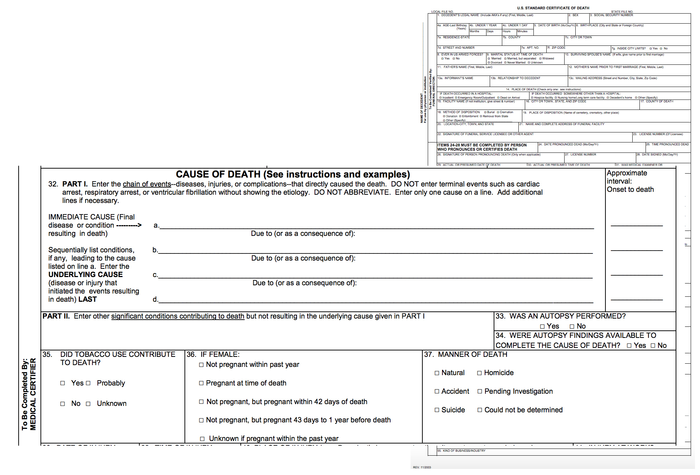
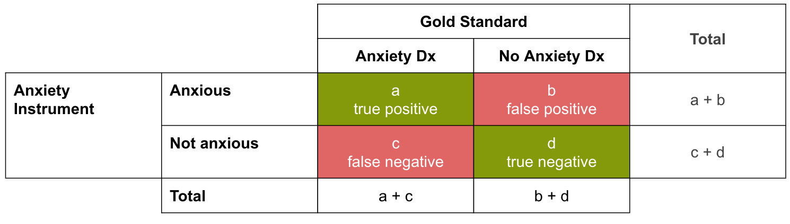
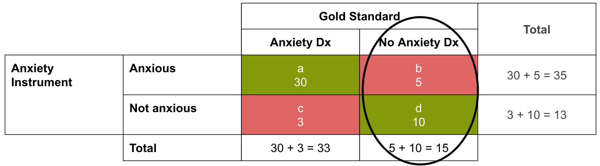
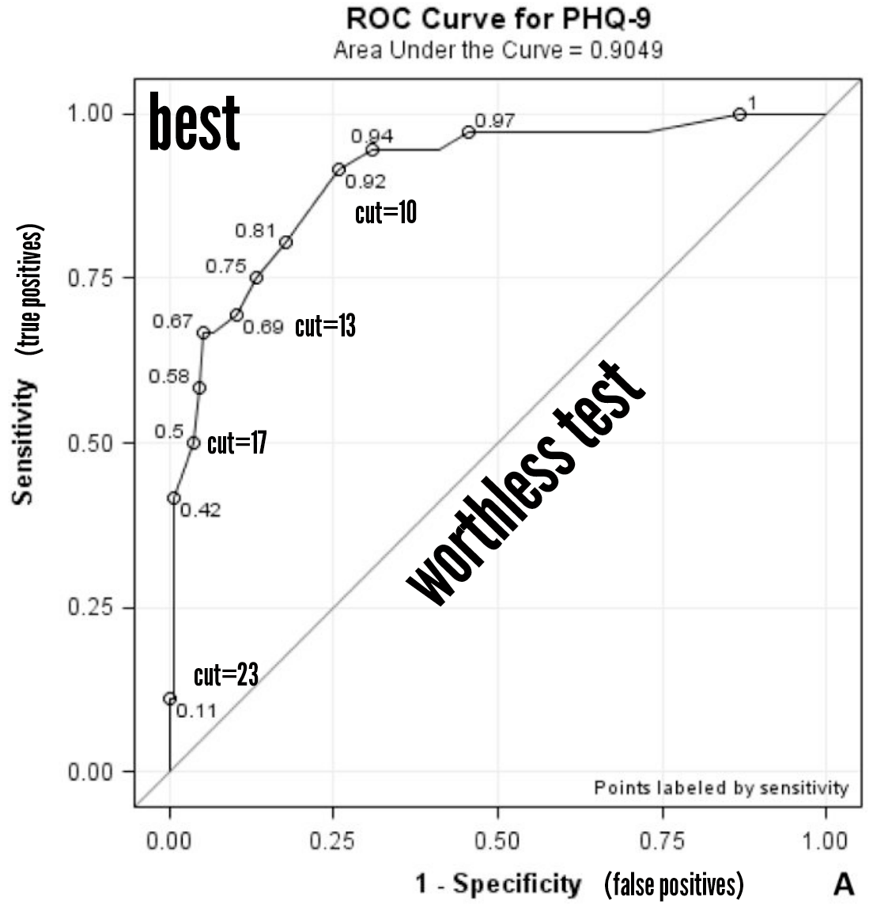

# Measure Twice, Cut Once {#measurement}

This proverb, well known to carpenters everywhere, should be the motto of every aspiring researcher. Ignore it and you run the risk of severely limiting what you can learn from your study—or ruining the whole thing altogether. 

Despite its importance, however, measurement rarely gets the attention it deserves. One reason, I think, is that to really understand measurement issues in a particular sub-field you need to get deep into the weeds. It's relatively easy to pick up a journal article outside of your major area of study and find something to say about the study design. Not so when it comes to the measurement.

Take an issue like maternal mortality. Dead or alive. Easy, right? Not quite.

What counts as a maternal death? What if a pregnant woman slips on a patch of ice and dies? Is that a maternal death? What if she dies from an infection 40 days after giving birth to a healthy baby girl? Is that a maternal death?

No and yes. I'll explain why. In the process, I'll introduce some key measurement issues to consider when designing or reviewing a study. I'll also introduce you to some population-level indicators that every global health data junkie should know.

## What is an Indicator?

Part of developing a good logic model is to identify indicators for each part of the causal chain.[^also] An **indicator** is an observable measure of a concept.[^terms] For instance, a primary outcome in the Kenya "sugar daddy" intervention study discussed in Chapter 3 was "reduction in unprotected sex". We can't observe unprotected sex directly, so it is a concept in need of a measurable indicator. That indicator could be _self-reported_ unprotected sex, but it might be hard to get people to report honestly. A potentially more accurate measure of unprotected sex among girls of reproductive age is the incidence of childbirth.

* * *

Let's look at another example and consider the importance of measuring indicators at each step of the causal chain. 

[^also]: The key measurement lessons of this chapter apply whether your research question is descriptive, correlational, or causal.

[^terms]: You'll sometimes see the terms outcome, indicator, measure, target, instrument, and variable used interchangeably. Don't fall into this trap. Indicators are measures of outcomes (or impacts). A **target** is a goal for change in the value of an indicator (e.g., reduce maternal mortality ratio by half). **Instruments** are the tools for measuring indicators. (Instruments might also go by different names, including scales, measures, inventories, batteries). **Variables** are the numeric values of the indicators that can vary between observations.

{width="wide"}
| Logic Model | Concept | Indicator |
|: ---|:---|:---|
| Input | Financial resources | Expenditures |
| Activities | Treatment fidelity | Checklist score |
| Outputs | Compliance | # TBAs trained |
| Outcomes | Fewer complications | # hemorrhage |
| Impacts | Reduced mortality | # maternal death |

Our example logic model comes from a study by Jokhio and colleagues (2005) of the impact of training traditional birth attendants on stillbirths, neonatal deaths, and maternal deaths.[^jokhio] 

When this study was conducted in 1998, the maternal mortality ratio in Pakistan was more than 280 per 100,000 live births (compared to 170 in 2013).[^whomm2] This represents more than 13,000 women who died giving birth.

The tragedy in this number is that maternal mortality is preventable. Women continue to die before, during, and after childbirth because of three major delays: (i) delays in seeking healthcare; (ii) delays in reaching healthcare; and (iii) delays in receiving high quality healthcare upon reaching a medical facility.[^3delays] The most common proximate causes of death are postpartum hemorrhage, hypertensive disorders, and sepsis.[^say] 

It's hard to predict who will suffer life threatening complications, so there is debate about how to best intervene. Some argue that we should invest in interventions to increase facility deliveries so that women would be better able to access emergency obstetric care if needed. Others point to the low frequency of complications and the high prevalence of poor quality care at medical facilities as a reason that women should be supported in their decision to stay at home where the family can better support them.

At the time Jokhio and colleagues conducted this study, facility deliveries in Pakistan were rare. The authors cited descriptive studies showing that most women in Pakistan deliver at home (80%) without a skilled birth attendant (89%). Only 1 out of 20 women who experience complications makes it to a medical facility with emergency obstetric care.

Given the high prevalence of home deliveries, Jokhio et al. tested an intervention that trained traditional birth attendants—the mothers, aunts, sisters, and neighbors who already help women through childbirth but have no formal medical training—and provided them with delivery kits. The training lasted 3 days and covered topics such as checking for danger signs, conducing a clean delivery using the provided kits, and making emergency referrals. Trained TBAs were asked to visit with women at least three times during the pregnancy to look for danger signs, and then again for the delivery.

The study design was a cluster randomized trial. Seven subdisticts of a rural district were randomized to the TBA intervention or the standard of care. TBAs in subdistricts assigned to the control group did not receive any training or delivery kits. The primary endpoint was reduced perinatal deaths (stillbirths and neonatal deaths) and maternal deaths. Before discussing the study results, let's think about measurement throughout the causal chain.

### PROCESS INDICATORS 

M&E managers think long and hard about how to track inputs, activities, and outputs—process or monitoring indicators—and how to summarize the data in quarterly monitoring reports to donors or NGO/ministry supervisors. All of these stakeholders want to know how much was spent and for what purpose, whether the implementation plans were followed, and how many people benefitted. 

As researchers we also care about collecting good process data, but usually as a means to developing a better understanding why programs do or don't work. Examples include program costs (to estimate cost-effectiveness), treatment fidelity (to judge the quality of implementation), and compliance with study protocols (to assess threats to internal validity).

#### Inputs

##### Cost and cost-effectiveness

Impact evaluations produce estimates of the effectiveness of a program or intervention. Does the program "work"? For some public health and behavioral health nerds, evidence of impact is enough because they are narrowly focused on developing and testing new interventions. Not true for many economists and policymakers who are thinking about delivering programs at scale with limited public funding; they want to know whether the intervention is cost-effective, not just effective.[^T4] A cost-effectiveness analysis requires close tracking of the cost of all program inputs.[^whoce] Unfortunately, Jokhio et al. don't tell us about the cost, other than to say the intervention was designed to be "low cost and sustainable".[^sugarCE] 

[^T4]: You'll recall from Chapter 1 that this gap between developing evidence of effective programs and actually implementing them at scale is an example of a "T4" translational research bottleneck.

{icon=puzzle-piece}
G> Cost effectiveness analysis (CEA) is not the same thing as cost-benefit analysis (CBA). The latter involves putting a dollar amount to benefits, such as the benefit to society of averting a maternal death. This is hard to do and quite subjective. This is why you will come across CEA much more frequently in global health. The typical calculation is the effect size divided by the costs. There is no effort to put costs and effects on the same dollar metric.

#### Activities/Outputs

##### Treatment fidelity

The TBA intervention included a 3-day training and the provision of delivery kits. If a trainer decided to skip portions of the training or knock off a day, the program would not be delivered as intended (aka, without fidelity to the treatment). The consequence of low **treatment fidelity** is usually an attenuation of treatment effects.[^atten] This is a threat to internal validity. If the study shows no effect but treatment fidelity is low, we can't be confident in the null result. Implementation failure rather than theory or program failure could be to blame. Low fidelity is also a threat to external validity because it isn't possible to truly replicate the study.

The first step in developing a measure of fidelity is to identify what constitutes the intervention. Then for each component of the intervention, you define the benchmark for success. If your intervention involves the distribution of goods such as delivery kits, this is relatively straightforward: count the kits delivered. When your intervention involves the delivery of a service, fidelity tracking is more complicated.

Training is an example of a service. In the write-up of the TBA study, we're told that TBAs were trained on the following topics:

* giving advice on antepartum, intrapartum, and postpartum care; 
* how to conduct a clean delivery; 
* how to use the disposable delivery kit; 
* when to refer women for emergency obstetrical
care; 
* and care of the newborn. 

There are two levels of training we can evaluate: the training of the trainers (TOT) and the competency of the trainees.

First, we want to make sure that the people leading the TBA training (i) adhere to the training manual ("do the facilitators deliver all of the training content?) and (ii) correctly present all of the training material ("do they present the training material correctly?"). We might do this by creating a TOT fidelity checklist that can be used to assess adherence and competence.[^breitenstein] For instance:

* Adherence
	* trainer reviews didactic material on conducting a clean delivery
	* trainer facilitates the demonstration activity on how to use the disposable delivery kit
* Competence
	* trainer correctly explains the key danger signs to look for during the antepartum period
	* trainer demonstrates proper use of the delivery kits

Second, we want to know that the TBAs learned something from the training. This could be as simple as administering a knowledge and practical test at the end of the training. To continually monitor fidelity over time, we could arrange to observe or record TBA interactions with patients and evaluate fidelity with another checklist. Depending on the situation, we could also use "mystery clients"—confederates who pose as real clients—to evaluate fidelity without the target's knowledge.

##### Treatment compliance

In a randomized trial, people (or other units like schools and clinics) are randomly assigned to different study arms. In Jokhio et al., subdistricts were randomly assigned to the TBA intervention group (treatment) or the no program group (control). Sometimes plans don't work out and people or units are "non-compliant" with these assignments. For instance:

*  Some people assigned to the _treatment_ group are never treated or only partially treated. Maybe some TBAs never showed up for the training program or stopped attending before the end.   

*  Some people assigned to the _control_ (comparison) group receive the treatment despite their assignment to the inactive control group. An example would be if TBAs in control subdistricts heard about the nearby training and decided to attend.

Just like low-treatment fidelity, **partial compliance** with the study protocol can attenuate treatment effects. We'll discuss these threats more in the chapter on experimental designs. The take home point for now is that close tracking of outputs can be critical for your analysis of treatment effects. 

### OUTCOME/IMPACT INDICATORS 

Researchers tend to spend the most time and effort defining measurement strategies for study outcomes and impacts. Jokhio et al. evaluated the effect of the TBA intervention on a set of outcomes that included the occurrence of major complications of pregnancy and referral to emergency obstetric care. The authors also examined the impact of the intervention on maternal mortality, but the study only had the statistical power—the topic of a later chapter—to detect a 90% drop in maternal deaths. Thus the authors were unlikely to find a statistically significant effect on maternal deaths, but the indictor made sense in the theory of change: better equipped TBAs who are present at deliveries will reduce the incidence of major complications that are most likely to lead to maternal deaths; better access to emergency referrals will have the same life saving effect. 

{icon=comment}
G> ## So what did they find?
G> 
G> The intervention reduced the odds of hemorrhage and sepsis by 39% and 83%, respectively. Women exposed to trained TBAs were also 1.5 times more likely to get a referral to emergency obstetric care.[^referral] Obstructed labor was more likely among the intervention group, but this can't be caused by TBAs. So how do we interpret this finding given that the study design was an experiment, and we know experiments are made for causal inference? _Increased reporting_. TBAs were trained to recognize danger signs and make referrals. It's likely that trained TBAs were more likely to see something and say something.
G>
G> So what about maternal mortality? The effect size estimate suggested a 26% reduction in maternal deaths, but the estimate was not very precise. The study was only designed to detect a reduction of 90% with precision, so this is not surprising. So no definitive evidence about the impact of the intervention on maternal mortality, but large effects on the intermediate outcomes supports the underlying theory of change. 

## Selecting Good Indicators

There are some people who say that indicators must be [SMART](https://en.wikipedia.org/wiki/SMART_criteria)™:

| **S**ecific   | clearly defined |
| **M**easurable | able to be quantified |
| **A**ttainable | target must be realistic |
| **R**elevant   | related to the construct |
| **T**ime-bound | observed at specific times |

I think indicators should be DREAMY™:

| **D**efined    | clearly specified |
| **R**elevant   | related to the construct |
| **E**xpedient  | feasible to obtain |
| **A**ccurate   | valid measure of construct |
| **M**easurable | able to be quantified |
| customar**Y**[^free]  | recognized standard |

[^free]: Anyone who figures out a better Y gets a free signed copy of this book.

### DREAMY INDICATORS™

Jokhio and colleagues wanted to develop and test an intervention that would make motherhood safer. The ultimate indicator of safe motherhood is reduced maternal mortality. Let's put this indicator to the DREAMY test. 

##### Defined

The first step to becoming a good indicator is having a clear definition. Jokhio et al. used the following definition of a maternal death: 

A> Maternal deaths were defined as death of the mother during pregnancy, delivery, and up to six weeks post-partum, excluding deaths known to have been due to injury or accident.

##### Relevant

Maternal deaths are clearly relevant to the construct of safe motherhood. 

##### Expedient

Data on maternal deaths are not easy to collect. Jokhio et al. relied on Lady Health Workers, a cadre of educated women with 3 to 6 months of training in primary health care and family planning who are an official part of Pakistan's public health system. Despite the challenges of collecting data on maternal mortality, the Lady Health Workers were surprisingly effective; they successfully followed up with 99.8% of the 19,557 women recruited into the study.

##### Accurate

Simply, yes. Maternal deaths measure what we think they measure—mortality.

##### Measurable

Not such a simple yes. Maternal deaths can be quantified, but without a registry of death certificates indicating the cause of death, it's easy to make mistakes. So what did Jokhio et al. do?

A> In cases of maternal death, the cause was ascertained by Lady Health Workers on the basis of oral reports from relatives, neighbors, or traditional birth attendants.

The authors do not use the term "[verbal autopsy](https://en.wikipedia.org/wiki/Verbal_autopsy)", but that is the inferred method. In this particular study, a VA is a reasonable choice because the timing of death was ascertainable for all women. It is possible that some deaths due to accident or injury were incorrectly labeled as maternal deaths, but there is no way to know.

{icon=comment}
G> Measurement can change over time, and these changes can impact your analysis. For instance, the U.S. revised the [U.S. Standard Certificate of Death](http://1.usa.gov/1UhYl7v) in 2003 to include "late maternal deaths" (43 to 365 days) and "pregnancy-related deaths" to better align with the ICD-10 criteria. At the time, only 21 of 50 states recorded a woman's pregnancy status; those that did used 1 of 6 different questions.[^hoyert]   
G>
G>

##### customarY

Jokhio et al.'s definition of maternal mortality will look familiar to folks who study reproductive health issues because it largely follows the authoritative definition that comes from a set of classification standards known as the ["International Statistical Classification of Diseases and Related Health Problems"](http://www.who.int/classifications/icd/en/), or ICD. According to the latest version, the ICD-10:[^icd9]

A> A maternal death is the death of a woman while pregnant or within 42 days of termination of
pregnancy, irrespective of the duration and the site of the pregnancy, from any cause related to or
aggravated by the pregnancy or its management, but not from accidental or incidental causes.[^answer]

### USE INTERNATIONAL STANDARDS

Whenever possible, you should seek out standard indicators and follow existing definitions and calculation methods. The WHO publishes a *Global Reference List* of the 100 core health indicators.[^core] The 2015 version categorizes the indicators several ways:

* domain
	* health status
	* risk factors
	* service coverage
	* health systems (service delivery, quality of care, health financing, essential medicines, the health workforce, health information)
* subdomains
	* communicable diseases (HIV/AIDS, sexually transmitted infections, tuberculosis, malaria, neglected tropical diseases, outbreaks, epidemic diseases)
	* reproductive, maternal, newborn, child and adolescent health (including sexual health and reproductive rights and immunization), 
	* noncommunicable diseases (including chronic disease, health promotion, nutrition, mental health and substance abuse)
	* injuries and violence and the environment
* levels of the results chain framework

Here is the full list of indicators organized by steps in a logic model. 

In the entry for maternal mortality ratio, we find the following definition:

A> The annual number of female deaths from any cause related to or aggravated by pregnancy or its management (excluding accidental or incidental
causes) during pregnancy and childbirth or within 42 days of termination of pregnancy, irrespective of the duration and site of the pregnancy,
expressed per 100 000 live births, for a specified time period.

The calculation of the MMR is specified in this entry, as is the method of measurement and estimation.

## Evaluating Data Collection Instruments and Methods

Sometimes it's possible to use existing data sources, such as administrative or medical records.[^secondary] It's often the case, however, that administrative records are incomplete, unreliable, and unsuitable for constructing your specific outcome of interest—especially in developing countries.

In all likelihood, especially in the case of program evaluations, part or all of your data will come from original data collection efforts. Potentially the most common forms of data collection in global health are interviews and surveys. Some less commonly used non-survey instruments include:[^rre]

* direct observation
* random spot checks
* mystery clients
* incognito enumerators
* physical tests
* biomarkers
* mechanical tracking devices
* spatial demography
* participatory resource appraisals
* observe purchasing decisions
* games
* standardized tests
* vignettes

### PSYCHOMETRICS

In some fields such as psychology, it is common to measure outcomes by administering self-reported instruments to participants and calculating a score from their responses. Whether you are using an off-the-shelf instrument or developing your own, you want to be sure that the instrument is a reliable and valid measure of your indicator.

A reliable measure is one that is capable of producing the same results when measuring the same thing repeatedly. Imagine your bathroom scale. If you stepped on, then off, then on again and the scale read 210 lbs and then 185 lbs, you would realize that you are the owner of a broken, unreliable scale.

Undeterred, you head to the store and pick up a new scale—this time one that posts your weight to Facebook to keep you "accountable". So you step on, off, and back on again. The scale reads 400 lbs then 402 lbs. As your Facebook wall updates, you whack the scale and get back on again. It reads 399. Your mom posts a comment congratulating you on dropping out of the 400s and 50 people like it. Meanwhile, you call customer support and explain that your scale is very reliable (precise), but also very inaccurate. You actually tell the customer service rep that the scale is an "invalid measure of your current weight". He's heard it before, but it's actually true in your case.

Rule #1: Don't get a scale that posts to Facebook.

Rule #2: An instrument can be reliable but not valid.

Rule #3: But an instrument cannot be valid without being reliable. 

#### Reliability

There are several methods for assessing the **reliability** of an instrument. Let's imagine that you developed a new 8-item measure of anxiety in which people have the following response options: (0) never, (1) rarely, (2) sometimes, or (3) often. This means that possible scores could range from 0 to 24.

##### Test-retest reliability

This is when scores are correlated on repeat administrations of the instrument. Participants complete your survey today and then again in a week. If each person's score is the exactly the same the second time, your instrument would be perfectly reliable. It won't be, but you'll hope for a high correlation coefficient (conventionally higher than 0.70).

For instance, let's say we survey 50 people and enter their data. Here are the responses for the first 6 people in the dataset. Each row consists of data for 1 person. The last column is the sum of the the person's responses to the instrument's 8 items.

{linenos=off}
~~~~~~~~
> head(datT1)
  q1 q2 q3 q4 q5 q6 q7 q8 t1.sum
1  1  1  1  0  2  2  2  2     11
2  2  2  2  1  3  2  2  3     17
3  3  3  3  0  2  3  3  3     20
4  2  3  3  0  2  2  2  2     16
5  2  3  3  1  3  3  2  3     20
6  2  2  2  0  3  3  2  2     16
~~~~~~~~

Then we go back and survey these same people again and enter their data once more. Here's the data for the first 6 people in the re-test dataset.  

{linenos=off}
~~~~~~~~
> head(datT2)
  q1 q2 q3 q4 q5 q6 q7 q8 t2.sum
1  0  1  0  0  0  3  2  3      9
2  3  1  3  2  3  3  3  3     21
3  3  3  2  2  3  1  3  3     20
4  3  3  3  1  2  3  2  3     20
5  3  3  3  3  3  3  2  3     23
6  3  3  3  1  3  2  2  2     19
~~~~~~~~

To calculate the test-retest reliability, we'll correlate the sum scores for each administration: `t1.sum` and `t2.sum`. We find a high correlation of 0.78, suggesting that the instrument has good test-retest reliability.

{linenos=off}
~~~~~~~~
> cor(datT1$t1.sum, datT2$t2.sum)
[1] 0.7753866
~~~~~~~~

##### Interitem reliability

This is when responses to items in your instrument are consistent. If not, you have to wonder if they are measuring the same underlying construct of anxiety.
	
_Item total correlation_: One approach to finding ugly ducklings in your instrument is to calculate item-total correlations. It's easy: correlate scores on each item with the total scores. Generally item-total correlations exceeding 0.30 are sufficient. 

Returning to our dataset from the first administration, we see that most items have an acceptable item-total correlation, except `q4`. This item seems to be measuring something different than the others. Maybe the rest are clearly tapping into the construct of anxiety, whereas `q4` asks people about how often they feel sad. Maybe it would fit better in an instrument assessing depression. 

{linenos=off}
~~~~~~~~
> library(multilevel)
> item.total(datT1[,1:8])
  Variable Item.Total Alpha.Without  N
1       q1  0.6021512     0.8033555 50
2       q2  0.5914340     0.8044035 50
3       q3  0.7402437     0.7808027 50
4       q4  0.1452794     0.8458352 50
5       q5  0.5295935     0.8127216 50
6       q6  0.5636561     0.8081818 50
7       q7  0.5369509     0.8117495 50
8       q8  0.6430992     0.7967467 50
~~~~~~~~

_Cronbach's alpha_: Instruments are imperfect. Even your new anxiety instrument that you worked so hard to create. Flawed. The result is that every person's observed score is actually a function of their 'true' score (which we can't know) plus some amount of measurement error. 

Cronbach's alpha gives you an estimate of how much variance in people's scores on your instrument is measurement error. When you calculate Cronbach's alpha in a program like R, behind the scenes R does the equivalent of splitting the dataset into two halves over and over again and calculating the correlation between total scores for the first half with total scores for the second half. Cronbach's alpha is the average of all possible correlation coefficients. If alpha is 0.70—a rough guide for the low-end of acceptable—it means that only 30% of the variance in scores is measurement error. In our sample dataset, alpha is 0.81, meaning that 19% of the variance is error.

{linenos=off}
~~~~~~~~
> library(psych)
> a <- alpha(datT1[,1:8])
> a[[1]][2]
 std.alpha
  0.814491
~~~~~~~~

##### Interrater reliability

This is another type of reliability that indicates whether two observers are consistent in their ratings of the same thing. Instead of using an 8-item self-report instrument, we might want to have two observers watch a video of a parent and child interacting and rate each behavior as "warm" or "cold". If the observers agree a lot, they would be reliable. 

Percent agreement is one way to measure interrater reliability, but it's not the best. It does not account for agreement that can happen by chance. Cohen's kappa coefficient does, and you generally want a value greater than 0.40.

#### Validity

Does your measure measure what you intend to measure with your measure? (unrelated bonus: how many metrics could your measure measure if your measure could measure metrics?).

In other, less annoying words: Does your 8-item anxiety instrument actually measure this thing called anxiety? If not, it's not a valid measure of anxiety. There are several types of **validity** that you can use to determine whether your instrument is valid.

##### Face validity

This is the weakest form of validity. The basic idea is: if it looks like a duck, quacks like a duck, it's a duck. If people think your anxiety instrument asks about anxiety, it has face validity as a measure of anxiety.

This is a weak standard, however. A great looking instrument can perform very poorly in practice, and an instrument that appears to lack face validity might perform very well.

The bottom line is that if you read an article and the only mention of validity is face validity, it's a lame duck.

##### Construct validity

Anxiety is a hypothetical construct. If your 8-item anxiety instrument has construct validity, it will be related to other instruments that are also thought to measure anxiety (**convergent validity**), but it will not be related to other instruments that have nothing to do with anxiety (**discriminant validity**).

For instance, your anxiety instrument would have convergent validity if participant scores on your measure are correlated with their scores on an existing measure like the [Multidimensional Anxiety Scale for Children (MASC)](http://www.mhs.com/product.aspx?gr=cli&id=overview&prod=masc2). Your instrument would have discriminant validity if scores were _not_ strongly correlated with scores on a measure of narcissism. 

If your instrument has both convergent and discriminant validity, you have more confidence that it measures the construct of anxiety that you think it measures.

##### Criterion-related validity

An even more robust form of validity is criterion validity. Do scores on your 8-item anxiety instrument correctly predict which participants will be diagnosed as suffering from an anxiety disorder when evaluated independently by a psychologist or psychiatrist? In this case, the mental health professional's judgement—made completely independent of the data generated by your instrument—is the "gold standard". 

A valid instrument will produce accurate predictions. This is easier to understand with a figure.

Your anxiety instrument has a possible range in scores from 0 to 24. Let's say we have reason to believe that the cutoff for anxiety is a score of 15. Anyone with a result greater than or equal to 15 will be classified by your instrument as "anxious". Everyone else is classified as "not anxious". These are the two possible test results.

There are also two possible diagnostic results from the gold standard mental health professional: has anxiety and doesn't have anxiety. 

Taken together, there are four possible combinations of test and gold standard results:

* **true positive (a)**: both the test result and the gold standard indicate that the person is anxious
* **true negative (d)**: both the test result and the gold standard indicate that the person is NOT anxious
* **false positive (b)**: the test result suggests anxiety, but the gold standard disagrees
* **false negative (c)**: the test result suggest no anxiety, but the gold standard disagrees

The true positive rate is known as **sensitivity**. It is calculated as follows:

`true positive / all positives = a / (a + c)`

`30 / (30 + 3) = 91%` 91% of patients with anxiety correctly screened positive. 9% of patients did not (false negative rate).

The true negative rate is known as **specificity**. It is calculated as follows:

`true negatives / all negatives = d / (b + d)`

`10 / (5 + 10) = 67%` 67% of patients with no anxiety correctly screened negative. 33% incorrectly screened positive (false positive rate).

There is often a tradeoff between sensitivity and specificity. The tradeoff can be visualized with a **receiver operating characteristic** (ROC) analysis. ROC curves plot sensitivity (the true positive rate) against 1 minus specificity for a range of different cutoff points. 

Earlier I mentioned that the cutoff score for your anxiety measure was 15. To determine if 15 is the best cut point, we could calculate the sensitivity and specificity again for several different cutoff points and plot the relationship in a ROC curve.

For instance, Rathore et al. (2014) evaluated different cut scores for the Patient Health Questionnaire 9 ([PHQ-9](http://phqscreeners.com/pdfs/02_phq-9/english.pdf)) when administered to adults with epilepsy and displayed the results on a ROC curve.[^rathore]

The area under the ROC curve was 0.90, generally considered to be a very accurate benchmark. It appears that a cut score of 12 on the PHQ-9 balances sensitivity and specificity. Decreasing false positives (higher specificity) could be favored to avoid labeling non-depressed patients as depressed and using resources for unnecessary additional evaluations. Doing so would mean missing more true positives, but it could be a defensible tradeoff.

### TO USE, ADAPT, OR DEVELOP?

When you design a new study that includes new data collection, you have to decide whether to use or adapt existing instruments that measure your indicators, or to develop your own. There are pros and cons to each approach.

There is a good chance that the off-the-shelf instrument you want to use in Country Z was developed in Country A and never used or at least never validated in Country Z. Using it would enable some cross-cultural and cross-national comparisons, but without running your own validity study first, you don't have much confidence that the instrument is valid or reliable in Country Z.

An alternative approach is to start with the off-the-shelf measure and adapt it for your needs. You translate it from one language to another, and you have someone else translate it back to the original language before you and your colleagues attempt to resolve discrepancies. Maybe you conduct some formative qualitative research to determine if there are some constructs not represented in the existing instrument that you could add. Or you pilot test the existing instrument and ask people to explain to you their understanding of the questions and response choices (cognitive interviewing). Then you ask yourself these six questions about cross-cultural validity:[^korht]

1. What is the purpose of the instrument?
2. What is the construct to be measured?
3. What are the contents of the construct?
4. What are the idioms used to identify psychological symptoms and behaviors?
5. How should questions and responses be structured?
6. What does a score on the instrument mean?

Or at the other end of the continuum, you believe that your instrument should be completely grounded in the lived experience of where you are working in Country Z, so you start from scratch with formative qualitative work. It is only through this work that a new instrument emerges.[^bolton] 

[^bolton]: And if you realize that you do not have a gold standard to help validate your new culturally-anchored instrument, you'll read: Bolton, P. (2001). Cross-cultural validity and reliability testing of a standard psychiatric assessment instrument without a gold standard. [*The Journal of Nervous and Mental Disease, 189(4)*](http://www.ncbi.nlm.nih.gov/pubmed/11339319), 238-242.

[^rathore]: Rathore, J. S., Jehi, L. E., Fan, Y., Patel, S. I., Foldvary-Schaefer, N., Ramirez, M. J., ... & Tesar, G. E. (2014). Validation of the Patient Health Questionnaire-9 (PHQ-9) for depression screening in adults with epilepsy. [*Epilepsy & Behavior, 37*](http://www.ncbi.nlm.nih.gov/pubmed/25064739), 215-220.

[^korht]: Kohrt, B. A., Jordans, M. J., Tol, W. A., Luitel, N. P., Maharjan, S. M., & Upadhaya, N. (2011). Validation of cross-cultural child mental health and psychosocial research instruments: adapting the Depression Self-Rating Scale and Child PTSD Symptom Scale in Nepal. [*BMC Psychiatry, 11(1)*](http://www.biomedcentral.com/1471-244X/11/127), 127.

[^cox]: Cox, J. L., Holden, J. M., & Sagovsky, R. (1987). Detection of postnatal depression. Development of the 10-item Edinburgh Postnatal Depression Scale. [The British Journal of Psychiatry, 150(6)](http://www.ncbi.nlm.nih.gov/pubmed/3651732), 782–786.

[^cooper]: Cooper, P. J., Tomlinson, M., Swartz, L., Landman, M., Molteno, C., Stein, A., ... & Murray, L. (2009). Improving quality of mother-infant relationship and infant attachment in socioeconomically deprived community in South Africa: randomised controlled trial. [*BMJ, 338*](http://www.ncbi.nlm.nih.gov/pmc/articles/PMC2669116/), b974.

[^cis]: Lewis, G, Pelosi, A, Araya, R, & Dunn, G. (1992). Measuring psychiatric disorder in the community: a standardized assessment for use by lay interviewers. [*Psychol Med, 22*](http://www.ncbi.nlm.nih.gov/pubmed/1615114?dopt=Abstract), 465–486.

[^patel]: Patel, V., Weiss, H. A., Chowdhary, N., Naik, S., Pednekar, S., Chatterjee, S., ... & Kirkwood, B. R. (2010). Effectiveness of an intervention led by lay health counsellors for depressive and anxiety disorders in primary care in Goa, India (MANAS): a cluster randomised controlled trial. [*The Lancet, 376(9758)*](http://www.ncbi.nlm.nih.gov/pubmed/21159375), 2086-2095.

[^hamilton]: Hamilton, M. (1960). A rating scale for depression. [*Journal of Neurology, Neurosurgery, and Psychiatry, 23(1)*](http://www.ncbi.nlm.nih.gov/pubmed/14399272), 56.

[^rahman]: Rahman, A., Malik, A., Sikander, S., Roberts, C., & Creed, F. (2008). Cognitive behaviour therapy-based intervention by community health workers for mothers with depression and their infants in rural Pakistan: a cluster-randomised controlled trial. [*The Lancet, 372(9642)*](http://www.ncbi.nlm.nih.gov/pmc/articles/PMC2603063/), 902-909.
 
[^jokhio]: Jokhio, A. H., Winter, H. R., & Cheng, K. K. (2005). An intervention involving traditional birth attendants and perinatal and maternal mortality in Pakistan. [*New England Journal of Medicine, 352(20)*](http://www.ncbi.nlm.nih.gov/pubmed/15901862), 2091-2099.

[^whomm2]: WHO (2014). [*Trends in maternal mortality: 1990 to 2013. Estimates by WHO, UNICEF. UNFPA, the World Bank and the United Nations Population Division*]((http://www.who.int/reproductivehealth/publications/monitoring/maternal-mortality-2013/en/)). Geneva, World Health Organization.

[^3delays]: Thaddeus, S., & Maine, D. (1994). Too far to walk: maternal mortality in context. [*Social Science & Medicine, 38(8)*](http://www.ncbi.nlm.nih.gov/pubmed/8042057), 1091-1110.

[^say]: Say, L., Chou, D., Gemmill, A., Tunçalp, Ö., Moller, A. B., Daniels, J., ... & Alkema, L. (2014). Global causes of maternal death: a WHO systematic analysis. [*The Lancet Global Health, 2(6)*](http://www.sciencedirect.com/science/article/pii/S2214109X1470227X), e323-e333.

[^sugarCE]: The Kenya "sugar daddies" study from [Chapter 3](#logic) included a cost-effectiveness analysis. Recall that the program reduced the incidence of childbearing by 28%. The program was reported to cost $28.20 USD per school and $0.80 per student. This worked out to $91 per childbirth averted. 

[^atten]: Think about it this way: if you replace half the dose of an injection with saline, the medication would not work as well, if it even works at all.

[^whoce]: See the ["WHO guide to cost-effectiveness analysis"](http://www.who.int/choice/publications/p_2003_generalised_cea.pdf) for guidance.

[^checklist]: The process of creating fidelity checklists requires you to think critically about your theory of change. What are the key messages or skills you want to convey in your training? Do the training activities emphasize these messages and teach these skills?

[^breitenstein]: Breitenstein, S. M., Fogg, L., Garvey, C., Hill, C., Resnick, B., & Gross, D. (2010). Measuring implementation fidelity in a community-based parenting intervention. [*Nursing Research, 59(3)*](http://www.ncbi.nlm.nih.gov/pmc/articles/PMC3421455/), 158.

[^referral]: Which is not to say that they were 1.5 times more likely to _need_ this referral or that they were 1.5 times more likely to actually _receive_ referral care. Just that the a referral was more likely to be made.

[^hoyert]: Hoyert, D. L. (2007). [*Maternal Mortality and Related Concepts*](http://www.cdc.gov/nchs/data/series/sr_03/sr03_033.pdf).

[^icd9]: The ICD-9 definition—which would have been the standard at the time of the study—is very similar. For more information, see [http://1.usa.gov/1JF0vnv](http://1.usa.gov/1JF0vnv).

[^answer]: Maternal deaths are therefore characterized by a causal and a temporal component. In the chapter opening I asked whether it would be a maternal death if a pregnant woman slips on a patch of ice and dies—or if she dies from an infection 40 days after giving birth to a healthy baby girl. No and yes. Accidents like slipping on ice don't count, but a non-accidental death within 42 days of a baby's birth would.

[^core]: WHO (2015). [*Global Reference List of 100 Core Health Indicators*](http://apps.who.int/iris/bitstream/10665/173589/1/WHO_HIS_HSI_2015.3_eng.pdf?ua=1).

[^secondary]: There is also secondary data analysis in which you analyze data that have already been collected for another purpose—typically another study.

[^rre]: Glennerster, R., & Takavarasha, K. (2013). [*Running Randomized Evaluations: A Practical Guide*](http://amzn.to/1FoGr6X). Princeton University Press.