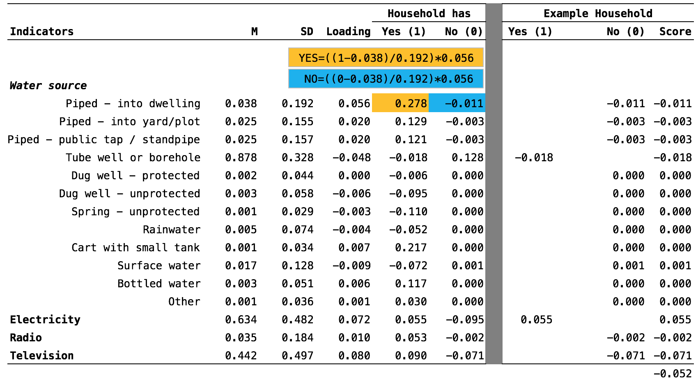

# Data Collection Methods {#datacollection}

Now that you know what indicators you want to measure, it's time to decide *how* to measure them. Sometimes it's possible to use existing data sources, such as administrative or medical records, but most likely part or all of your data will come from original data collection efforts. In this chapter we'll review common quantitative and qualitative methods that you can use. 

## Quantitative Methods

An **instrument** is a tool for measuring indicators [@glennerster:2013]. Many studies in global health rely on survey instruments, so we'll begin our tour with surveys before turning to non-survey instruments.

### SURVEYS{-}

The most common type of data collection instrument in global health is surveys. Surveys are relatively cheap and easy to administer compared to some methods like biomarker testing, but care must be taken to pre-test the instrument, train enumerators, and monitor the administration.

```{block, type='rmdpuzzle'}
I'll use the term 'survey' throughout this section, but some people would use the more specific term 'questionnaire' instead. This is because survey can represent the larger category of data collection that includes interviews. When interviews are [structured or semi-structured](https://en.wikipedia.org/wiki/Structured_interview), they look a lot like a written questionnaire that is read aloud to participants. 
``` 

#### Designing a survey instrument{-}

##### Start with standard tools{-}

Whenever possible, begin with well-known survey instruments. A great option for basic demographic and health questions is the [DHS model questionnaires](http://dhsprogram.com/What-We-Do/Survey-Types/DHS-Questionnaires.cfm). There are four types plus several optional modules: household, woman, man, and biomarker.

| Household | Woman | Man | Biomarker | Optional |
|:---       |:---   |:--- | :---      |:--- |
| Household schedule | Background | Background | Anthropometry | Domestic Violence | 
| Household characteristics | Reproductive behavior and intentions | Reproduction | Anemia | Female Genital Cutting |
| | Contraception | Knowledge and use of contraception | HIV | Maternal Mortality | 
| | Antenatal, delivery, and postnatal care | Employment and gender roles | | Fistula |
| | Breastfeeding and nutrition | HIV and other sexually transmitted infections | | Out-of-pocket Health Expenditures |
| | Children's health | Other health issues | |
| | Status of women | | |
| | HIV and other sexually transmitted infections | | |
| | Husband's background | | |
| | Other topics | | |

DHS questionnaires and analysis code are available for download, along with materials used in the [AIDS Indicator Survey](http://dhsprogram.com/What-We-Do/Survey-Types/AIS.cfm) (AIS), [Malaria Indicator Survey](http://dhsprogram.com/What-We-Do/Survey-Types/MIS.cfm) (MIS), [Service Provision Assessment](http://dhsprogram.com/What-We-Do/Survey-Types/SPA.cfm) (SPA), and [Key Indicators Survey](http://dhsprogram.com/What-We-Do/Survey-Types/KIS.cfm) (KIS).

##### Writing good survey questions{-}

Sometimes you have to create your own surveys. Start early! Writing good survey questions is an art. It takes a lot of practice and trial & error to get it right. Common problems include:

* Use of confusing or complex language
* Unclear meaning
* Use of double-negatives
* Embedding more than one question in a question (double-barreled)
* Use of leading statements
* Hard to answer

The solution to all of these problems is pre-testing. **Cognitive interviewing** is a good technique for pre-testing in which you ask a question and record a response, but only as a way of inquiring about the respondent's understanding of the question. For instance, let's say the survey item is:

> Over the past 2 weeks, how often have you been bothered by feeling tired or having little energy? Not at all, several days, more than half the days, nearly every day.

In cognitive interviewing, you would ask the respondent to explain the meaning or the purpose of the question. What do you think I am asking you to tell me? What does it mean to experience something for 'more than half of the days' in the past two weeks? If the respondent's answers reflects a clear understanding of the question and response options, it's probably a good item. If not, it might be worth exploring alternative phrasings that can be pre-tested with other members of your target population. These tests can take place one-on-one or in a group format.

```{block, type='rmdtip'}
Some researchers advocate mixing positively and negatively worded questions to limit acquiescence bias, which happens when respondents get in the pattern of just agreeing (or disagreeing) when question after question follows a similar format. The potential downside of mixing directions is that respondents might have a harder time understanding the meaning of each question. Pilot-testing should limit this concern, however.
``` 

##### Selecting response options{-}

Survey items are typically **closed-ended** rather than **open-ended**, meaning that the respondents are asked to provide a specific answer such as a number (e.g., age) or date, or are asked to pick from a set of possible options. When an item has more than one option, it is called a **categorical variable**. One type of categorical variable is a **dichotomous variable** (aka binary) that has two options, usually "yes" or "no". When respondents pick from mutually-exclusive categories that don't have any particular order, we call this a **nominal variable** (e.g., cow, pig, sheep). If the options are ordered, it's called an **ordinal variable** (e.g., never, rarely, sometimes, often). 

One type of ordinal variable is a **Likert-type item** in which response options take a discrete value along a continuum with qualitative anchors. For instance, you might ask a respondent if they agree or disagree with a statement on a 4-point Likert-type scale:

* Strongly agree (0)
* Agree (1)
* Disagree (2)
* Strongly disagree (3)

Without a "neutral" middle option, this response set would be referred to as **forced choice** because the respondent has to decide to be closer to 'agree' or 'disagree'. This is often an advantageous survey design decision because you avoid having participants clump around this neutral middle point. Participants must be free to refuse to answer questions, but advertising the neutral or 'don't know' option on questions about attitudes or beliefs tends to increase it's use because it's always easier not to make a decision.[^facts]

[^facts]: Questions about facts—"Has your bednet been treated with an insecticide?"—should probably include a "don't know" option to avoid having inaccurate data. 

```{block, type='rmdtip'}
It's also possible to position the two extremes of a scale on either end of a horizontal line and ask respondents to draw an intersecting vertical line somewhere along the line. This is called a **visual analogue scale**. Web or tablet administration makes it possible to ask the respondent to move a virtual slider to the desired position between the two anchors. Such scales blur the lines between ordinal and continuous measurement. 
```

#### Translating the survey{-}

It's essential to prepare a high quality translation when materials are presented to participants in a different language. There are various approaches to translation, but one that seems to work well is forward translation by a skilled translator and then blind back-translation by a second skilled translator. The key word here is *blind*; the back translation is worthless if the translator has access to the original version. This process makes it possible to look for problems by comparing the original version and the back-translated version. Whenever a potential loss or change of meaning is detected, it's necessary to review all three versions (original, translated, back-translated) and determine the cause. Once discrepancies are resolved, it is ideal to have translated instrument reviewed by language experts and subject matter experts. Avoid plans to translate 'on-the-fly'.

```{block, type='rmdtip'}
Know your participants and find the right translator. For instance, if you want to survey women in a rural area without much formal education, make sure that the translator does not introduce complex language and sentence structure that might be technically correct by utterly confusing for participants. 
```

#### Administering the survey{-}

There are two basic approaches to survey administration:

1. Participants complete the survey on their own
2. Trained enumerators read each question aloud and record answers

Surveys conducted in low-income countries are often administered in person by trained enumerators who read each question aloud and record answers on paper[^double] or an electronic device (via **computer-assisted personal interviewing**, or [CAPI](https://en.wikipedia.org/wiki/Computer-assisted_personal_interviewing)). This is done primarily to ensure that illiterate people are not excluded. When survey need to ask about sensitive topics, researchers might employ audio or video computer-assisted self-interviewing tools (CASI) to allow the participant to complete the survey on their own.

[^double]: When responses are recorded on paper, it's customary to employ different people to double enter all survey data and reconcile discrepancies to ensure data quality.

| Format  | Administration | Mode | Data Capture | Enumerator Present | Label |
|:---   |:---            |:---  |:---  |:---         |:---|
| Paper | Participant | Read | Participant | Maybe | |
| Paper | Enumerator | Read | Enumerator | Yes  | |
| Paper | Enumerator | Read | Participant | Yes  | Secret ballot |
| Electronic | Participant | Read | Participant | Yes | Computer-assisted personal interviewing (CAPI) |
| Electronic | Enumerator | Read | Enumerator | Yes | Computer-assisted personal interviewing (CAPI) |
| Electronic | Participant | Read | Participant | No | Computer-assisted self interviewing (CASI) |
| Electronic | Participant | Listen | Participant | No | Audio computer-assisted self interviewing (ACASI) | 

```{block, type='rmdcomment'}
Technology makes some things easier other things harder. On the positive side, electronic administration eliminates the time, cost, and errors associated with manual data entry. The ability to incorporate survey logic also prevents skip pattern errors. Some downsides include hardware costs and maintenance woes. The combination of rough use in field surveys and rapid developments in software and hardware mean that you might find yourself in a regular cycle of evaluating new options for collecting data. See [here](http://blogs.worldbank.org/impactevaluations/electronic-versus-paper-based-data-collection-reviewing-debate) for more thoughts about how to answer the paper vs. digital question (which is increasingly becoming a question of "how to do digital data collection").

**Online surveys** are not commonly used in global health, but as Internet access grows platforms like [Amazon's Mechanical Turk](https://www.mturk.com/mturk/welcome) are becoming more feasible for certain research questions. See [here](https://www.princeton.edu/~psrc/mturk.html) for a discussion of how researchers are using Mechanical Turk in mostly high-income settings to recruit study participants.
```
#### Constructing indicators{-}

##### Single item indicators{-}

Some indicators are measured with responses to a single item (or a short series of items) on a survey. For instance, in Malaria Indicator Surveys the "[proportion of households with at least one ITN](http://www.rollbackmalaria.org/files/files/resources/tool_HouseholdSurveyIndicatorsForMalariaControl.pdf)" is the "number of households surveyed with at least one ITN" (numerator) divided by the "total number of households surveyed" (denominator).

> The numerator for this indicator is obtained from asking the household respondent if there is any mosquito net in the house that can be used while sleeping and from determining whether each net found in a household is a factory-treated net that does not require any treatment (an LLIN) or a net that has been soaked with insecticide within the past 12 months. The denominator is the total number of surveyed households.
 
To determine if a household has an ITN, enumerators ask the following sequence of [questions](http://malariasurveys.org/toolkit.cfm). 

```{r itnq, echo=F}
itnq <- data.frame(n=c(
  "119",
  "120",
  "121",
  "122",
  "123",
  "124",
  "125"
),
q=c(
"Does your household have any mosquito nets?",
"How many mosquito nets does your household have?",
"ASK THE RESPONDENT TO SHOW YOU ALL THE NETS IN THE HOUSEHOLD",
"How many months ago did your household get the mosquito net?",
"OBSERVE OR ASK BRAND/TYPE OF MOSQUITO NET",
"Since you got the net, was it ever soaked or dipped in a liquid to kill or repel mosquitoes?",
"How many months ago was the net last soaked or dipped?"
)
)
names(itnq) <- c("Number", "Question")

knitr::kable(itnq, format = "html") %>%
  html_table_width(c(50,550))
```

The end result is a binary indicator (yes/no) of whether the household has a bednet that has been dipped in the past 12 months or is factory-treated. In theory it is possible to ask this in one question—"Does your household have any factory-treated mosquito nets or nets that have been dipped in a liquid to kill or repel mosquitoes in the past 12 months?—but this is a long and complicated question. It's more effective to break up the question.

Sometimes more abstract constructs can also be measured with just one item. For instance, Konrath et al. [-@konrath:2014] ran 11 studies and found that you can measure narcissism with one question:

> To what extent do you agree with this statement: "I am a narcissist." Response options range from "not very true about me" (1) to "very true of me" (7).[^skeptical]

[^skeptical]: Skeptical? From the authors: "We recognize that some readers may be skeptical about whether simply asking people if they are narcissistic is an appropriate measure of narcissism, given that narcissism is associated with a host of defensive processes. Are people really aware of their own levels of narcissism? We would argue that, based on the evidence from the current studies, people who are willing to admit that they are relatively more narcissistic than others, actually are."

Most often, however, constructs like narcissism and depression are measured with multiple items that are combined into indexes or scales. These two terms are often used interchangeably, but they are not synonyms. While sharing in common the fact that multiple items or observations go into their construction—making them **composite measures**—the method and purpose of combining these items or observations is distinct.

##### Indexes{-}

**Indexes** combine items into an overall composite, often without concern for how the individual items relate to each other. For instance, the [Dow Jones Industrial Average](https://en.wikipedia.org/wiki/Dow_Jones_Industrial_Average) is a stock market index that represents a scaled average of stock prices of 30 major U.S. companies such as Walt Disney and McDonald's. The Dow Jones is a popular indicator of market strength and is constantly monitored during trading hours. Every index has its quirks, and the Dow Jones is no exception. Companies with larger share prices have more influence on the index.

An index popular with the global health crowd is the [DHS wealth index](http://www.dhsprogram.com/topics/wealth-index/Wealth-Index-Construction.cfm). As a predictor of many health behaviors and outcomes, economic status is a covariate in high demand. Failing to measure economic status in a household survey would be like failing to note a respondent's gender or age, but measuring economic status is not nearly as easy.[^socioecon] 

[^socioecon]: @dhswealth:2004 remind us that the wealth index is more appropriately referred to as a measure of economic status rather than socio-economic status because it does not include type of occupation and level of education.

In an ideal data world every survey would include *accurate* information on household income and consumption as measures of household wealth. Income is volatile, however, and consumption is very hard to measure quickly. So in the late 1990s, researchers first proposed creating an index of household assets as a measure of a household's economic status [@dhswealth:2004].

Data for the wealth index come from DHS surveys conducted in a particular country. Indicator variables include individual and household assets (e.g., phone, television, car), land ownership, and dwelling characteristics, such as water and sanitation facilities, housing materials (i.e., wall, floor, roof), persons sleeping per room, and cooking facilities. The figure below shows a snapshot of the DHS Household Questionnaire.

```{r wealth, fig.cap="DHS Round 7 Household Questionnaire.", echo=F}
knitr::include_graphics("images/wealth.png", dpi = NA)
```

A key decision when creating indexes like the wealth index is *whether to weight* the individual components. Should owning a car be given the same weight as owning a phone? In other words, in constructing an index that measures someone's wealth, should owning a phone contribute as much to the index as owning a car? Most readers would probably say no, so the next question is *how to assign differential weights* to the components. @filmer:2001 first proposed assigning weights via **[principal components analysis](https://en.wikipedia.org/wiki/Principal_component_analysis)**, or PCA. 

PCA is a data reduction technique in which indicators are standardized (i.e., transformed into *z*-scores) so that they each have a mean of 0 and a variance of 1. If there are 10 items, the total variance is therefore 10, and there are 10 *principal components*. A principal component (aka eigenvector) is a linear combination of the original indicators, so every indicator (e.g., yes/no to owning a phone) has a factor loading that represents the correlation between the individual indicator and the principal component. 

The first principal component always explains the most variance, and each component after the first explains a smaller and smaller amount of total variance. In constructing the wealth index, we assume that the first component measures this thing called "wealth", so we use the factor loadings on the first principal component to create a score for each household. Let's use the [2014 Bangladesh DHS survey](http://dhsprogram.com/what-we-do/survey/survey-display-461.cfm) as an example.  

```{r wealthex, fig.cap="Example wealth index construction (abbreviated from 2014 Bangladesh DHS).", echo=F}

```

As shown above, the factor loading for water piped into a dwelling (i.e., indoor plumbing) was 0.056 in the PCA run on the 2014 Bangladesh DHS data. In order to create the index, this loading gets converted into a score for whether the household has or does not have the asset, and these indicator scores are summed to get an overall index score for each household. Once every household has an index score, it's possible to assign every participant to of 1 of 5 wealth quintiles reflecting their economic status (*relative to the sample*). This makes it possible to examine the relationship between health outcomes and wealth.

##### Scales{-}

In an index, indicators "cause" the concept that is being measured. For instance, a household's wealth is determined by the assets it owns (e.g., livestock, floor quality). Conversely, in a **scale**, the concept "causes" the indicators. 

```{r scaleindex, fig.cap="Scale vs index.", echo=F}
knitr::include_graphics("images/scalevsindex.png", dpi = NA)
```

Let's take an example like depression. There is not a blood test for depression, so depression is a construct that needs a definition. According to the Diagnostic Criteria for Major Depressive Disorder and Depressive Episodes, currently the DSM-V, the criteria for Major Depressive Disorder are as follows, A-E:

***A. Five (or more) of the following symptoms have been present during the same 2-week period and represent a change from previous functioning; at least one of the symptoms is either (1) depressed mood or (2) loss of interest or pleasure.***

1. Depressed mood most of the day, nearly every day, as indicated by either subjective report (e.g., feels sad, empty, hopeless) or observation made by others (e.g., appears tearful). 
2. Markedly diminished interest or pleasure in all, or almost all, activities most of the day, nearly every day (as indicated by either subjective account or observation.)
3. Significant weight loss when not dieting or weight gain (e.g., a change of more than 5% of body weight in a month), or decrease or increase in appetite nearly every day. 
4. Insomnia or hypersomnia nearly every day.
5. Psychomotor agitation or retardation nearly every day (observable by others, not merely subjective feelings of restlessness or being slowed down).
6. Fatigue or loss of energy nearly every day.
7. Feelings of worthlessness or excessive or inappropriate guilt (which may be delusional) nearly every day (not merely self-reproach or guilt about being sick).
8. Diminished ability to think or concentrate, or indecisiveness, nearly every day (either by subjective account or as observed by others).
9. Recurrent thoughts of death (not just fear of dying), recurrent suicidal ideation without a specific plan, or a suicide attempt or a specific plan for committing suicide.

***B. The symptoms cause clinically significant distress or impairment in social, occupational, or other important areas of functioning.***

***C. The episode is not attributable to the physiological effects of a substance or to another medical
condition.***

***D. The occurrence of the major depressive episode is not better explained by schizoaffective disorder, schizophrenia, schizophreniform disorder, delusional disorder, or other specified and unspecified schizophrenia spectrum and other psychotic disorders.***

***E. There has never been a manic episode or a hypomanic episode.***

If someone meets criteria A-E, they are diagnosed with Major Depressive Disorder. A diagnosis by a trained mental health professional like a psychiatrist would usually be considered the gold standard measure of depression. Gold standards are in short supply in many places, however, and we need more feasible methods of measuring this thing called depression. A reasonable alternative is to develop a set of questions—a scale—that we could administer to someone as a way of measuring their symptom severity. Presumably, if a person scored high enough on this scale, we'd classify them as depressed.

In this example, depression is the **latent variable** that we can't measure directly. To get an indicator of depression, we need to measure a combination of **manifest variables** that are 'caused' by the latent variable depression. 

One measure of depression is the Beck Depression Inventory [@beck:1996]. The BDI-II consists of 21 groups of statements, such as:

1. **Sadness**
	* (0) I do not feel sad
	* (1) I feel sad much of the time
	* (2) I am sad all the time
	* (3) I am so sad or unhappy that I can't stand it
2. **Pessimism**
	* (0) I am not discouraged about my future
	* (1) I feel more discouraged about my future than I used to be
	* (2) I do not expect things to work out for me
	* (3) I feel my future is hopeless and will only get worse

Each item is a manifest variable—something that we measure directly by asking the question. The latent variable depression is measured indirectly by summing a person's responses to all 21 manifest variables to create the BDI-II scale score. 

#### Determining the factor structure of scales{-}

##### Exploratory factor analysis{-}

Typically when developing a new scale, researchers will start with a large pool of potential items—many more than they could ever use an applied context where administration time is a relevant constraint—and use exploratory factor analysis or some other method of data reduction to shrink the pool.

[**Exploratory factor analysis**](https://en.wikipedia.org/wiki/Exploratory_factor_analysis) (EFA) looks a lot like PCA, but they are conceptually and computationally distinct. Whereas PCA results in a linear combination of indicators that maximized total variance, factor analysis maximizes the common or shared variance. 

Factor analysis helps us to understand the structure of the data. For instance, the BDI-II consists of 21 items that are thought to measure the latent construct of depression, but many studies have examined whether these items can be grouped into subfactors—different domains of depression.

@manian:2013 administered the BDI-II to 953 new mothers "from a large East coast metropolitan area" and then conducted EFA on data from half of the sample.[^holdout] They looked for 2- to 4-factor solutions and found that a 3-factor model made the most sense empirically (based on data) and theoretically (based on their knowledge of the literature). Their model suggested that the latent variable of depression is composed of three subfactors as shown in the figure below: cognitive symptoms, affective symptoms, and somatic symptoms.  

[^holdout]: This hold out approach allows you to develop the model using some of your data and cross-validate (aka, test) the model on new data not used to build the model. This is important because you can come up with the best EFA model ever, but if it is too closely fit to your data, it won't replicate. In other words, if you were to run a new study and collect new data, you might find that your model is not a good fit to the new data. It's certainly possible to run a new study to test EFA models, but most researchers prefer to recruit a large enough sample to allow them to divide the dataset into a training set (EFA) and test set (CFA).

##### Confirmatory factor analysis{-}

@manian:2013 then used the holdout data (i.e., data from their sample not used in the EFA) to test the fit of their 3-factor model through [**confirmatory factor analysis**](https://en.wikipedia.org/wiki/Confirmatory_factor_analysis) (CFA). It fit! The model is shown below.

If you are using an existing scale in a new population or setting, CFA is a good technique to determine if the original factor structure generalizes to your context. A typical case is one in which the original scale is developed in a high-income setting and research suggests that it makes sense to construct an overall scale score (of some latent variable like depression) *AND* 2 or 3 subscale scores that correspond to subfactors like cognitive symptoms and affective symptoms. However, let's say that you recruit a sample in a completely new context and your CFA suggests that the original 2-factor model does not fit. Maybe in a different cultural context depression is not manifested along the same dimensions of cognitive and affective symptoms. Such a finding should make you question whether it makes sense to use the scale as is without further evaluation of its applicability.

```{r factor3, fig.cap="Final 3-factor model of the BDI-II with standardized path coefficients. Source: @manian:2013.", echo=F}
knitr::include_graphics("images/3factor.jpg", dpi = NA)
```

#### Constructing scale scores: revisited{-}

An under-appreciated question when it comes to scales is how to actually construct scale scores. Let's say you come up with a bunch of items that you think measure this thing—this latent construct—called depression, administer the survey with these items to a few hundred people, and conduct EFA and CFA to determine the factor structure. Now what?

Well, you have a few options. distefano:2009 lump them into two buckets: refined and non-refined. 

1. **Non-refined methods** are most commonly used because they are simple to compute and easy to compare across samples.
	* **Sum raw scores.** If there are 21 items each with a possible range of 0 to 3, you just add up the scores on each item. This is what the BDI-II does, which gives it a possible range of 0 to 63.
	* **Average raw scores.** Same idea as summing, but averaging keeps the possible range consistent with the response scale. For instance, if you average 21 items with response options that range from 0 to 3, the possible scale scores will range from 0 to 3. Some people think this makes more intuitive sense when presenting results.
	* **Sum standardized scores.** With this method you would first standardize each item to have the same mean and standard deviation. It might be a good idea if the standard deviations of the items vary quite a bit. 
2. **Refined methods** may produce more exact scores since items are weighted empirically (vs equal weighting in non-refined methods) and relationships between factors are reflected in the scoring, but they are more complex and require the analyst to make a number of decisions along the way that can produce very different results. 

#### Evaluating psychometrics{-}

When it comes to evaluating scales like the BDI-II, we often look at several **psychometric** properties that we can group generally into two buckets: reliability and validity. Here's a simple example that highlights the basic difference between these terms.

Imagine your bathroom scale. If you stepped on, then off, then on again, and the scale read 210 lbs and then 180 lbs, you would realize that you are the owner of a broken, *unreliable* scale. So you head to the store and pick up a new scale. You step on and off your new scale, and it reads 400.12 lbs then 400.15 lbs. It's very reliable (*good precision*), but unfortunately very wrong (*poor accuracy*, *invalid*) since you actually weigh something closer to 195 lbs.

##### Reliability{-} 

A **reliable** instrument is a consistent instrument. Consistent over repeated use (as in the bathroom scale example), and consistent among it's component parts. There are several methods for assessing the reliability of an instrument. Here are a few common approaches.

**Test-retest reliability.** This is sometimes referred to as stability. Participants complete your survey today and then again in after a short period of time, maybe a few days or a week. If each person's score is the exactly the same the second time, your instrument would be perfectly reliable. It won't be, but you'll hope for a high correlation coefficient (conventionally higher than 0.70). @beck:1996 assessed the test-retest reliability of the BDI-II by giving the screening to 26 outpatients in Philadelphia at their first and second therapy sessions, approximately 1 week apart. They reported a test-retest correlation was 0.93. The tricky thing with test-retest reliability is knowing when to conduct the retest. Wait too long and scores will change because people change. Don't wait long enough and you just get people repeating their answers from memory.

**Interitem reliability.** This is when responses to items in your instrument are consistent. If not, you have to wonder if they are measuring the same underlying construct of depression. 

1. One approach to finding unreliable items in your instrument is to calculate **item-total correlations**. It's easy: correlate responses on each item with the total scale score. Generally item-total correlations exceeding 0.30 are sufficient. @beck:1996 reported that item-total correlations for the 21 BDI-II items ranged from 0.39 to 0.70 in the outpatient sample.
2. Another approach is **Cronbach's alpha**, a measure of **internal consistency**. @beck:1996 reported a coefficient alpha value of 0.92 for the outpatient sample. To understand Cronbach's alpha, you have to understand that instruments are imperfect, even the BDI-II. Every person's *observed score*—e.g., their total score on the BDI-II—is actually a function of their *'true' score* (which we can't know) plus some amount of *measurement error*. Cronbach's alpha gives you an estimate of how much variance in people's scores is measurement error. When you calculate Cronbach's alpha in a program like R or Stata, behind the scenes the program does the equivalent of splitting the dataset into two halves over and over again and calculating the correlation between total scores for the first half with total scores for the second half. Cronbach's alpha is the average of all possible correlation coefficients. Things to note about alpha:

	* Alpha can range from 0 to 1
	* 0.70 is a rough guide for the low-end of acceptable
	* A value of 1 would indicate complete redundancy suggesting that the items are *too* similar!
	* Alpha is sensitive to the number of items so a high alpha might just reflect that there are a lot of items included in the scale
	* Alpha is not a property of the test, rather a characteristic of the test when used in a particular sample
	* Alpha should not be used when a scale might tap different latent constructs—only use alpha when the scale is unidimensional
	* @dunn:2014 and others reviewed the limitations of alpha and suggest coefficient *omega* as an alternative

**Interrater reliability.** This is another type of reliability that indicates whether two observers are consistent in observational ratings. Instead of using self-report instrument like the BDI-II, we might want to have two observers watch a video of a parent and child interacting and 'code' the parent's behaviors using a depression rating system that we developed. If the observers agree a lot in their video ratings, they would be reliable. Things to note about interrater reliability:
   
   * Percent agreement is one method of evaluating two raters when the rating is binary, but it does not account for agreement that can happen by chance
   * Cohen's kappa coefficient does account for agreement by chance; generally want a value greater than 0.40
   * Weighted kappa is good when the rating scale is ordinal (e.g., good < better < best) and you need to account for the fact that *good vs best* represents more disagreement than *better vs best*
   * Intraclass correlation is a good option when you have 2 or more raters

##### Validity{-}

Ask this three times: does your measure measure what you intend to measure with your measure? Or more simply: is the BDI-II an accurate measure this thing called 'depression'? If not, it's not a valid measure of depression. There are several types of **validity** that you can use to determine whether your instrument is valid.

**Face validity.** This is the weakest form of validity. The basic idea is: if it looks like a duck, quacks like a duck, it's a duck. If people think your depression instrument asks about depression, then it has face validity as a measure of depression. This is a weak standard, however. A great looking instrument can perform very poorly in practice, and an instrument that appears to lack face validity might perform very well. The bottom line is that if you read an article and the only mention of validity is face validity, it's a lame duck.

**Construct validity.** Depression is a hypothetical construct. If your new depression instrument has construct validity, it will be more strongly related to other instruments that are also thought to measure depression (**convergent validity**) and less strongly (or not at all related) to other instruments that claim to measure something other than depression (**discriminant validity**). For instance, @beck:1996 reported that the BDI-II was more positively correlated with the Hamilton Psychiatric Rating Scale for *Depression* (0.71; convergent) than the Hamilton Rating Scale for *Anxiety* (0.47, discriminant). If your instrument has both convergent and discriminant validity, you have more confidence that it measures the construct you think it measures.

**Content validity.** This form of validity asks whether the components of an instrument—e.g., each question in a questionnaire—is relevant to the measurement of the larger construct. For instance, a question about difficulty sleeping is relevant to the measurement of depression since insomnia is a common symptom of depression. Conversely, a question about compulsive behaviors is probably not relevant since compulsive behaviors are not a typical symptom of the syndrome. Content validity also accounts for missing dimensions of a construct. If the BDI-II lacked a question about A5, "Psychomotor agitation", we might question its content validity.

**Criterion-related validity.** An even more robust form of validity is criterion validity. Does an **index test** correctly classify people by their true disease status as determined by some gold standard **criterion reference**?

* Does a new rapid diagnostic test correctly identify evidence of malaria parasites in human blood samples?
* Do scores on the BDI-II correctly predict which people will be diagnosed with depression when evaluated independently by a mental health professional--the gold standard? 

Let's use an example to explore criterion-related validity in more depth. Kim et al. [-@kim:2014] conducted a study with 562 HIV-positive adolescents in Malawi in which they had the adolescents complete the BDI-II and then participate in a separate clinical interview with clinicians trained to use a structured interview tool called the Children's Rating Scale, Revised (CDRS-R).

1. **Index test**: With 21 items on the BDI-II—each with possible response values from 0 to 3—BDI-II scale scores can range from 0 to 63. Higher scores represent more severe depression. One goal of a validity study is to find a cutoff score on the index test that maximizes diagnostic accuracy. For instance, if the **cutoff score** is 15, anyone who scores greater than 15 is classified as depressed and everyone else is classified as not depressed.
2. **Criterion reference**: In this study, independent clinician classification of depression was the gold standard. Every adolescent was classified as depressed or not depressed following a clinical interview.

Taken together, there are four possible combinations of index test and gold standard results that we can display in a **confusion matrix**:

* **true positive (a)**: both the test result and the gold standard indicate that the person is depressed
* **true negative (d)**: both the test result and the gold standard indicate that the person is NOT depressed
* **false positive (b)**: the test result suggests depression, but the gold standard disagrees
* **false negative (c)**: the test result suggest no depression, but the gold standard disagrees

```{r confusion, fig.cap="Confusion matrix based on @kim:2014.", echo=F}
knitr::include_graphics("images/confusion.png", dpi = NA)
```

From this base set of numbers we can calculate a number of useful metrics about the index test (see the [STARD guidelines](http://www.equator-network.org/reporting-guidelines/stard/) for reporting in studies of diagnostic accuracy):

```{r cm, echo=F}
cm <- data.frame(m=c(
  "**Prevalence**",
  "**Accuracy**",
  "**Sensitivity**",
  "**False Negative Rate**",
  "**Specificity**",
  "**False Positive Rate**",
  "**Positive Predictive Value**",
  "**False Discovery Rate**",
  "**Negative Predictive Value**",
  "**False Omission Rate**",
  "**Positive Likelihood Ratio**",
  "**Negative Likelihood Ratio**"
),
d=c(
"This is the proportion of the sample (with the right methods we can infer to the population) who have (or had) a certain characteristic such as depression. We will distinguish between point, period, and lifetime prevalence, as well as introduce important issues related to sampling and prevalence, in a later chapter.",
"This is the total misclassification rate for a particular cutoff point. How often does the test misclassify people according to their 'true' disease state measured by the criterion reference? [Area under the curve, or AUC, is another useful metric of test accuracy. See below for more details.]",
"Sensitivity is also referred to as the true positive rate. @kim:2014 reported an estimate of 0.75, which indicates that 75% of adolescents with depression correctly screened positive with a cutoff value of 15",
"The flip side of sensitivity (true positives) is the false negative rate. In this example, 25% of depressed adolescents were misclassified by the test as not depressed.",
"Specificity is also referred to as the true negative rate. @kim:2014 reported an estimate of 0.77, which indicates that 77% of non-depressed adolescents correctly screened negative with a cutoff value of 15.",
"The inverse of specificity (true negatives) is the false positive rate. In this example, 33% of non-depressed adolescents were misclassified by the test as depressed.",
"If someone tests positive, you want to know how likely it is that the person is actually positive. This is what PPV indicates, but there's a catch: the PPV (and NPV, below) depend on the prevalence of the condition in the sample, so they should only be used with representative samples obtained by probability sampling. @kim:2014 report PPV, but this is questionable given their use of convenience sampling. If this were a probability sample, we could interpret a PPV of 0.43 to mean that the probability of depression when testing positive with the BDI-II using a cutoff of 15 is 43 percent. *How is this different from sensitivity?* Sensitivity does not depend on prevalence, but PPV does. A test can be sensitive (i.e., high true positive rate) but still produce many false positives if the prevalence of the condition is low, resulting in a low PPV.",
"This is the inverse of PPV. Whereas PPV is the probability of disease if the test is positive, the FDR is the probability of a false positive (a false discovery) if the test is positive.",
"Similar to the PPV, the NPV asks if a person tests negative, what is the probability that they are actually negative. In the example shown, a NPV of 0.93 can be interpreted to mean that the probability of not being depressed when testing negative with the BDI-II using a cutoff of 15 is 93 percent.",
"This is the inverse of NPV. Whereas NPV is the probability of no disease if the test is negative, the FDR is the probability of a false negative (a false omission) if the test is negative.",
"This is a measure of how much more likely a positive test result occurs in people with the condition compared to people without the condition. A LR+ of 1 would mean that the result is equally likely, therefore the test is not very helpful. In @kim:2014 the LR+ is 2.3, which means that a positive test result is 2.3 times more likely if the person is actually depressed. This is fairly modest. As a clinician, you'd hope to see that the test had a LR+ ratio greater than 10 as a general rule.",
"This is a measure of how much more likely a negative test result occurs in people with the condition compared to people without the condition. Again here a LR- of 1 signifies that the test is not useful. A ratio less than 1—particularly less than 0.1—is a good indicator that a negative result is diagnostically accurate."
)
)
names(cm) <- c("Metric", "Details")

knitr::kable(cm, format = "html") %>%
  html_table_width(c(150,450))
```

In the sensitivity and specificity calculations shown above, the example cutoff score for depression on the BDI-II was set to 15. To determine if 15 is the best cut point, we could calculate the sensitivity and specificity again for several different cutoff points and plot the relationship in a **receiver operating characteristic** (ROC) curve. ROC curves plot sensitivity (the true positive rate) against 1 minus specificity for a range of different cutoff points. For instance, the figure below shows the ROC curve presented in @kim:2014.

```{r roc, fig.cap="Receiver operating characteristic (ROC) curve for the BDI-II and CDI-II-S as compared to the CDRS-R. Source: @kim:2014. Circle annotation added.", echo=F}
knitr::include_graphics("images/JIAS-17-18965-g001.jpg", dpi = NA)
```
The best cutoff is typically the one that maximizes sensitivity and specificity.[^tradeoff] In a ROC curve, this is the point that is closest to the top left of the graph—sensitivity of 1 and (1-specificity) of 0. In @kim:2014, the optimal cutoff did indeed turn out to be 15.

[^tradeoff]: Decreasing false positives (higher specificity) could be favored to avoid labeling non-depressed patients as depressed and using resources for unnecessary additional evaluations. Doing so would mean missing more true positives, but it could be a defensible tradeoff.

To evaluate the overall accuracy of the test, we can calculate the **area under the ROC curve** (AUC). In @kim:2014, the AUC for the BDI-II is 0.82, generally considered to be an accurate benchmark (1=perfect; 0.5=worthless). The BDI-II performs better than an alternative screening instrument also assessed in this study called the Children's Depression Inventory-II-Short (CDI-II-S); AUC=0.75.

```{block, type='rmdpuzzle'}
***What is the difference between overall accuracy `((true positives + true negatives) / total)` and AUC?*** Recall that the numbers you can calculate in a confusion matrix are dependent on the threshold you set for what counts as a positive test. Different thresholds (cutoffs) result in different patters of misclassification. AUC, on the other hand, takes into account sensitivity and specificity associated with all possible cutoffs. 
```

#### Adapting instruments for new settings{-}

The BDI-II appeared to be an accurate measure of depression among HIV-positive adolescents in Malawi according to @kim:2014. This is not always the case, however, when exporting scales developed and validated in one cultural context to another. Whenever you are considering using or adapting a survey instrument like the BDI-II for use in a new context, you should determine if the instrument is a valid measure of the construct in that new context. *Translation alone does not make an instrument a valid tool for measuring a construct in a new socio-cultural setting.* This advice from Kohrt et al. [-@kohrt:2011] just about says it all:

> ...instruments developed and validated with children in high income countries with Western cultural settings cannot simply be translated with the expectation they will have the same psychometric properties in other cultural contexts. Cutoff scores established with Western child populations are not necessarily comparable in other settings and may lead to misclassification and distortion of prevalence rates. Moreover, the instruments may not capture the constructs they are intended to measure in other cultural contexts where the meaning, clustering, and experience of symptoms often differs.

You should be skeptical when you read that an instrument has been validated in a particular setting. Kohrt et al. [-@kohrt:2011] give us six questions to appraise cross-cultural validity of instruments (with an emphasis on global mental health):

```{r kohrt, echo=F}
kohrt <- data.frame(q=c(
  "**1. What is the purpose of the instrument?**",
  "**2. What is the construct to be measured?**",
  "**3. What are the contents of the construct?**",
  "**4. What are the idioms used to identify psychological symptoms and behaviors?**",
  "**5. How should questions and responses be structured?**",
  "**6. What does a score on the instrument mean?**"
),
d=c(
"Just as an instrument developed in the U.S. might not be a valid measure of a construct in Japan, an instrument developed to assess prevalence of this construct might not be a valid measure of response to treatment. The validity of instruments should be evaluated based on purpose and context. As Kohrt et al. note: 'Validity is not an inherent property of an instrument.'",
"*Construct validity* refers to the extent to which an instrument measures the construct it is intended to measure. Construct validity is traditionally described as consisting of two parts: convergent and discriminant validity. Establishing construct validity in cross-cultural settings is more complex, however. In global mental health, we might examine three types of constructs through qualitative and ethnographic inquiry: local constructs (aka, idioms of distress or culture-bound syndromes), Western psychiatric constructs, and cross-cultural constructs.",
"**Content validity** is more specific and says that the components of an instrument—e.g., each question in a questionnaire—is relevant to the measurement of the larger construct. Content validity also accounts for missing dimensions of a construct. Is the instrument comprehensive?",
"Language matters. The words we use to describe behaviors and inner states—idioms—can take on different meanings in different contexts. **Semantic equivalence** indicates that 'the meaning of each item is the same in each culture after translation into the language and idiom (written or oral) of each culture'.",
"As discussed above, it is hard to write good questions and structure response options that promote accurate measurement. **Technical equivalence** is demonstrated when, 'the method of assessment... is comparable in each culture with respect to the data that it yields'.",
"When we talk about validating measures, we often mean establishing **criterion validity**: evidence that the instrument is an accurate measure of some outcome. Two subtypes of criterion validity are concurrent validity and predictive validity. **Predictive validity** assesses whether an instrument used today predicts some outcome measured in the future (e.g., standardized test scores and future performance in graduate school). **Concurrent validity** takes a present focus: Is the instrument a proxy for some **gold standard**, like a diagnosis of major depressive disorder by a mental health professional. This particular example might also be referred to as **diagnostic validity**. Of course it's often impossible—or at least highly impractical—to establish a gold standard criterion in low-income settings where there are relatively few trained professionals, so researchers often try to establish that a new measure is correlated with existing validated measure, but there is a chicken and egg problem here. The bottom line is that it's challenging to validate measures across cultures and typically involves a lot of detailed work. Essential work. As Kohrt et al. note: 'The misapplication of instruments that have not undergone diagnostic validation to make prevalence claims is one of the most common errors in global mental health research.'"
)
)
names(kohrt) <- c("Question", "Details")

knitr::kable(kohrt, format = "html") %>%
  html_table_width(c(150,450))
```

"So what if the instrument I want to use has not been validated?" It might be fine to use. Or it might not. The problem is that it can be impossible to tell the difference. If you don't make an effort to prospectively answer these six questions and instead choose to just translate the instrument and move forward—or someone gives you a dataset to analyze from a completed study—then you might be out of luck. Sorry.

Please keep this in mind: reliability and validity are established in particular samples. If your sample is representative of the population, reliability and validity should hold across new samples from this population. If you move to a new population, however, this becomes a very strong assumption.  

### NON-SURVEY INSTRUMENTS{-}

Surveys are widely used in global health, but researchers are constantly on the lookout for creative new low-cost and easy to use instruments that will obtain more valid measurements. Here are some examples that you will find in global health.[^nsi]

[^nsi]: See @glennerster:2013 for more examples. HT to @jacobsen:2016 for details about medical instruments. 

#### Direct observation{-}

One alternative to participant recall and self-report is to observe behavior directly. Direct observation is often described as a qualitative method, but there are several approaches where the goal is primarily to quantify behavior.

##### Random spot checks{-}

**Random spot checks** can be a good technique to use when participants might want to hide a certain behavior, such as not showing up for work. For instance, @chaudhury:2006 studied teacher absenteeism in India by having study enumerators show up at schools unannounced to check whether the teacher was present, whether students were in class, and whether any classroom instruction was taking place.

##### Mystery clients and incognito enumerators{-}

**Mystery clients** mask their identity and purpose to have an authentic experience and data collection opportunity. Kaur et al. [-@kaur:2015] used mystery clients in Nigeria to update a sampling frame of public and private facilities offering artemisinin-based combination therapies for the treatment of malaria. Mchome et al. [-@mchome:2015] took a more qualitative approach, training a dozen Tanzanian youth to visit health facilities and evaluate "youth-friendly" reproductive health services by requesting condoms and information on sexually transmitted infections and family planning. An **incognito enumerator** does something similar but does not participate as a client. @glennerster:2013 give the example of going on a 'ride along' with drivers to count the number and amount of bribes they are compelled to pay along their route.

#### Physical/environmental tests{-}

**Physical tests** are objective measures of materials and environmental substances. For instance, Rosa et al. [-@rosa:2014] conducted a trial of a combined intervention that involved distributing free water filters and improved cookstoves to hundreds of households in Rwanda. In addition to measuring use of these devices through self-report and spot-checks, the research team assessed (i) levels of fecal contamination (presence of thermotolerant coliforms in drinking water samples) and (ii) average 24-h concentrations of particulate matter in the main cooking area.

#### Biological samples{-}

This is a large category of assessment that includes **diagnostic tests** and the analysis of specimens such as hair, saliva, toenail clippings, urine, and tissue biopsies, to name a few. These tests can determine the presence of disease (or markers of disease), predictors of disease, and consequences of disease [@jacobsen:2016]. One of many examples comes from Obala et al. [-@obala:2015] who used a rapid diagnostic test for malaria to confirm infection and caseness in a case-control study in western Kenya.

#### Anthropometric measures{-}

**Anthropometric measures** quantify characteristics of the human body, such as height, weight, and mid-upper-arm circumference. Research on obesity and malnutrition features anthropometric measurement prominently, but you'll find use cases in every area of global health. Use care to follow standard data collection techniques and methods of indicator construction [@cogill:2003,@blossner:2005].

#### Vital signs{-}

**Vital signs** include physiological measurements such as body temperature, blood pressure, pulse, and respiratory rate. Such measurements are typically easy to obtain. Some et al. [-@some:2016] demonstrated in Kenya that management of non-communicable diseases such as hypertension, diabetes mellitus type 2, epilepsy, asthma, and sickle cell, could be effectively shifted from clinical officers (roughly nurse practitioners in the U.S. healthcare system) to nurses to improve overall access to care by reducing the workload of more skilled providers.

#### Clinical examination{-}

Medical personnel can also be trained to collect reliable data through a **clinical examination**. A clinician might listen to a patient's heart, breath, and bowel sounds, or she might examine the patient's eyes, ears, and hair. When used in a research context, examination procedures and data recording should be standardized, and data collectors should be trained until reliable. One example comes from Liu et al. [-@liu:2016] who used the Structured Clinical Interview for Diagnostic and Statistical Manual for Mental Disorders (SCID) to assess depression among a sample of elderly participants in Hunan Province, China. The SCID is *structured* in the sense that the examination has detailed steps and includes an algorithm for making a clinical determination about depression. This standardization makes it easy to train data collection personnel and reduce measurement error.

#### Tests of physiological function{-}

Some studies use tests that measure **physiological function**, such as electrocardiography (ECG) to measure heart function and electroencephalography (EEG) to measure brain function. Lelijveld et al. [-@lelijveld:2016] measured lung function with spirometry in a cohort of Malawian children treated for severe acute malnutrition.

#### Medical imaging{-}

**Medical imaging** techniques create visual representations of internal body structures. Examples include radiography (X-rays), computed tomography (CT) scans, magnetic resonance imaging (MRI), and ultrasound [@jacobsen:2016]. For instance, Rijken et al. [-@rijken:2012] studied the effects of malaria infections early in pregnancy on fetal growth by using ultrasound to measure fetal biparietal diameter and comparing outcomes among infected and uninfected women.

#### Tracking devices{-}

This category of instruments is growing rapidly. From radio-frequency identification (RFID) to track attendance to wearable digital health technology to monitor activity, researchers have a large selection of consumer and professional **tracking devices** for measuring individual behavior. Vanhems et al [-@vanhems:2013] used wearable proximity sensors (RFID) to measure contacts (frequency and duration) among patients and healthcare workers in a geriatric unit of a hospital in France. 

#### GIS and remote sensing{-}

In recent years, researchers in global health have found many applications for **geographic information systems (GIS)**, **global positioning systems (GPS)**, and **remote sensing** (e.g., satellite imagery). A particularly active area of research has been the spatial epidemiology of malaria. For instance, Sewe et al. [-@sewe:2016] used satellite imagery to measure the Normalized Difference Vegetation Index, day Land Surface Temperature, and precipitation, and examined the relationship between these environmental variables and malaria mortality.

#### Standardized tests{-}

As a measure of knowledge, **standardized tests** are useful instruments to estimate the immediate impact of a program or intervention designed to teach people new ideas or skills. For example, HIV prevention programs often include some measure of HIV knowledge [@hughes:2011]. As many studies have demonstrated, however, increasing knowledge does not always translate to changing behavior.

#### Vignettes{-}

Another method of assessing knowledge (and attitudes and skills) is to present participants with hypothetical scenarios called **vignettes**. Corneli et al. [-@corneli:2015] used vignettes to study women's differential likelihood of engaging in risky sexual behavior if taking pre-exposure prophylaxis (PrEP) for HIV. 

**Discrete choice experiments** (DCE) are a particular type of vignette commonly used in healthcare policy and economics. In a DCE, participants are presented with the same basic vignette that combines variations in attributes to elicit the factors that have the greatest influence on preferences [mangham:2009]. For instance, Michaels-Igbokwe et al. [-@michaels:2015] designed a DCE with variations on six attributes to measure youth's preferences for family planning service providers in Malawi. The six attributes included distance to the provider, hours of operation, waiting time, provider attitude, stock, and price. Given the large number of combinations possible, the authors used a fractional factorial design to present participants with a limited choice set. Provider attitude and stock appeared to be important drivers of uptake.

#### Behavioral games{-}

A related idea is to design "games" in which participants are asked to make decisions with real money to measure constructs like time preferences, trust, risk aversion, and prosocial behavior. Blattman et al. [-@blattman:2016] used games in a randomized trial of a microenterprise development program in Uganda to measure how future orientation moderated program impacts.

#### List randomization{-}

It is challenging to obtain accurate and honest answers to sensitive questions, such as questions about sexual behavior. One approach to promoting more honest responding is the **unmatched count** technique, aka list randomization. In this technique, researchers create two lists of questions or statements. The lists are identical, except that one list has an additional question to measure the sensitive issue. Participants are randomly assigned to get the shorter or longer list. Everyone is asked to indicate the total number of correct or truthful items rather than providing an answer to each item. The difference in the mean number of endorsed items per list can be interpreted as the proportion of participants who endorsed the sensitive issue. For instance, if one list has 5 items and the other list has 6 items, mean counts of 3.4 and 3.9, respectively, would indicate that 50 percent of participants endorsed the sensitive item. Karlan and Zinman [-@karlan:2012] used this technique in Peru and the Philippines to measure the proportion of loan recipients who used loan proceeds for non-enterprise purchases. A limitation of this approach is that estimates are only available at the level of randomization.

#### Purchasing decisions{-}

Another alternative to self-report is measuring purchasing decisions. For instance, Dupas [-@dupas:2014] returned to a sample of Kenyan households who were randomly assigned to receive a new type of bednet at prices that ranged from $0 to $3.80. When the research team returned a year later, all households were offered an opportunity to purchase another bednet at the subsidized price of $2.30. They examined how partial or full subsidies in the first phase affected a household's willingness to purchase a bednet in the second phase. By measuring purchasing decisions, the researchers were able to avoid relying on household self-report about whether they would purchase bednets.

#### Social networks{-}

Social relationships influence the spread of disease and offer opportunities for health interventions. Researchers measure these relationships as **social networks**. Kelly et al. [-@kelly:2014] review examples of how to collect and analyze social network data in low-income settings.

## Qualitative Methods

Whereas a good survey requires uniformity and structure, a good interview is flexible and probing. This flexibility is what makes qualitative methods well-suited for exploratory and descriptive research. Flexibility to examine questions of *how* and *why*. The three most common qualitative methods are in-depth interviews, focus groups, and participant observation [@mack:2005].

```{block, type='rmdtip'}
Dr. Leslie Curry at the Yale School of Public Health produced six video modules on qualitative research that readers might find useful. You can watch all six videos [here](https://www.youtube.com/playlist?list=PLqHnHG5X2PXCsCMyN3_EzugAF7GKN2poQ). 
```

### IN-DEPTH INTERVIEWS{-}

An **in-depth interview** is a method of eliciting a person's views and stories. The interviewee is the expert, and it's the interviewer's role to learn from this expertise. Typically interviews are conducted as a private conversation between two people. Some interviews are highly structured with a pre-determined set of questions and follow-up probes. Other interviews are designed to explore a general research topic and do not follow a specific format. All interviews need to be managed, however. The interviewer must guide the participant enough to find the desired narrative within the time constraints.

Data generated by interviews can include audio and/or video recordings that become transcripts, interviewer field notes, and analysis memos. Data quality typically hinges on the skills of the interviewer. To obtain rich, thick description of events and perspectives, the interviewer must keep the participant talking. This takes a substantial amount of practice to do well. Mack et al. [@mack:2005] point to three key skills that interviewers should master:

1. **Rapport-building**: An interviewer must quickly make the participant feel at ease and free to talk openly and honestly.
2. **Emphasizing the participant's perspective**: This requires an interviewer to mask their own perspectives and treat the participant as the expert. People talk when they believe that the person across from them is truly listening and engaging in what they are saying.
3. **Adapting to different personalities and emotional states**: Every interview is different. The interviewer must be able to adapt his or her interview style to match the needs and style of the participant.

Interviewers must also learn to ask clear, open-ended questions and probe responses effectively. Common interviewing mistakes include asking multiple questions at once and asking closed-ended questions that signal the need for a yes/no or short answer. New interviewers also make the mistake of moving on to the next question too quickly, or failing to listen to the participant's response because they are thinking of the next question to ask.

There are two main strategies for eliciting more information from participants: asking follow-up questions and probing. Sometimes interview guides will specify sub-questions that should be explored if a participant's initial response does not address all of the important issues. Other times follow-up questions are ad hoc and intended to clarify a participant's statement or pursue an interesting idea. Specifying follow-up questions in advance can be a useful technique, but it can also create a tendency for new interviewers to move into "survey mode" where the goal is to get some answer for every question, rather than to explore the topic in a more open-ended fashion.

Often, the better approach to keep people talking is to use probes. Probes can be direct questions or indirect expressions or visual cues for a participant to say more. Effective **direct probes** include:

* Can you say more about that?
* I'm not sure I understand. Can you explain?
* Can you give me an example?
* Why do you think...?

Examples of **indirect probes** include:

* Verbal expressions that indicate you are an active listener, such as "uh huh", "ok", and "I see".
* Restating the participant's perspective, e.g., "So you believe that bednets are really only useful during the rainy season".
* Reflecting the participant's feelings, e.g., "And that made you feel disrespected".
* Non-verbal gestures to signal that you are listening, such as nodding.

Combining direct and indirect probes with clarifying questions is typically a winning combination, but it takes a substantial amount of practice to do well. And it's only one interviewing skill to master. The other main skill is "managing" the interview. This means watching the clock and deciding how to balance depth and breadth of responding, redirecting participants when the conversation gets too far afield, and taking good notes. Doing this while sustaining rapport, monitoring a participant's experience, and maintaining an awareness of what ground the interview has and has not covered is incredibly difficult.

It is relatively easy to teach someone to be a good survey enumerator—to ask specific questions and record discrete answers. It is much harder to teach someone to be a good interviewer. Whereas you might be able to run a survey training over the course of a few days or a week, training qualitative interviewers could easily take a month or more to allow enough cycles of practice and feedback.

### FOCUS GROUPS{-}

While interviews are a good method for understanding individual perspectives, focus groups are a better choice if the goal is to quickly gain insight into group norms and the range in group opinions. Focus groups can explore individual experiences to learn about these issues, but private stories are best left for individual interviews where confidentiality and privacy are under the interviewer's control.

It's often most effective for two people to tag team a focus group with one playing the role of moderator and the other taking notes and preparing materials. The moderator has a difficult role to play. Just as an interviewer has to manage the interview process, the moderator has to manage the focus group. This sometimes means redirecting the conversation away from certain topics and dominant participants to achieve certain goals within a set time period. This job becomes harder as groups grow in size as it can be a challenge to involve everyone and make sense of too many voices. There is no cap on how many participants can join a focus group, but more than a dozen would likely be too hard to manage.

It can be helpful to begin a session by laying some ground rules for the discussion that encourage respect for all participants. This gives the moderator something to refer back to when someone in the group is having a negative impact on the discussion. Once the rules are established, it's the moderator's responsibility to ensure that these rules are followed.

Focus group discussions are usually most interesting when the moderator is able to encourage productive crosstalk between participants. Typically discussions begin as a series of 2-way exchanges between the moderator and a participant. To break out of this pattern and encourage participants to respond to each other, the moderator can follow a participant's contribution with a question like "Who takes a different view?" or "What do you think of this idea?" and use non-verbal cues to signal that other people should weigh in.

If you have permission to capture an audio recording of the session, it is helpful to identify participants when they speak. For instance, the notetaker might create a basic matrix of participant demographics (e.g., age, gender, education) and give each participant an identification number. By placing cards with ID numbers in front of each participant during the discussion, the moderator is able to say something like "Go ahead #3" to link voices to demographics in the audio recording. This pattern can be cumbersome to maintain, so a notetaker should also capture ID numbers along with viewpoints.

Focus group activities do not need to be limited to discussion of questions posed by the moderator. Sometimes it can be helpful to design short exercises to stimulate conversation. For instance, **free listing** is a technique where participants brainstorm on a particular issue and the notetaker records ideas in rapid succession. The moderator might ask the group to think of what "depression" looks like among pregnant women and new mothers in that particular community. A potential follow-up activity is **card sorting** in which the group ranks the free listing ideas and/or sorts them into conceptual piles. As each activity unfolds, the moderator finds opportunities to probe and engage participants in a discussion.

### PARTICIPANT OBSERVATION{-}

Another approach is **participant observation**—making observations while participating to some extent in community life. This is not the same as some of the 'observation-for-quantification' approaches we discussed earlier, such as random spot checks. Participant observation typically happens over a much longer time—weeks, months, or years—and is designed to result in '[thick description](https://en.wikipedia.org/wiki/Thick_description)' of context, attitudes, and behaviors.

Sometimes participant observation is used as a formative research step to inform the development of interview and focus group guides or to generate hypotheses. This method is also used after quantitative data collection to understand more about why an intervention might not have worked, or to triangulate quantitative findings. If your study aims are more ethnographic in nature, you might find yourself engaging in participant observation as a primary method of data collection. 

Mack et al. [-@mack:2005] remind us that observers always remain "outsiders" to some extent, thus it is important to document observations without the filter of interpretation, which can often be wrong. The authors give the example of observing two men holding hands in a place like Uganda—where men will often hold hands as a sign of friendship—and making the incorrect conclusion that the men are homosexual. Interpretation and questioning of one's observations is better documented in research memos (analysis) rather than field notes. 

If you are training team members to become participant observers, it is important to discuss strategies for how they will blend in with the community. This involves thinking about things like dress, mannerisms, and behavior. Attempting to participate in community life can lead to an authentic experience, but sometimes full participation is not wise. For instance, there are lines that should not be crossed when it comes to illegal behavior or sexual relationships with participants. Having regular supervision or mentoring meetings with study staff can help make sense of grey areas.

```{block, type='rmdpuzzle'}
It's common to find references to ["Grounded Theory"](https://en.wikipedia.org/wiki/Grounded_theory) in qualitative work. Grounded theory is an iterative methodology for collecting and analyzing data. Data collection is iterative in the sense that the focus can shift over time as you reach *saturation*, the point at which you begin hearing the same themes over and over. Analysis involves *coding* data (e.g., text, photos, videos, observations, etc) based on emergent themes. Sampling procedures in grounded theory tend to follow gaps in the data, rather than a random process. As you collect and analyze data, you write research memos that themselves become sources of data. Hypotheses inductively emerge from this process of collection and analysis, and some grounded theorists attempt to close the loop by testing hypotheses with additional data collection and analysis.
```

## Mixed Methods

```{block, type='rmdplay'}
John Creswell answers the question "What is mixed methods research?"
```

```{r creswell, echo=F}
knitr::include_url("https://www.youtube.com/embed/1OaNiTlpyX8")
```

In mixed methods research, qualitative and quantitative methods are like peanut butter and jelly. Better together. 

Mixed methods guru [John Creswell](http://johnwcreswell.com/) defines mixed methods research as: 

> An approach in the social, behavioral, and health sciences in which the investigator gathers both quantitative (closed-ended) and qualitative (open-ended) data, integrates the two, and then draws interpretations based on the combined strengths of both sets of data to understand research problems.

In this formulation, mixing is the key characteristic of mixed methods research. A study that uses qualitative and quantitative methods to collect data but never brings the data together is probably not a mixed methods study. 

A mixed methods research design is often a good choice when:

* qualitative or quantitative methods alone are insufficient to fully answer the research question
* you need to develop quantitative tools through exploratory research
* you need to triangulate results
* you need to better understand results

Creswell outlines three basic mixed methods designs: convergent, explanatory sequential, exploratory sequential.

```{r mixedm, echo=F}
mixedm <- data.frame(n=c(
"**Convergent**",
"**Explanatory sequential**",
"**Exploratory sequential**"
),
q=c(
"qualitative and quantitative data are collected separately and then merged in the analysis phase so that the results reflect joint interpretation",
"begin with quantitative work and then later turn to qualitative inquiry to help explain the quantitative results",
"begin with qualitative work to explore an issue, create new instruments, or develop new interventions, and then later apply this learning in a quantitative study of the issue"
)
)
names(mixedm) <- c("Label", "Details")

knitr::kable(mixedm, format = "html") %>%
  html_table_width(c(150,450))
```

```{block, type='comment'}
A nice example comes from @bass:2008, a mixed methods study of post-partum depression in the Democratic Republic of Congo. The authors conducted a round of qualitative research to develop a pool of screening items and then conducted a quantitative validation study to evaluate the criterion validity of the new instrument. 
``` 

## Share Feedback{-}

This book is a work in progress. You'd be doing me a big favor by taking a moment to tell me what you think about this chapter.

```{r CH07feedback, echo=F}
knitr::include_url("https://duke.qualtrics.com/SE/?SID=SV_bfk3tpSfNbyYoa9",
height="600px")
```